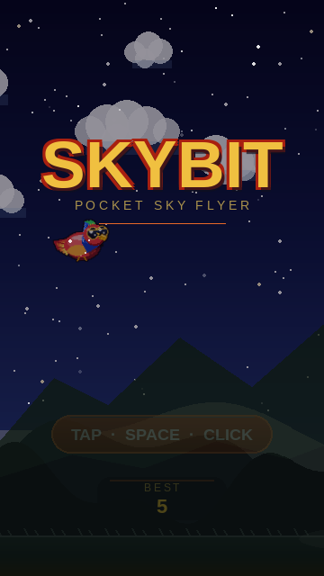
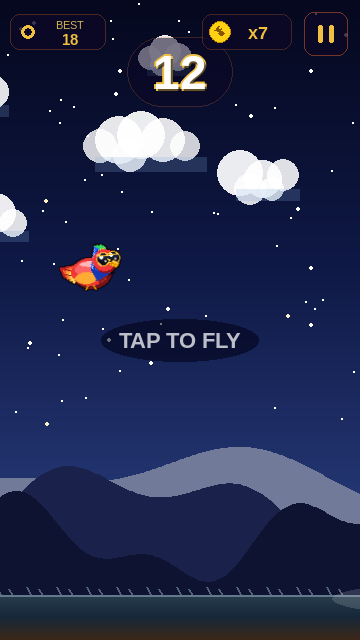
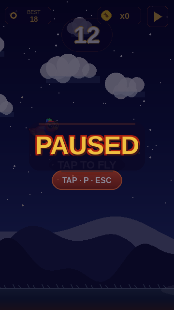
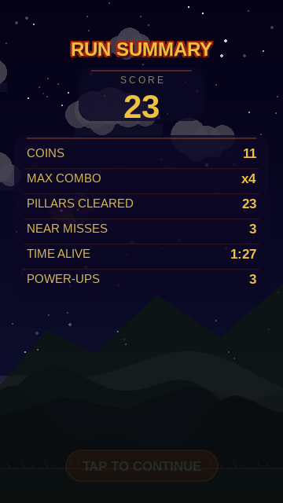
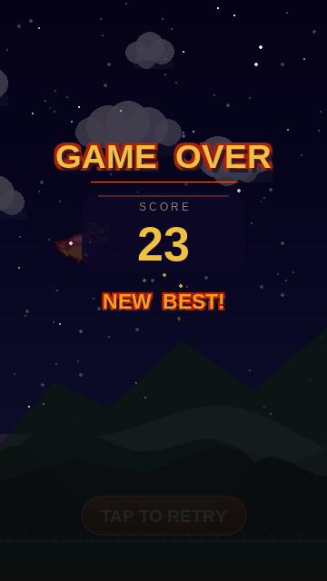
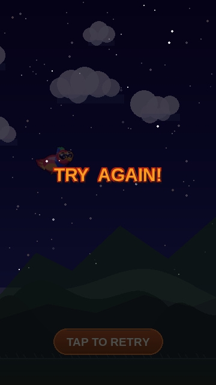

# Skybit — Visual Overhaul Preview

Branch: `claude/visual-overhaul`

All non-gameplay screens redesigned to match the HTML loading screen's dark-purple / gold / red-outline night-sky aesthetic. Screenshots taken against the in-game night biome background.

---

## Menu Screen

Stars twinkling across a night sky, floating gold "SKYBIT" title with red pixel outline, spaced subtitle, pulsing pill CTA, mountain silhouette and best-score panel.

---

## In-Game HUD

Score pill with dark panel + orange border. BEST and coin pills using the same themed language. Gold pause icon on dark button.

---

## Pause

Deep blue-purple overlay, frosted panel behind "PAUSED", styled resume pill.

---

## Run Summary

Stars + outlined header, framed score block, dark stats card with thin orange row dividers, TAP TO CONTINUE pill.

---

## Game Over — New Best!

"GAME OVER" gold + red outline, score panel, 8-point rotating star burst around "NEW BEST!", TAP TO RETRY pill.

---

## Game Over — Try Again

Clean minimal layout for zero-score runs.

