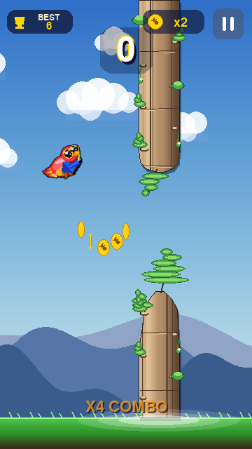
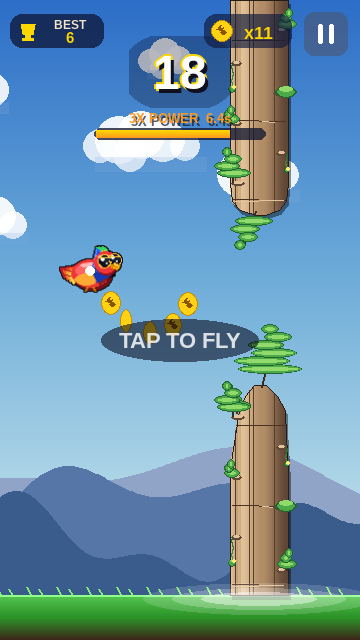
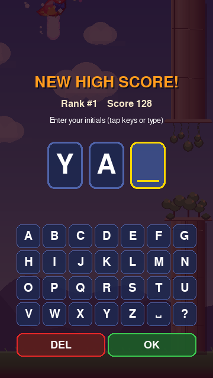
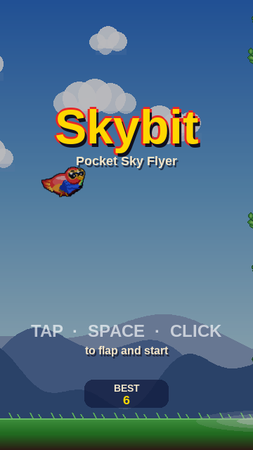
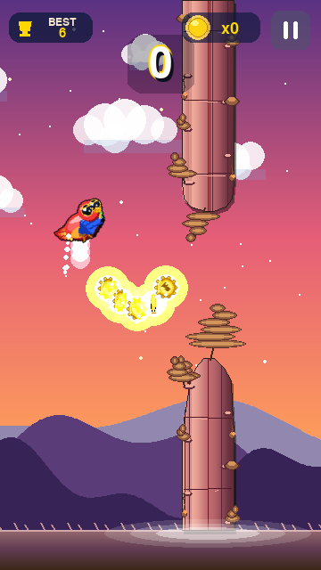
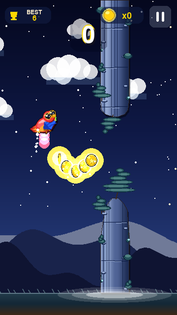
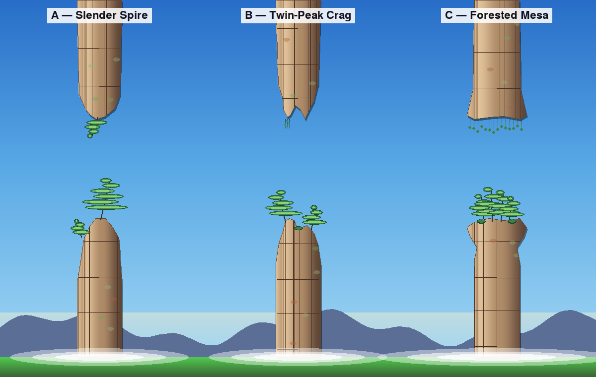

# Skybit — Pocket Sky Flyer

A colorful Flappy-style casual arcade game. Fly a **vivid scarlet-macaw parrot** through pipes, collect glowing coins, and grab the rare mushroom for a **3× coin multiplier** that lasts 8 seconds. Built in **Python** with Pygame — procedural graphics, smooth gradients, soft glows, no pixel art.

<p align="center">
  
  
</p>

---

## Play online — share the link

Three zero-install URLs in order of recommendation. Each works on phone, tablet, and desktop browsers.

### 1. Netlify (recommended)

A `netlify.toml` is committed at the repo root. **One-time setup (≈90 seconds, free tier):**

1. Sign in at <https://app.netlify.com/start> with GitHub.
2. *Import an existing project* → *Deploy with GitHub* → pick `ytocker/Claude_test`.
3. Branch: `claude/retro-pixel-game-gPPYY`. Leave build command blank, publish directory `.` (auto-detected from `netlify.toml`).
4. *Deploy*. ~30 seconds later you get a `https://<random-name>.netlify.app` URL. Rename it from *Site settings → Change site name* to anything you like.

Every push to the branch redeploys automatically. `netlify.toml` makes `/` serve `play.html`, sets long-cache headers on `skybit.apk`, and adds `Access-Control-Allow-Origin: *` so the WASM runtime loads.

**Instant fallback while you're setting that up — Netlify Drop:**
Open <https://app.netlify.com/drop>, drag the local repo folder onto the page (or just `play.html` + `skybit.apk`). You get a live URL in ~10 seconds, no account needed.

### 2. GitHub Pages (canonical CI deploy)

**<https://ytocker.github.io/Claude_test/>**

Driven by `.github/workflows/pages.yml`. Auto-enables Pages on first run via `actions/configure-pages` with `enablement: true`. If the Pages URL hasn't gone live yet, check **Actions → Deploy Skybit to GitHub Pages** for build status — the workflow may need to be re-run manually (*Run workflow* button) if a previous run failed before `enablement` was added.

### 3. raw.githack.com (instant, zero-setup)

**<https://raw.githack.com/ytocker/Claude_test/claude/retro-pixel-game-gPPYY/play.html>**

Proxies the public repo files with the right MIME types. Works the moment the branch is pushed. No setup needed.

> **Other free options** that also work with the `play.html` + `skybit.apk` pair: **Cloudflare Pages**, **Vercel static**, **itch.io** (HTML5 game upload), or any S3/nginx that serves static files. A FastAPI/Flask backend is overkill — these are static assets and a CDN-backed static host is faster, free, and zero-maintenance.

### Run locally in a browser

```
git clone https://github.com/ytocker/Claude_test.git
cd Claude_test
git checkout claude/retro-pixel-game-gPPYY
python3 -m http.server 8000
# open http://localhost:8000/play.html
```

The first load pulls a one-time CPython WebAssembly runtime (~10 MB) from the Pygame-web CDN. Subsequent loads are cached.

---

## Run natively (Python)

```bash
pip install pygame
python main.py
```

Requires Python 3.9+ and Pygame 2.x.

---

## How to Play

Tap, click, or press **Space / Up / W** to flap. Survive as long as possible, rack up points by passing pipes and collecting coins.

| Action       | Desktop                        | Mobile       |
|--------------|--------------------------------|--------------|
| Flap         | Tap / Click · Space · Up · W   | Tap screen   |
| Quit         | Esc                            | —            |

### Scoring

| Event                              | Points |
|------------------------------------|--------|
| Pass a pipe                        | +1     |
| Collect a coin                     | +1     |
| Collect a coin while 3× is active  | +3     |

Chain coins quickly to build a **combo multiplier** — a bouncing `X4 COMBO!` badge appears near the bottom of the screen.

### The Mushroom Power-Up

A red-capped mushroom occasionally spawns in the gap between pipes (roughly 1-in-9 chance, with a cooldown). Grab it to:

- Activate **3× POWER** for 8 seconds — coins worth +3 each
- Trigger a radial sparkle burst and a brief time-slow
- See an orange/gold aura glow around the parrot for the duration
- Watch a timer bar below the score drain in real time

### Leaderboard

Cracking the **top 10** pops up an arcade-style name-entry screen after Game Over. Tap the on-screen keyboard (or type on a keyboard — A–Z, Backspace, Enter) to pick three initials. Your entry is sorted into the list and persisted to `skybit_scores.json` next to the game.

> When playing in a browser, scores are saved to pygbag's in-browser virtual filesystem (IndexedDB) — they survive refreshes on the same device and domain, but aren't shared across players or devices. For a shared leaderboard, deploy with a backend of your choice.

<p align="center">
  
  
</p>

### Difficulty

- **Score 0–20**: wide gaps, relaxed scroll speed
- **Score 20–35**: gaps tighten, speed ramps up
- **Score 35+**: near-minimum gap, maximum scroll speed

### Evolving scenery

The sky and the **Zhangjiajie-style stone pillars** follow a continuous **day → golden hour → sunset → dusk → starry night → predawn → sunrise → day** cycle. One full cycle every **5 minutes of gameplay** (real time, independent of score), interpolated smoothly — long runs cover the whole arc.

| Phase       | Sky tone                | Pillar + canopy                       |
|-------------|-------------------------|---------------------------------------|
| Day         | Bright cyan             | Warm tan sandstone, lush green trees  |
| Sunset      | Pink-orange horizon     | Rose-stone pillars, autumn canopy     |
| Night       | Navy + scattered stars  | Moonlit blue-grey stone, dark teal moss |
| Sunrise     | Peach + pink bloom      | Peach stone, fresh-green canopy       |

---

## Screenshots

<table>
<tr>
  <td align="center">
    <br>
    <sub>Title — day biome</sub>
  </td>
  <td align="center">
    <br>
    <sub>Gameplay — coin arc, X4 combo</sub>
  </td>
</tr>
<tr>
  <td align="center">
    <br>
    <sub>Sunset biome (~score 10)</sub>
  </td>
  <td align="center">
    <br>
    <sub>Starry night biome (~score 18)</sub>
  </td>
</tr>
<tr>
  <td align="center">
    <br>
    <sub>3X POWER active — timer bar + sparkle</sub>
  </td>
  <td align="center">
    <br>
    <sub>Game Over + Top 10</sub>
  </td>
</tr>
</table>

---

## Project Structure

```
main.py                    Entry point — asyncio loop so pygbag can export to WASM
play.html                  Browser-playable build (Pygame on WebAssembly)
game/
├── config.py              Gameplay constants (physics, spawn rates, timings)
├── biome.py               Day/night palette keyframes + phase interpolation
├── draw.py                Low-level drawing: gradient surfaces, glow caches,
│                          mountains, clouds, ground, nature-pillar bodies
├── parrot.py              4-frame scarlet-macaw w/ aviator sunglasses (procedural)
├── entities.py            Bird, Pipe, Coin, Mushroom, Particle, FloatText
├── world.py               Simulation: scroll, spawn, collision, pickups,
│                          difficulty ramp, shake, pickup FX
├── hud.py                 Score, best, coin count, 3X timer, combo badge,
│                          pause button, leaderboard, game-over overlay
├── nameentry.py           Arcade-style 3-letter initials keyboard (top-10)
├── scenes.py              Scene state machine (Menu / Play / NameEntry /
│                          GameOver) + App
└── storage.py             Top-10 leaderboard persistence (JSON file)
tools/
└── snapshot.py            Headless screenshot generator
docs/screenshots/          PNG screenshots (regenerate with: python tools/snapshot.py)
```

---

## Technical Notes

- **Screen**: 360 × 640 virtual pixels (mobile portrait). Smooth graphics, no integer upscaling.
- **Language**: Python 3, [Pygame 2.x](https://www.pygame.org/). Rendered with `SRCALPHA` surfaces, `BLEND_ADD` glows, pre-computed gradient/glow caches for performance.
- **Sprites**: everything — parrot, pipes, coins, mushroom, clouds, mountains, UI — is drawn procedurally (no image files).
- **Graphics polish**: radial glows around coins, soft drop shadows on pipes, antialiased parrot silhouette with 4 wing-cycle frames, parallax clouds + mountains, spring-decay screen shake, gravity particles.
- **Physics**: fixed-timestep update at 60 FPS; `GRAVITY = 1600 px/s²`, `FLAP_V = -520 px/s`, `MAX_FALL = 700 px/s`.
- **Coin pickup**: **localized** gold/white sparkle particles + "+1" / "+3" floating text. No full-screen flash.
- **Persistence**: high score saved to `skybit_save.json`.
- **Web export**: `python -m pygbag --build main.py` produces `build/web/index.html`. Copy it to `play.html` in the repo root.

Rebuild `play.html` after editing source:
```bash
pip install pygbag
python -m pygbag --build main.py
cp build/web/index.html play.html
```

---

## Pillar design templates (work in progress)

Three candidate Zhangjiajie-pillar designs, rendered side-by-side for review. The chosen template will replace the current in-game pillar art.

<p align="center">
  
</p>

- **A — Slender Spire**: tapered single peak with a dramatic Wuling pine clinging to the summit; smaller secondary pine on a side ledge.
- **B — Twin-Peak Crag**: top splits into two uneven rocky spires with a pine on each and a shrub in the cleft; hanging vines from the larger fang on the inverted version.
- **C — Forested Mesa**: trunk narrows in the middle and flares into a wide bumpy plateau crowded with conifers; cascading moss tendrils from the inverted version's ledge.

Regenerate with:
```bash
python tools/pillar_preview.py
```
