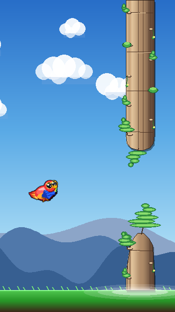
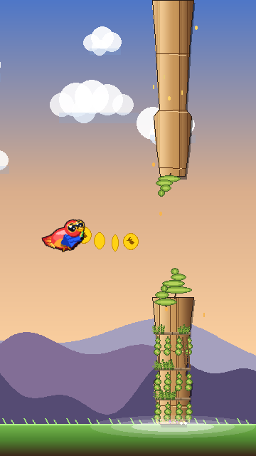
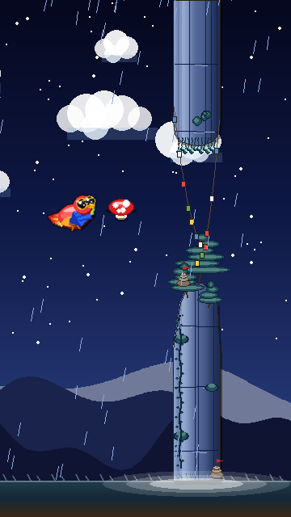
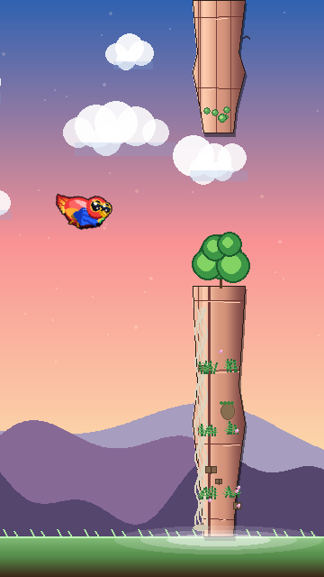
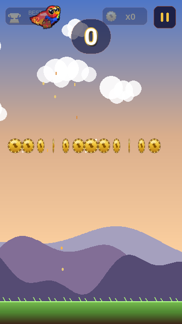
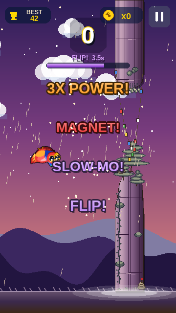
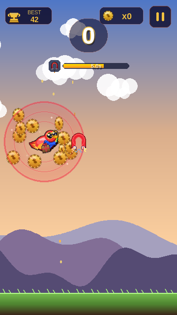
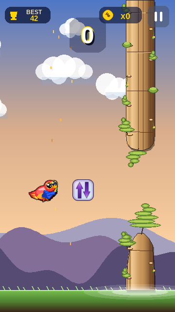
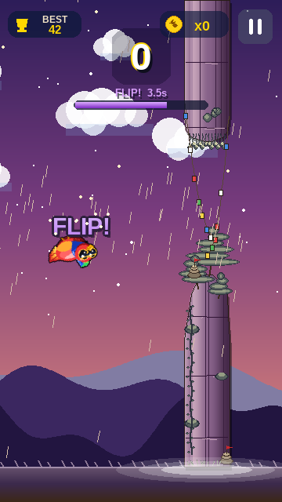
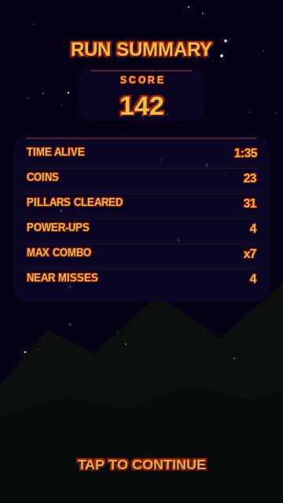

# Skybit — Pocket Sky Flyer

A colourful Flappy-style casual arcade game. Fly **Pip** — a vivid scarlet
macaw with aviator sunglasses — through stone pillars, collect glowing
gold coins, and grab one of six wild power-ups (a seventh is implemented
but currently disabled). Built in **Python** with Pygame — procedural
graphics, smooth gradients, soft glows, no pixel art assets.

<table>
<tr>
  <td align="center"><br><sub><b>Start of a run</b><br>day biome, Pip approaching the first pillars</sub></td>
  <td align="center"><br><sub><b>Golden hour</b><br>about to grab a coin trail</sub></td>
</tr>
<tr>
  <td align="center"><br><sub><b>Starry night</b><br>3× mushroom power-up next to Pip</sub></td>
  <td align="center"><br><sub><b>Sunrise</b><br>gliding past a different pillar</sub></td>
</tr>
</table>

---

## Run

```bash
pip install pygame
python main.py
```

Requires Python 3.11+ and Pygame 2.x.

---

## How to Play

Press **Space**, **Up**, **W**, or click/tap to flap. The menu doubles as
the start prompt — your first click both starts the run and counts as
the first flap, so Pip launches immediately. The pickup-cottage drifts
off-screen-left over the first ~2.5 s of gameplay before pillars take
over.

| Action | Input                          |
|--------|--------------------------------|
| Flap   | Space · Up · W · Click / Tap   |
| Pause  | P · Esc                        |
| Quit   | Esc (from menu)                |

### Scoring

| Event                              | Points |
|------------------------------------|--------|
| Pass a pillar                      | +1     |
| Collect a coin                     | +1     |
| Collect a coin while 3× is active  | +3     |

`+1` and `+3` float-text both render in the same bold-gradient style as
the power-up activation labels — gradient gold/orange fill, dark
auto-derived outline, and small white sparkle dots.

### Coin design

Gold parrot medallion with a vertical light → mid → deep-gold gradient
body, a bold double-band amber outline, an embossed parrot silhouette,
a soft upper-left specular highlight, and a **twisted-rope rim** of
alternating dark-and-light arcs around the perimeter. Twin sparkle
twinkles flash near the coin out of phase. The cached face is
smoothscaled per frame to apply the spin squeeze, so the rope rim and
all other detail are visible across every frame of the rotation cycle.

<p align="center">
  
</p>

---

## Power-ups

Power-ups spawn in a pillar gap with a 14 % chance per non-rush pillar
(5.5 s minimum cooldown between spawns). Six kinds plus a **surprise
box** are equally weighted; the surprise box re-rolls at pickup time
into one of the six.

Every activation pushes a bold float-text label up out of the pickup
position — gradient fill auto-derived from the power-up's identity
colour, a thick darker outline, and 8 deterministic white sparkle dots
around the glyphs.

<p align="center">
  
  <br><sub>The unified power-up float-text style (all six labels shown at once for comparison)</sub>
</p>

### Triple — 3× POWER!

A gold dollar coin (procedural `$` glyph) — coins are worth +3 each for
**8 seconds**. Triggers a radial sparkle burst, a brief shake, and a
gold/orange aura on Pip. Timer-bar at the top of the screen drains in
real time.

### Magnet — MAGNET!

Glossy red horseshoe with chrome leg tips, an animated lightning arc
between the poles, and yellow/white crackle bolts radiating from each
pole tip. For **8 seconds**, uncollected coins within `MAGNET_RADIUS`
(82 px) are tugged toward Pip with a linear-falloff pull.

The active pull-zone is rendered as a coherent breathing field around
Pip: three gold rings (1.00× / 0.78× / 0.55× of the radius) at varying
alphas with three-pass anti-aliasing, plus a soft inner radial glow
(bell-curve falloff peaking near the outer edge). All four elements
shrink and grow together — outer ring oscillates **0.70× → 1.00×**, the
inner two and the glow follow the same pulse factor. Cycle ≈ 1.14 s.

<p align="center">
  
</p>

### Slow-Mo — SLOW-MO!

Purple hourglass. Scales the world (scroll, entity velocity, entity
spin, weather) by `SLOWMO_SCALE = 0.7` for **8 seconds**, **without**
slowing Pip's input physics — so taps stay responsive while everything
else crawls.

### KFC — DEEP FRIED!

Red KFC bucket logo. Pip transforms into a fried-chicken parrot variant
and the in-flight coins become tilted french-fry sprites for
**8 seconds**. Plays a "poof" sound on activation and on expiry, with a
cloud-puff burst at both transitions.

### Ghost — GHOST!

Holographic-foil ghost: classic spectre silhouette (rounded dome head +
straight sides + 3-bump symmetric scallop bottom) inside a 2-px navy
outline. Body uses a diagonal multi-stop foil gradient (pale lavender
→ pearl pink → cyan → mint → warm ivory) with a soft white sheen on
the upper portion. For **8 seconds** Pip becomes a translucent
ghost-parrot variant that **phase-passes through pillars** — only the
ground/ceiling can still kill him.

### Grow — GROW!

Red-and-white Mario-style mushroom. Scales Pip up by `GROW_SCALE = 1.5`
for **8 seconds** (collision footprint, parcel, everything). The cached
grow-parrot is built once at first use.

### Surprise — random pick

Gold-and-bow gift box. At pickup, re-rolls uniformly to one of the six
real kinds above and immediately runs that kind's activator. Plays the
matching power-up sound (no separate "surprise" cue). A brief
gold-particle reveal burst fires before the chosen kind's own
activation FX.

### Reverse — currently disabled

A holographic-foil-rim glass card with two purple chevrons (one up, one
down). Flips Pip's gravity for `REVERSE_DURATION` seconds — taps push
him *down*, idle gravity pulls him *up*. The implementation is fully
intact (icon, `Bird.draw(flipped=True)` with a vertical sprite mirror,
parcel-mirror so KFC/ghost/grow stack correctly, dedicated big timer
bar with the `FLIP! X.Xs` label) but the kind is intentionally
**excluded from spawn** in `POWERUP_WEIGHTS` and from the surprise-box
random pick. To re-enable: add `("reverse", 1)` to `POWERUP_WEIGHTS`
in `game/config.py` and restore `"reverse"` to the `random.choice(...)`
tuple inside `World._on_powerup`.

<p align="center">
  
  
</p>

---

## Coin Rush

Every **15th** pillar is a "coin rush": the gap is widened by 30 % and
filled with a dense ~14-coin formation (sine wave / S-curve / chevron /
oval / double-arc, picked at random per rush). A `COIN RUSH!` float-text
+ gold particle burst announces the rush as the pillar enters from the
right edge. No power-ups spawn on rush pillars.

---

## Sound

Every action has a procedurally-synthesised cue, generated at startup
with the stdlib `wave` module — no audio asset files. Falls back
silently if the system has no audio device:

* **flap** — short whoosh
* **coin** / **coin_combo** / **coin_triple** — pickup tones layered
  with combo cues during 3X
* **mushroom** — triple-coin fanfare
* **magnet** — magnetic shimmer
* **slowmo** — descending tone
* **ghost** — ethereal pad
* **grow** — rising chime
* **poof** — KFC transformation puff (also used on expiry)
* **thunder** — weather cue
* **death** / **gameover** — descending impact + sting

The browser/pygbag build routes every `play_*` call through
`window.AudioContext` instead of `pygame.mixer` (since pygame's mixer
isn't available under emscripten).

---

## Difficulty & Scenery

The pillar gap (`GAP_START = 170 px`) and scroll speed
(`SCROLL_BASE = 160 px/s`) are constant — coins and pillars don't
speed up the world. Difficulty comes from coin-rush density and the
variety of pillar silhouettes.

The sky and the stone pillars follow a continuous **day → golden hour
→ sunset → dusk → starry night → pre-dawn → sunrise → day** cycle
(one full cycle per 5 minutes of gameplay), interpolated smoothly.
Pillars also vary — every spawn picks one of 8 sandstone-pillar
variants from its seed, with distinct silhouettes and decorations
(prayer flags, banner poles, terraces with cascading vines,
monasteries, hero lanterns, jungle-ruin masonry, menhirs).

---

## Leaderboard & anti-cheat

A global top-10 lives in Supabase (`public.scores` table) and is read
+ written from the browser. Native runs persist scores to a local JSON
file instead. The full schema + RLS policies are in
[`supabase/schema.sql`](supabase/schema.sql).

### Anti-cheat caveat

The leaderboard is a **soft** leaderboard. Without a server we control
to validate submissions, the Supabase anon key has to ship in the
browser bundle, and the `public.scores` row policy accepts any insert.
A determined attacker who reads the bundle can post forged rows
directly with `curl`.

What ships in this build is layered client-side hardening to cover the
casual-cheat surface:

* No `window.lbSubmitStart` / `lbFetchStart` / `skyLogPlayStart` globals.
  Everything funnels through one closure-private `window.__sk(action,
  payload)` dispatcher (see `inject_theme.py`).
* Score submissions ride a tamper-evident proof bundle (per-run UUID,
  append-only event ledger, rolling SHA-256 chain hash) computed in
  Python (`game/_proof.py`). The dispatcher recomputes the chain hash
  on the JS side and refuses any payload that doesn't match.
* The submitted score is the proof ledger's sum, not `world.score` —
  so poking `world.score = 99999` in the console doesn't change what
  goes over the wire.
* A deterministic plausibility check (`game/_plausibility.py`) runs
  before the network call, using the gameplay constants in
  `game/config.py` as bounds. It also runs on the read path: rows with
  scores above the ceiling are filtered out of the displayed top-10.
* The dispatcher tracks consumed run UUIDs in a closure-private set,
  so a captured legitimate submission can't be replayed.

---

## Game States & UI

* **Intro** — once-per-launch cinematic. Any tap skips it.
* **Menu** — start screen showing the pickup-cottage with Pip in front.
  First tap starts a run.
* **Play** — gameplay.
* **Pause** — toggle with P / Esc / pause-button tap.
* **Stats** — post-run summary: score, coins, pillars cleared, near
  misses, time alive, total power-ups picked.
* **Name Entry** — top-10 names captured in a 3-letter arcade keyboard.
* **Leaderboard** — top-10 list (persistent JSON) with the current
  player highlighted.
* **Game Over** — score + leaderboard + retry prompt.

The HUD score sits on a soft dark-gradient ellipse so the digits stay
legible against any background. The **BEST** and **coin** pills in the
top corners fade out when Pip climbs into the upper 60 px so the sprite
never disappears behind UI chrome. Active power-ups each get a
24-px-icon + 132-px-bar timer row stacked at the top of the screen,
with low-time pulse rings on the high-priority bars.

<p align="center">
  
</p>

---

## Project Structure

```
main.py                    Entry point (sync + async for pygbag)
game/
├── config.py              Gameplay constants (physics, spawn rates,
│                          power-up durations, weights)
├── biome.py               Day/night palette keyframes + phase interpolation
├── draw.py                Low-level drawing: gradient surfaces, glow caches,
│                          mountains, clouds, ground, stone-pillar bodies
├── parrot.py              4-frame scarlet macaw + KFC / ghost / hat /
│                          grow variants + parcel companion
├── entities.py            Bird, Pipe, Coin, PowerUp, Particle, CloudPuff,
│                          FloatText, plus all power-up sprite caches
├── world.py               Simulation: scroll, spawn, collision, pickups,
│                          power-up timers, shake, FX, coin-rush
├── hud.py                 Score, best, coin pill, active-buff timer rows,
│                          combo badge, pause button, name entry,
│                          leaderboard, game-over overlay
├── nameentry.py           Arcade-style 3-letter initials keyboard
├── scenes.py              Scene state machine + App + per-frame magnet
│                          force-field render
├── storage.py             Top-10 leaderboard persistence (JSON file)
├── audio.py               Procedural SFX — stdlib `wave` module, with a
│                          browser-only `window.AudioContext` adapter
├── intro.py               Once-per-launch cinematic
├── play_log.py            Per-run telemetry POST
├── weather.py             Rain/fog/thunder per biome phase
├── pillar_variants.py     Eight sandstone-pillar silhouettes
├── kfc_fries.py           Tilted french-fry coin variant for KFC mode
├── dollar_coin_glyphs.py  Procedural "$" coin glyph (also used in HUD)
├── dollar_parrot_ghost.py Ghost-parrot variant builder
├── dollar_parrot_hat.py   Top-hat parrot variant builder for triple mode
├── surprise_box_variants.py  Procedural gift-box sprites
└── assets/                Vendored fonts (Liberation Sans) + KFC logo
```

---

## Technical Notes

* **Screen** — 360 × 640 virtual pixels (mobile portrait).
* **Language** — Python 3.11+, Pygame 2.x. Rendered with `SRCALPHA`
  surfaces, `BLEND_ADD` glows, smoothscale super-sampling for crisp
  vector-style sprites, and pre-computed gradient/glow caches.
* **Sprites** — every visual is drawn procedurally (no PNG sprite
  sheets). Where a sprite is non-trivial to compute per-frame
  (ghost holographic body, magnet U-shape, coin face with rope rim,
  KFC logo, surprise box, reverse arrow card), the sprite is built
  once at first draw and cached at module level. Subsequent draws are
  a single blit per frame.
* **Anti-aliasing** — perimeter-stroke approach (line + vertex circle)
  on supersampled canvases (typically 8×–16×), then smoothscaled down.
  This produces uniformly thick outline rings with no gaps at corners.
* **Physics** — fixed-timestep update at 60 FPS. `GRAVITY = 1600 px/s²`,
  `FLAP_V = -520 px/s`, `MAX_FALL = 700 px/s`. Downward tilt capped at
  ≈41° so fast falls don't read as already-crashing. 1-second "TAP TO
  FLY" freeze at round start.
* **Coin pickup** — localised gold/white sparkle particles + `+1` /
  `+3` floating text. No full-screen flash.
* **Persistence** — high score saved to `skybit_save.json`, top-10
  leaderboard to `skybit_scores.json`.

---

## Documentation Layout

```
docs/
├── screenshots/
│   ├── gameplay/                README hero shots + ambient previews
│   └── powerups/
│       ├── all_text_styled.png  Unified float-text style preview
│       ├── reverse/             Icon + text + variant exploration sets
│       ├── coin/                Coin design + rim variants
│       ├── ghost/
│       │   ├── iterations/      Chronological progression of the live ghost
│       │   └── variants/        Outline / metallic / body / shape / scallop
│       │                          / pointed-blend exploration sets
│       └── magnet/              Live preview, polished previews,
│                                  pulse-amplitude GIFs, and four
│                                  variants/ exploration sets
└── asset_dev/                   Older asset-development previews
                                   (coin / parrot / KFC / surprise box)
```

The `screenshots/powerups/*/variants/` folders contain the five-option
exploration sets built during the design iteration — kept around as a
visual changelog of decisions.
