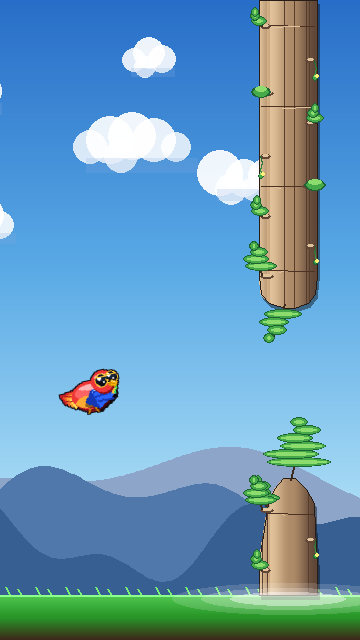
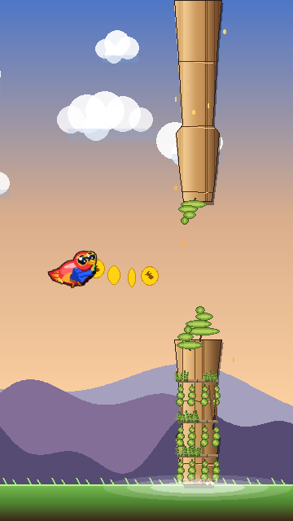
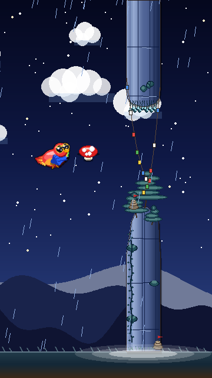
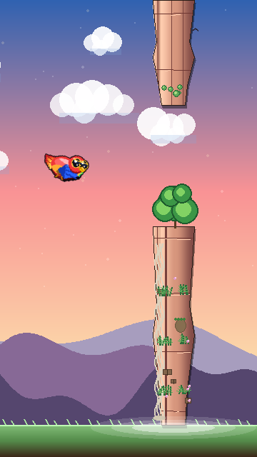

# Skybit

A one-button, Flappy-style pocket arcade game. Fly **Pip** — a scarlet
macaw in aviator sunglasses, parcel tucked under his wing — through
sandstone pillars, grab glowing coins, and stack power-ups before the
gaps start to bite.

Every visual is drawn from code. No sprite sheets.

  <a href="https://ytocker.github.io/skybit/"><b>▶ Play in your browser</b></a>
  &nbsp;·&nbsp;
  No install. Desktop or mobile.

<table>
<tr>
  <td align="center"> Start of a run · day biome</td>
  <td align="center"> Golden hour · coin trail incoming</td>
</tr>
<tr>
  <td align="center"> Starry night · Triple coming up</td>
  <td align="center"> Sunrise · gliding past a pillar</td>
</tr>
</table>

## Controls

| Action | Input                            |
|--------|----------------------------------|
| Flap   | Space · Up · W · click / tap     |
| Pause  | P · Esc                          |
| Quit   | Esc (from menu)                  |

The menu doubles as the start prompt: your first tap both starts the
run and counts as Pip's first flap, so he launches immediately.

## Scoring

| Event                              | Points |
|------------------------------------|-------:|
| Pass a pillar                      | +1     |
| Collect a coin                     | +1     |
| Collect a coin while Triple active | +3     |

## Power-ups

A power-up may spawn in any non-rush pillar gap (about a 1-in-4 chance,
with a short cooldown between spawns). Six kinds, plus a Surprise Box
that re-rolls into one of the six at pickup. Each lasts 8 seconds.

| Power-up     | Effect                                                            |
|--------------|-------------------------------------------------------------------|
| Triple       | Coins are worth +3                                                |
| Magnet       | Coins within ~82 px are pulled toward Pip                         |
| Slow-Mo      | The world slows to 0.7×; your taps stay full-speed                |
| KFC          | Pip becomes a fried-chicken macaw; coins become fries; gaps widen |
| Ghost        | Pip phases through pillars (ground/ceiling still count)           |
| Grow         | Pip and his parcel scale up by 1.4×                               |
| Surprise Box | Re-rolls at pickup into one of the six above                      |

A seventh power-up (Reverse) is built but intentionally disabled.

## Coin Rush

Every 15th pillar widens its gap by 30% and packs in a ~14-coin
formation — sine wave, S-curve, chevron, oval, or double-arc, picked
fresh each rush. No power-ups during a rush; just dive in.

## Difficulty

The first 25 pillars are an onboarding ramp: gaps tighten (225 → 170 px),
scroll speed climbs (125 → 160 px/s), and pillar spacing shortens
(370 → 280 px) one notch per pillar you clear. After pillar 25 the game
settles at its regular tuning and stays there — no late-game cliff.

Two forgiveness gestures keep the feel honest while you learn the
ramp: the ceiling clamps Pip instead of killing him (the ground still
does), and the pipe collision radius is a few pixels smaller than the
visible bird so brushes don't punish you.

## Built procedurally

Every sprite, gradient, glow, and effect in the game is computed in
Python — pillar silhouettes, the coin's twisted-rope rim, the ghost's
holographic foil, the magnet's breathing force-field, all of it. The
only files in `game/assets/` are vendored fonts, the KFC logo, and a
handful of sound OGGs.

The day/night biome cycles through day → golden hour → sunset → dusk →
starry night → pre-dawn → sunrise once every 5 minutes, and re-tints
the pillars as it goes. Eight pillar silhouettes (prayer flags, banner
poles, monasteries, jungle ruins, menhirs, and more) keep the scenery
varied.

Variant explorations and design iterations live under [`docs/`](docs/).

## Hacking on it

Local-run instructions, web-build pipeline, architecture, leaderboard
internals, and known gaps live in **[DEVELOPING.md](DEVELOPING.md)**.

## License

License terms TBD — contact the maintainer before redistributing or
forking commercially.
