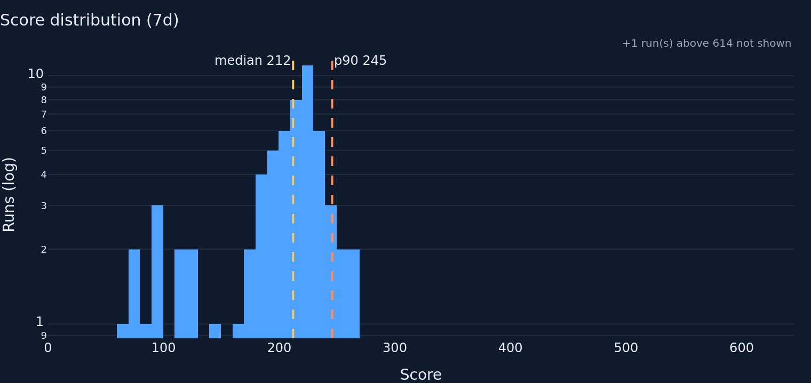
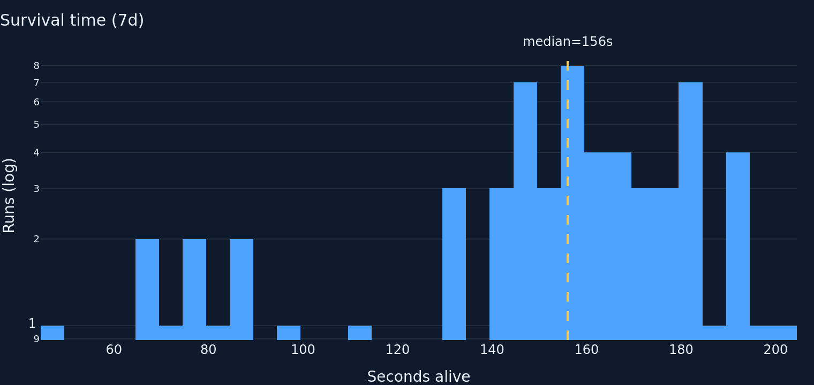
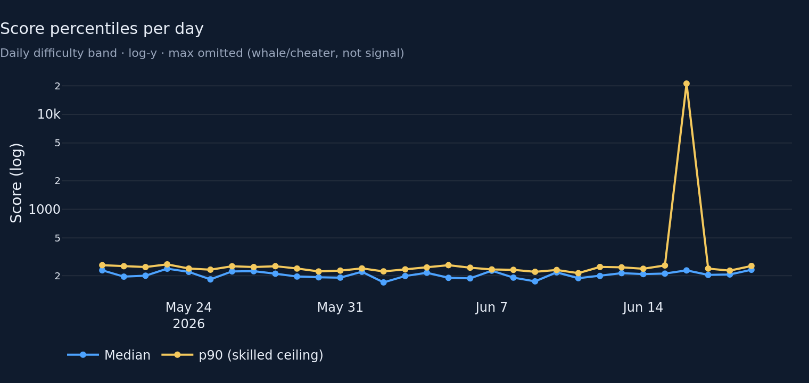
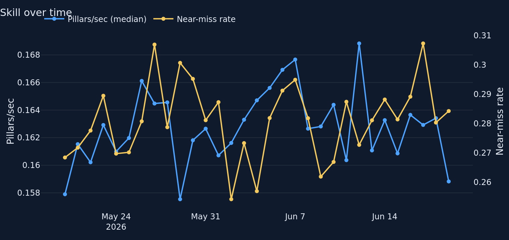
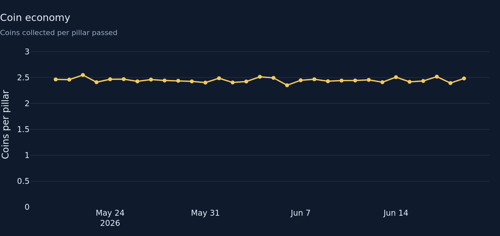
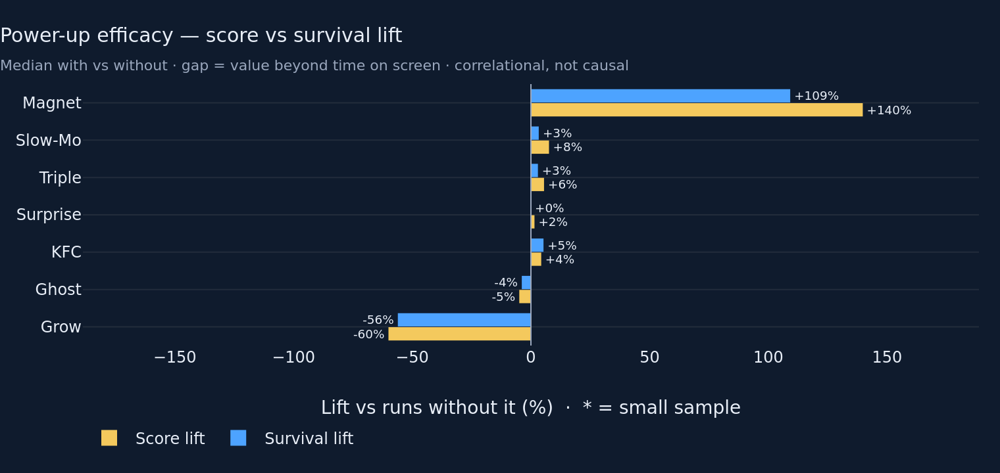

# Gameplay & Balance — Round 1 (baseline audit + targeted fixes)

**Goal.** Own the tuning-knob tab: how hard is the game, is skill drifting,
are the power-ups balanced, is the coin economy steady. This round is a
critical audit of the inherited round-1 implementation plus the targeted
fixes I'm confident in — no bloat, structure kept, tests green.

## What I changed and why

### 1. Marquee fix — power-up efficacy now shows score AND survival lift
The old chart showed only median **score** lift with-vs-without each
power-up. That single number is the most-confounded read on the tab:
power-ups spawn deeper into a run, so a power-up that does nothing will
still correlate with high scores simply because long runs see more
spawns. I now plot **both score lift and survival lift as paired bars**,
and the metric reports `excess_lift_pct = score_lift − dur_lift`. The
*gap* between the two bars is the honesty payload: score lift well above
survival lift = real value per second alive; the two tracking together =
just more time on screen (the known exposure confound). Bars are sorted by
excess, so genuine over/under-performers land at the extremes, not the
most-exposed. Still labelled "correlational, not causal".

- New columns on `powerup_efficacy`: `excess_lift_pct`, `low_n`.
- `low_n` flags power-ups with `< MIN_EFFICACY_N` (=10) picked runs; the
  chart greys those bars and suffixes their label with `*` so a noisy
  three-run bar isn't mistaken for a balance verdict (honest-baselines
  rule).

### 2. Score histogram was unreadable — one outlier owned the x-axis
The 42,000-point fixture run (plausible under the 100k ceiling, but a
whale/cheat tier) stretched the x-axis to 40k and squashed the entire
9–250-point playing population into a single bar; the median/p90 vline
labels overprinted into mush. Fixed: x-axis clipped to a **robust** upper
bound built from p90/p95 only (`max(p95·1.5, p90·2.5, median·2)`) — the
upper quantiles are deliberately avoided because a lone extreme already
poisons p99 (16k off one row). Runs above the clip are **counted in an
annotation** ("+N runs above X not shown") so nothing is hidden. Vlines
moved to opposite top corners so labels never collide.

### 3. Score-percentiles-per-day — dropped `max`, switched to log-y
`max` is a whale/cheater line, not a tuning signal, and it pinned the
y-axis. Even after dropping it, the 42k run drags one low-volume (6-run)
day's **p90** to ~21k, flattening every normal day on a linear axis.
Switched the axis to **log**, which keeps the real ~200-point daily band
fully legible while the spike stays visible and honest. Kept median + p90
(the actionable difficulty band).

### 4. Coin economy was selling noise as a trend
Plotly autoscaled the y-axis to the data's ±2% jitter, dramatising a flat
~2.45 coins/pillar economy into a sawtooth. **Anchored the y-axis at 0**
with headroom, so the series reads as what it is — steady — and a real
regression would actually look like one.

### 5. Honesty / polish fixes
- **Label bug:** `POWERUP_LABELS.get(n).title()` corrupted the curated
  "KFC" label into "Kfc". The labels are already display-ready; dropped
  the `.title()` in both `powerup_mix` and `powerup_efficacy`.
- **Window-label lie:** `powerup_mix` was titled "(7d)" but the tab feeds
  it the global window (default 30d). Made the title window-agnostic.
- **Dropped the 9th chart:** removed `powerups_per_run` from the tab — it
  was a near-flat single line already summarised by the "Power-ups / run"
  KPI card. Tab is now **7 charts + 5 KPI cards**, under the ≤8 ceiling
  with headroom. (The `powerups_per_run` *builder* stays in `charts/`
  since the shared, non-editable `charts/__init__.py` re-exports it.)
- **Layout:** efficacy promoted to **full width** below the F-pattern grid
  — it's the chart the team retunes against and the paired bars need room.

### Files changed
- `metrics/gameplay.py` — `powerup_efficacy` gains `excess_lift_pct` +
  `low_n`; added `MIN_EFFICACY_N = 10`.
- `charts/gameplay.py` — robust score-hist clip + overflow annotation;
  log-y daily percentiles (max dropped); zero-anchored coin economy;
  paired score+survival efficacy bars with low-N greying + bottom legend;
  `.title()` label bug removed; window-agnostic mix title.
- `tabs/gameplay.py` — efficacy full-width; `powerups_per_run` chart
  removed from layout; caption notes the exposure control + small-sample
  flag.
- `tests/test_metrics_gameplay.py` — 3 new tests (excess nets out
  exposure, low_n flag, schema).

## Fixture numbers (437 rows, 37 devices, plausibility-filtered)

| KPI (7d) | value |
|---|---|
| Median score | 212 |
| p90 score | 245.8 |
| Median survival | 156 s |
| Coins / run | 59.8 |

Note: 7d `max` score is 42,000 — the single near-ceiling run that the
audit fixes are built to stop dominating the charts.

**Power-up efficacy (30d) — score vs survival lift, exposure-adjusted:**

| Power-up | n with | n without | score lift | survival lift | excess (score−survival) |
|---|---|---|---|---|---|
| Magnet | 258 | 55 | +139.8% | +109.2% | **+30.6%** |
| Slow-Mo | 95 | 218 | +7.6% | +3.3% | +4.3% |
| Triple | 89 | 224 | +5.5% | +3.0% | +2.6% |
| Surprise | 105 | 208 | +1.5% | +0.0% | +1.5% |
| KFC | 114 | 199 | +4.3% | +5.3% | −1.0% |
| Ghost | 92 | 221 | −4.9% | −3.8% | −1.1% |
| Grow | 21 | 292 | −60.0% | −56.1% | −3.9% |

Read: Magnet's score lift (+140%) sits well above its survival lift
(+109%) → genuine per-second value beyond exposure (by fixture design).
Grow is negative on both → a real penalty, not exposure. KFC/Ghost score
lift roughly equals survival lift → mostly exposure, little independent
effect. No power-up is below `MIN_EFFICACY_N` in this fixture, so no bars
are greyed here (the guard is there for live small-N windows).

## Charts (rendered, dark `#0F1B2D`, 760×360 @2)









## Tests

```
$ python -m pytest -q tests/test_metrics_gameplay.py tests/test_render_smoke.py
..............                                                           [100%]
14 passed in 1.41s
```

Full suite (`python -m pytest -q`): **70 passed**.

## Known limitations / open questions (for the director)

- **Is "median pillars/sec" a real skill proxy?** Scroll speed is
  fixed-step, so pillars/sec is near-constant by design (fixture range
  0.158–0.169 — a ±3% band the auto-zoomed twin axis exaggerates into
  apparent volatility). It may be measuring survival, not skill. Candidate
  alternatives: near-miss rate alone, or score-per-second. Flagging rather
  than over-engineering this round.
- **Efficacy is still correlational.** `excess_lift_pct` is a *partial*
  exposure control (survival is a proxy for spawn exposure, not exposure
  itself). A spawn-count-normalised denominator would be more rigorous if
  the telemetry recorded power-ups *offered* vs *picked* — it currently
  only records picks. Open question whether to pursue.
- **Missing balance signal?** Considered a score-vs-duration scatter for
  difficulty shape, but the two histograms + the efficacy survival axis
  already cover it; held off to respect the ≤8-visual budget. Director's
  call on whether it adds a distinct "so what".
- **Robust clip thresholds** (`p95·1.5`, `p90·2.5`, `MIN_EFFICACY_N=10`)
  are reasoned defaults, not tuned against live volume — worth revisiting
  once real distributions land.
