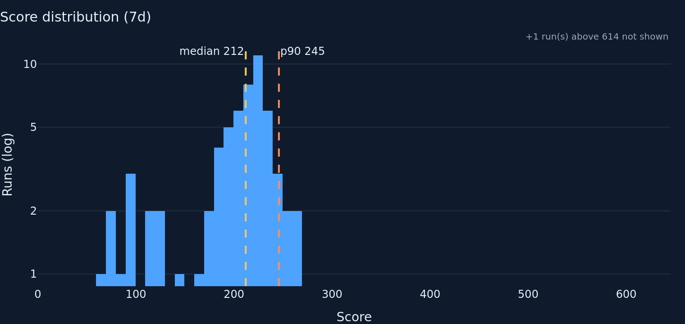
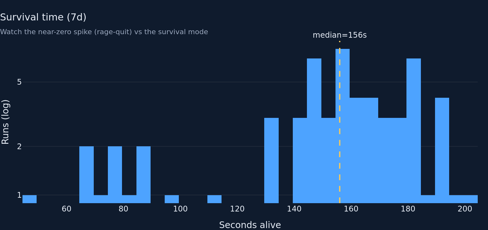
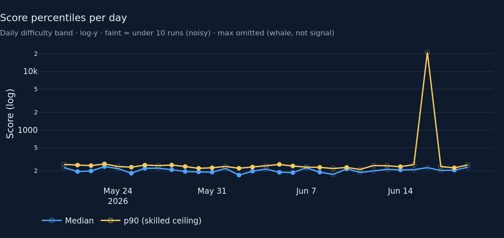
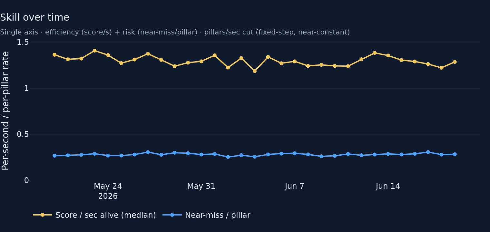
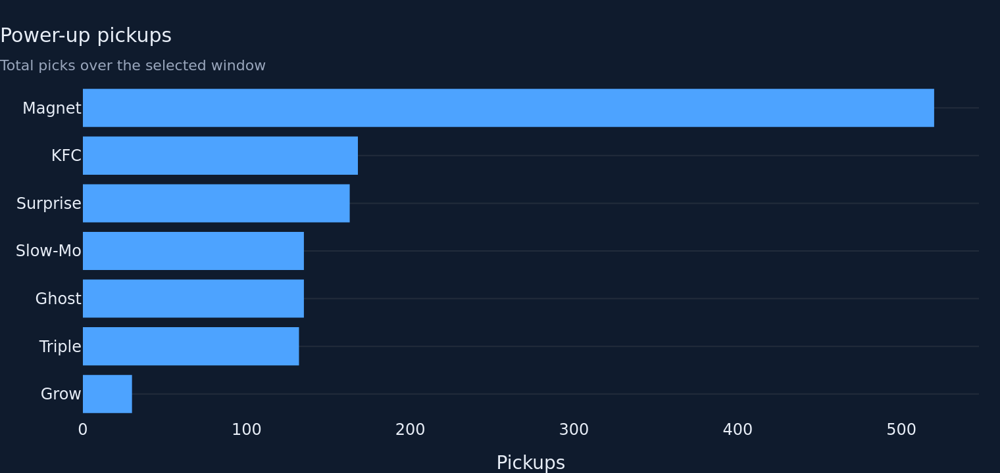
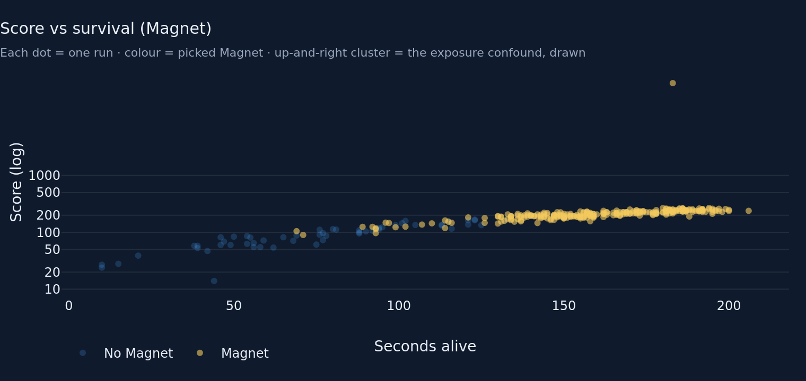
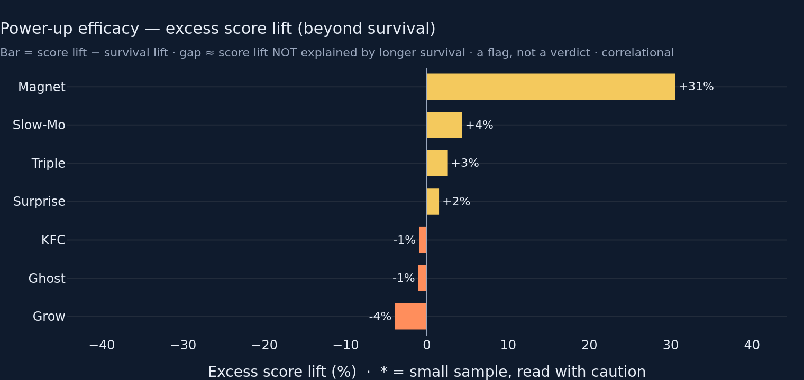

# Gameplay & Balance — Round 2 (director ITERATE → addressed)

**Goal.** Implement every directive from the round-1 ITERATE: make the
excess gap the *drawn* object, kill the legend-swatch bug, fix the colour
semantics, cut the fake-story pillars/sec axis, guard thin-day
percentiles, and add the difficulty-shape scatter that visualises the
exposure confound. Tests stay green; charts re-rendered.

All six directives below are done. Numbers are on the bundled fixture
(437 rows, 30-day window, plausibility-filtered).

---

## 1. Excess is now the PRIMARY drawn quantity (was hover-only)

The marquee chart no longer plots two paired lift bars with the gap hidden
in the hover. It now draws **`excess_lift_pct` (= score lift − survival
lift) as a single diverging horizontal bar**, sorted by that same
quantity — so the thing the chart is sorted on is the thing you see. Raw
score lift, survival lift, and n moved into the hover as supporting
detail.

Caption softened per the directive — it no longer claims "value beyond
time on screen". New subtitle:

> Bar = score lift − survival lift · gap ≈ score lift NOT explained by
> longer survival · a flag, not a verdict · correlational

**Excess lift per power-up (30d fixture), sorted:**

| Power-up | excess (drawn) | score lift | survival lift | n with / without |
|---|---|---|---|---|
| Magnet | **+30.6%** | +139.8% | +109.2% | 258 / 55 |
| Slow-Mo | +4.3% | +7.6% | +3.3% | 95 / 218 |
| Triple | +2.6% | +5.5% | +3.0% | 89 / 224 |
| Surprise | +1.5% | +1.5% | +0.0% | 105 / 208 |
| KFC | −1.0% | +4.3% | +5.3% | 114 / 199 |
| Ghost | −1.1% | −4.9% | −3.8% | 92 / 221 |
| Grow | −3.9% | −60.0% | −56.1% | 21 / 292 |

Read: Magnet's score lift runs ~31 points of % ahead of its survival lift
— a flag worth a look, not a causal verdict. KFC/Ghost sit near zero
(score bump ≈ survival bump → mostly exposure). Grow is negative on both
axes (a real penalty, not exposure).

## 2. Legend-swatch bug fixed (low_n via opacity, not colour array)

The round-1 builders set per-bar `marker_color` *arrays* to grey low-N
bars — which blanks the Plotly legend swatch exactly when data is noisy.
Round 2 keeps `marker_color`/`line.color` a **scalar per trace** and
expresses small-N via **`marker.opacity` arrays** (`_LOW_N_OPACITY = 0.32`)
plus the existing `*` label suffix. Applied to the efficacy bar
(de-emphasised at 0.32 opacity) and the score-percentiles markers
(low-opacity + hollow `circle-open` symbol).

New test `test_efficacy_chart_builds_with_low_n_row` builds the efficacy
chart on a frame with a genuine `low_n=True` row and asserts it renders
without raising.

## 3. Efficacy colour semantics re-mapped

Theme GOLD = the *actionable* element; SKY = primary. Round 1 mis-put GOLD
on the confounded raw **score** bar and SKY on the survival control.
Round 2 reserves **GOLD for the excess bar itself** (the one quantity the
team retunes against) when excess ≥ 0, and **CORAL for negative excess**
(under-performers) so the two directions read apart at a glance. The
least-trustworthy raw bars are no longer accented — they're hover detail.

## 4. pillars/sec cut; skill chart is now single-axis efficiency + risk

`skill_proxy_by_day` no longer returns `pillars_per_s` (near-constant
0.158–0.169 by fixed-step scroll design; the twin auto-scaled axes
manufactured a ±3% fake story). Replaced with **`score_per_s`** —
median points earned per second alive, the efficiency signal that moves
with skill where survival rate can't — kept alongside **`near_miss_rate`**
(per pillar, the half-real risk signal). Both are ~0.25–1.4-magnitude
per-unit rates, so they share a **single linear axis** (rangemode tozero),
no twin-axis noise. Median (not mean) makes score/sec whale-proof — a test
asserts a 210-pts/s whale leaves the day's 1.0 median untouched.

## 5. Per-day min-N guard on `score_quantiles_by_day`

`score_quantiles_by_day` now returns `n` and `low_n` (days under
`MIN_EFFICACY_N` = 10 runs) and **drops `max`** (a whale line, never a
tuning read). The chart draws thin days at 0.32 opacity with hollow
markers — on the fixture, the ~21k p90 spike lands on exactly such a
de-emphasised (6-run) day, so a whale-driven percentile no longer reads as
a difficulty signal while staying visible and honest. 14 of 31 fixture
days are flagged low_n. Test `test_score_quantiles_low_n_guard` asserts
the flag boundary and that `max` is gone.

## 6. Score-vs-survival scatter added; log-tick artifact fixed

New `score_vs_survival` metric (one row per run: duration, score, whether
it picked the power-up of interest) + chart: one dot per run, x = seconds
alive, y = log score, colour = picked Magnet (the standout from #1). The
fixture cloud shows the exposure confound *directly* — Magnet runs cluster
up-and-right (longer AND higher-scoring), which is the very correlation the
excess bar tries to net out. 313 runs in the 30d window, 258 picked Magnet.

While in the histograms: explicit log `tickvals=[1,2,5,10,…]` on the score
and survival histograms (and the scatter's score axis) kill the stray
"1 / 9" minor-tick artifact at the axis bottom. The survival histogram
gained a subtitle flagging the near-zero rage-quit spike vs the survival
mode (bimodality note).

Chart count: score_hist, duration_hist, score_quantiles, skill_over_time,
powerup_mix, coin_economy, **score_vs_survival (new)**, powerup_efficacy =
**8**, at the ≤8 ceiling (pillars/sec was a line inside the skill chart,
not a separate visual, so the scatter is the net addition).

## Files changed
- `metrics/gameplay.py` — `score_quantiles_by_day` gains `n`/`low_n`, drops
  `max`; `skill_proxy_by_day` swaps `pillars_per_s` → `score_per_s`; new
  `score_vs_survival`.
- `charts/gameplay.py` — efficacy rebuilt as a sorted diverging excess bar
  (GOLD/CORAL by sign, opacity for low-N); skill chart single-axis
  (score/s GOLD lead + near-miss SKY); score_quantiles low-N de-emphasis;
  new `score_vs_survival` scatter; `_LOG_TICKS` on both histograms + the
  scatter; duration-hist bimodality subtitle; `MIN_EFFICACY_N` imported.
- `tabs/gameplay.py` — scatter wired full-width above the efficacy marquee;
  caption updated ("a flag, not a verdict").
- `tests/test_metrics_gameplay.py` — 6 new/updated tests (score/sec column
  + value, whale-proof median, low-N day guard, scatter shape, efficacy
  builds on low_n, scatter builds).

## Charts (rendered, dark `#0F1B2D`, 760×360 @2)










## Tests

```
$ python -m pytest -q
................................................................................ [100%]
80 passed in 1.99s
```

(Was 70; +10 from the 6 new gameplay tests across this round.)

## Known limitations / open questions

- **Score-percentiles y-axis ticks.** The daily chart keeps Plotly's
  default log ticks (it can span 200 → 21k on a whale day); the explicit
  `[1,2,5,10,…1000]` tickvals are applied only to the two histograms + scatter
  whose range is bounded. Open to forcing decade-only ticks there too if
  the director prefers.
- **Efficacy is still correlational.** The excess bar is a *partial*
  control (survival proxies spawn exposure, not exposure itself). A
  picks-vs-offers denominator would be more rigorous but the telemetry
  records picks only — unchanged from round 1.
- **Scatter power-up is hard-wired to Magnet.** It leads on the standout;
  a selector would let the team inspect any power-up but adds a control to
  a tab that's already dense. Flagging rather than building.
</content>
</invoke>
