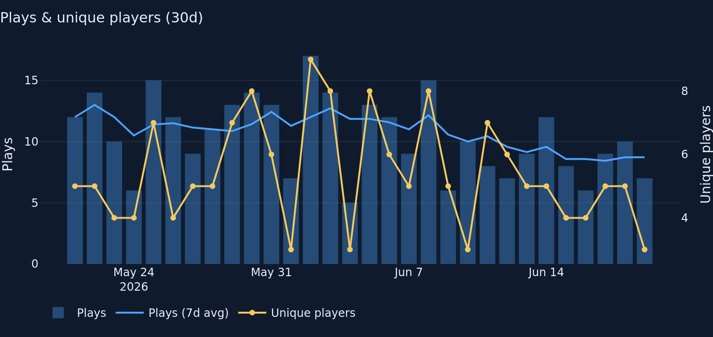
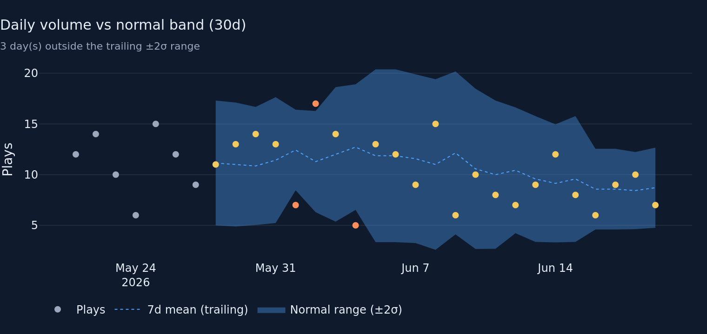
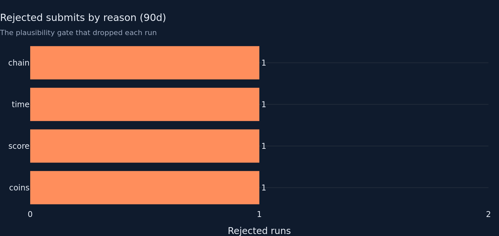
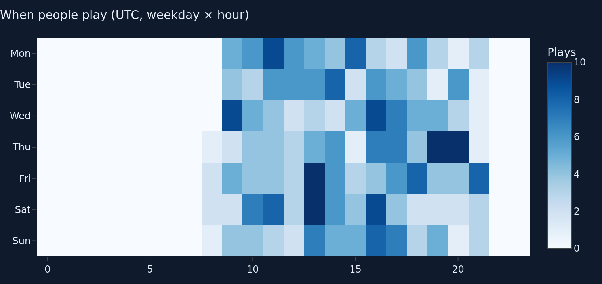

# Overview / Live-ops tab — round 1 (data-analyst)

**Goal.** Audit the round-1 baseline of the Overview / Live-ops tab and make
targeted, confident improvements toward its purpose: a glance-and-go answer to
"is the game alive, growing, and clean?" Keep it scannable (≤ 8 visuals), keep
honest baselines, keep tests green.

## Audit findings → what I changed

1. **No single glance-and-go verdict.** The tab opened straight into a 5-card
   KPI row; the operator had to read and synthesise five numbers to answer the
   one question the tab exists for. **Added `m.health_status(df)`** — one
   OK / WATCH / ALERT line above the KPI row, rolling up three checks that
   mirror the tab's purpose, each kept honest about small N:
   - **alive** — minutes since last play vs the data's *own* recent cadence
     (median inter-play gap over 7d, floored at 6h), not a hard wall. A quiet
     indie game with naturally long gaps shouldn't read as "down". ALERT at
     3× the typical gap, WATCH at 1.5×.
   - **growing** — 7d plays vs prior 7d; only a *drop* ≥30% is a concern, and
     only WATCH (a volume dip is not an outage). Always prints `cur vs prev`.
   - **clean** — 7d rejection rate, **gated on an absolute count** (needs ≥3
     rejected runs before it can escalate) so one rejected submit in a thin
     window can't trip an alert.

2. **Anomaly band was statistically unsound.** The old band used a
   *self-inclusive* rolling window with `min_periods=2`. Two bugs:
   - Self-inclusion pulls the mean toward an outlier and shrinks σ — masking
     the very spike we want to flag. On the fixture the old band flagged **0**
     outlier days; the corrected trailing band flags **3**.
   - `min_periods=2` fits a band on a 2-point σ and `fillna`'d the rest, so
     early days collapsed to lo=hi=plays (a fake zero-width "normal range").

   **Reworked `daily_plays_with_band`** to a **trailing** window
   (`closed="left"`, judges each day against the 7 days *before* it) with a
   full **`min_periods=7` warm-up**. Warm-up days carry `NaN` band columns and
   a `warmup=True` flag; the chart greys them out instead of drawing a
   fabricated band. New columns `warmup`, `outlier` move the outlier decision
   into the metric (tested), out of the chart.

3. **Rejection KPI hid its denominator.** The card showed a bare `3.2%` and
   flagged "elevated" at >5% with no count — exactly the small-N trap the
   honest-baselines rule warns against (the fixture's 3.2% is **2 of 63 runs**).
   **Added `m.rejection_count(df)` → (rejected, total)** and surfaced
   `n/total runs` on the card; "elevated" now requires ≥3 rejected runs *and*
   >5%.

4. **Chart polish.** Legends on `plays_and_uniques` and `plays_anomaly_band`
   overlapped the title/subtitle (`y=1.02`) — moved below the plot. The
   rejection bar showed fractional `0.2/0.4` gridlines for integer counts —
   forced `dtick=1` integer ticks with value labels.

## Files changed

- `metrics/overview.py` — reworked `daily_plays_with_band` (trailing window,
  warm-up, `warmup`/`outlier` columns); new `health_status`, `rejection_count`,
  `_fmt_dur`.
- `charts/overview.py` — `plays_anomaly_band` greys warm-up days, colours
  outliers from the metric flag, count-driven subtitle, legend below plot;
  `rejection_reasons` integer ticks + value labels; `plays_and_uniques` legend
  below plot.
- `tabs/overview.py` — health-status banner above the KPI row; rejection card
  shows `n/total` and gated "elevated".
- `tests/test_metrics_overview.py` — +7 tests (warm-up has no band, band flags
  a spike, `rejection_count` num/denom + empty, `health_status` shape / empty /
  clean-OK / single-reject-stays-OK / many-rejects-ALERTs). New submodule funcs
  imported via `from metrics import overview as ov` (no `__init__` edit).

## Fixture numbers (437 rows, 37 devices, rebased to now)

- Health status: **OK** — "Alive, growing, and clean".
- DAU today **3** (Δ −2 vs yest); Plays today **7** (Δ −3 vs yest).
- Plays 7d **63** vs prior 7d **67** (−6%).
- Rejected submits 7d: **3.2% = 2 / 63 runs** (below the ≥3-count gate → not flagged).
- Rejection reasons (90d): coins 1, score 1, time 1, chain 1.
- Anomaly band (30d): **3** outlier days flagged (was 0 under the old
  self-inclusive band); first **7** days are warm-up (no band).

## Charts (rendered from the fixture, dark bg)






Visual count: 1 status line + 5 KPI cards + 4 charts — within the ≤8-visual
discipline (4 charts).

## Tests

```
$ python -m pytest tests/test_metrics_overview.py -q
...................                                                      [100%]
19 passed in 0.39s
```

Full repo suite: `70 passed in 1.63s` (my module contributes 19; +7 net new
this round).

## Known limitations / open questions

- `health_status` thresholds (3×/1.5× cadence, 30% drop, ≥3 & 5%/10% reject)
  are judgement calls tuned for a low-traffic indie game; they're documented
  but not yet validated against a real traffic outage. Worth revisiting once
  live volume is known.
- The cadence-based freshness floor (6h) means the "alive" check is coarse for
  a game that genuinely plays many times an hour; it errs toward not crying
  wolf.
- `_fmt_dur` and the new metrics aren't re-exported in `metrics/__init__.py`
  (shared file, off-limits this round) — tab uses the `m.`/`c.` submodule
  alias, tests import from the submodule directly.
- All numbers above are synthetic fixture values — judge the design/validity,
  not the magnitudes.
