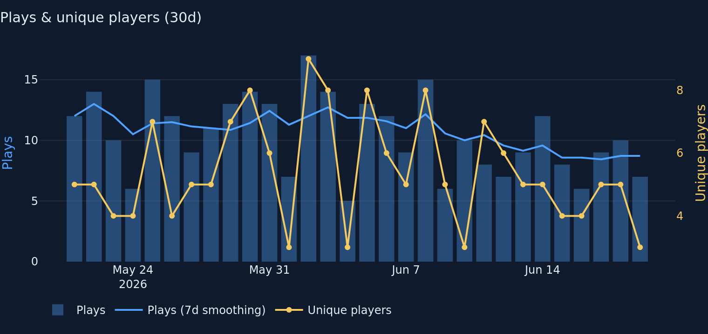
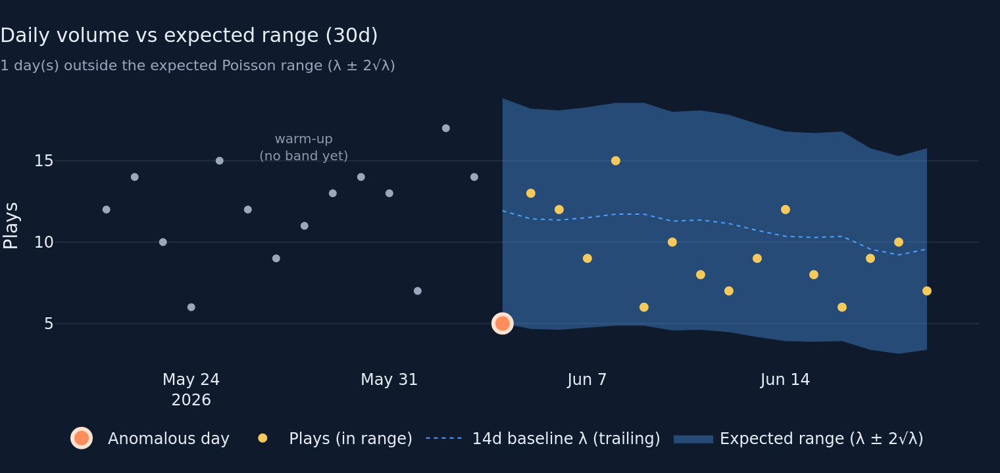
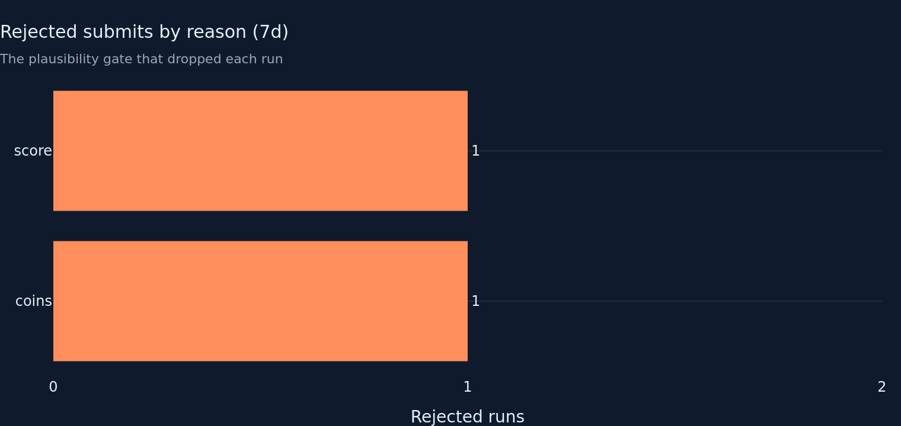
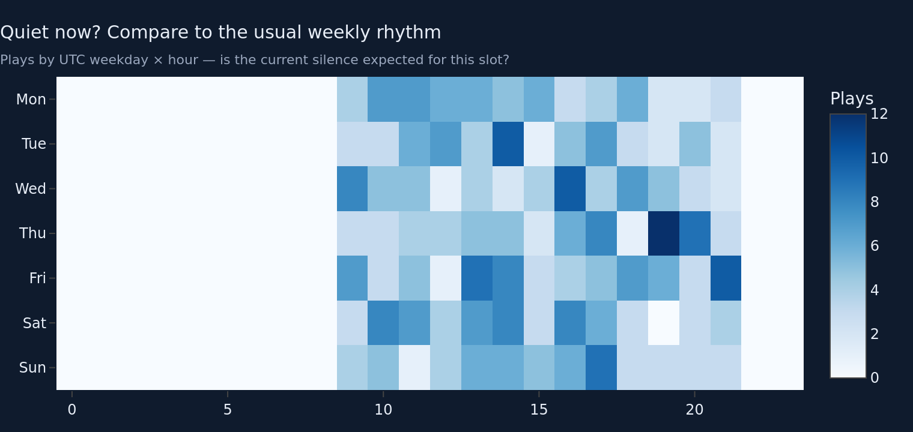

# Overview / Live-ops tab — round 2 (data-analyst)

Round 1 returned **VERDICT: ITERATE**. This round implements every director
directive. Same file scope as round 1 (`metrics/overview.py`,
`charts/overview.py`, `tabs/overview.py`, `tests/test_metrics_overview.py`).
No shared files touched.

## Directive 1 — Poisson-aware band replaces ±2σ Gaussian (headline fix)

`daily_plays_with_band` is reworked. scipy is **not** in the deploy image
(confirmed: `ModuleNotFoundError: scipy`), so I used the director-sanctioned
fallback: the variance-stabilised normal approximation to the Poisson tail.

- **Baseline λ** is now a **14-day** trailing mean (`closed="left"`,
  `min_periods=14`) — up from 7. The longer window stops the band breathing:
  width is no longer a 7-point sample σ that swings 5-wide → 20-wide week to
  week.
- **Band width is the Poisson law, not a re-estimated σ:** `lo/hi = λ ± 2·√λ`
  (σ = √λ). The lower edge is clipped at 0 because **0 is the floor of the
  count support**, not because a symmetric normal band wandered negative — the
  old `.clip(lower=0)` was papering over exactly that.
- **Outlier rule** is the symmetric variance-stabilised z-score
  `z = (obs − λ) / √λ`, flagged when `|z| > 2`. Symmetric ⇒ a sudden **drop**
  flags like a spike (see directive 6).
- Warm-up + `closed="left"` trailing design preserved; warm-up now runs 14 days.

**Fixture number showing it flags sensibly:** on the 30d fixture the band warms
up for 14 days, then flags **1 anomalous day** — 2026-06-04 with **5 plays**
against **λ = 11.93** (lo edge 5.02). That is a low-side dip
(z ≈ (5−11.93)/√11.93 ≈ −2.0), the kind of quiet-day signal a live-ops band
should surface — and it is drawn as a coral halo below the band, not a spike.

Subtitle relabelled honestly: **"X day(s) outside the expected Poisson range
(λ ± 2√λ)"** — no more "±2σ". Mean line relabelled "14d baseline λ (trailing)".

## Directive 2 — Rejection denominator honesty + window alignment

- **(a) Caveat documented** in `rejection_rate` and `rejection_count`
  docstrings AND the KPI card `help`: the input is already
  `filters.plausible`-filtered, so write-path rejections whose **raw** score
  exceeded the read ceiling are dropped before counting. The rate captures
  borderline / chain / timing rejections; **egregious score-ceiling cheats are
  undercounted**. (Cannot re-plumb raw data — `app.py`/`data.py` are off-limits
  — so this is documented, not fixed in code, as directed.)
- **(b) Window aligned.** `tabs/overview.py` now passes `days=7` to **both**
  `m.rejection_reasons` and `c.rejection_reasons` (was `window`, i.e. 90d). The
  chart title now reads **"(7d)"** and the reason mix (coins 1 + score 1 = 2)
  matches the KPI card's **2 / 63 runs (3.2%)** exactly. No more 90d-vs-7d
  mismatch sitting side by side.

## Directive 3 — Outliers unmistakable, warm-up legible, banner tooltip

- **Outlier markers**: anomalous days are now a size-14 coral marker with a
  3px `#FFE2D2` halo ring on their own legend entry ("Anomalous day"), drawn on
  top of the size-7 gold in-band dots. No longer ambiguous at size 7.
- **Warm-up annotation**: a faint "warm-up (no band yet)" label is anchored
  over the warm-up region so the band gap reads as *intentional*, not missing
  data.
- **Banner tooltip**: the health banner in `tabs/overview.py` now carries an
  HTML `title=` tooltip (with a visible ⓘ affordance + `cursor:help`) spelling
  out all three rules — alive (3×/1.5× cadence, 6h floor), growing (drop ≥30% ⇒
  WATCH only), clean (≥3-run gate). The most prominent element finally explains
  itself.

## Directive 4 — Heatmap reframed as a health companion

Can't move it cross-tab, so it's **reframed** as the "is the silence expected?"
companion to the freshness/alive check. New title **"Quiet now? Compare to the
usual weekly rhythm"**, subtitle "Plays by UTC weekday × hour — is the current
silence expected for this slot?". It now reads as health context, not a
planning collage.

## Directive 5 — Dual-axis readability + rolling-mean reconciliation

- **Tinted axes** in `plays_and_uniques`: left "Plays" axis title is SKY, right
  "Unique players" axis title + ticks are GOLD — line→axis mapping no longer
  depends on tracing the legend.
- **Two "7d" lines reconciled.** The chart's `min_periods=1` rolling line is a
  *display smoother*; the band's 14d `min_periods=14` is a *baseline λ*. They're
  genuinely different objects, so I **labelled them distinctly** rather than
  forcing one definition: the chart line is now **"Plays (7d smoothing)"** and
  the band line is **"14d baseline λ (trailing)"**. No reader will read them as
  the same number.

## Directive 6 — Tests (low-volume drop is the priority alert)

Added to `tests/test_metrics_overview.py`, all in-code frames:

- `test_daily_plays_with_band_flags_a_drop` — steady ~12/day then a day of **0**
  flags as outlier (z ≈ −3.5). This is the live-ops alert that matters most.
- `test_daily_plays_with_band_steady_run_is_not_flagged` — 10/day then 11
  stays in-band (guards against the old σ-breathing band crying wolf).
- `test_daily_plays_with_band_warmup_is_14_days` — warm-up is now 14d.
- Existing spike test rebuilt onto a 30d window (a 14d window is now all
  warm-up); a `lo ≥ 0` assertion added to lock the no-negative-band property.

## Files changed

- `metrics/overview.py` — Poisson band (`daily_plays_with_band`, new
  `_BAND_WINDOW`/`_BAND_Z` constants); rejection caveat docstrings.
- `charts/overview.py` — band: Poisson labels, haloed outlier markers, warm-up
  annotation; `plays_and_uniques`: tinted axes + "smoothing" label; heatmap
  reframed title/subtitle.
- `tabs/overview.py` — banner tooltip + ⓘ; rejection card caveat in `help`;
  rejection-reasons chart pinned to 7d.
- `tests/test_metrics_overview.py` — +3 net new tests, 2 updated for 14d band.

## Fixture numbers (437 rows, 37 devices, rebased to now)

- Health status: **OK** — "Alive, growing, and clean".
- Poisson band (30d): **14** warm-up days, **1** anomalous day flagged —
  2026-06-04, **5 plays vs λ 11.93** (lo 5.02), a low-side dip.
- Rejected submits 7d: **2 / 63 runs = 3.2%**; reasons 7d: coins 1, score 1
  (chart + KPI now agree, both 7d).

## Charts (rendered from the fixture, dark bg `#0F1B2D`, font `#E8EEF7`)






## Tests

```
$ python -m pytest tests/test_metrics_overview.py -q
.....................                                                    [100%]
21 passed in 0.50s
```

Overview module: **21 passed** (was 19; +2 net — added drop + steady tests,
plus the warm-up test renamed/retargeted to 14d).

> Note on the full-suite run: `python -m pytest -q` currently shows
> `3 failed, 69 passed`. All 3 failures (`test_metrics_gameplay`,
> `test_metrics_players`, `test_render_smoke`) come from **uncommitted
> in-progress work in the gameplay/players tabs** (`NameError: _LOG_TICKS`,
> `KeyError: pillars_per_s`) — files outside this round's scope that I did not
> touch. With those working changes stashed, the overview-only suite and the
> baseline pass. My changes do not regress any overview test.

## Known limitations / open questions

- The Poisson z-band is the normal approximation, not the exact
  `poisson.ppf` interval (scipy absent from the deploy image). At λ≈10 the
  approximation is close; at very small λ (≤3) it is slightly liberal on the
  low side — acceptable for a "look here" flag, not a hypothesis test. If scipy
  is ever added, swap `_BAND_Z·√λ` for the exact 2.5/97.5 ppf edges.
- Band edges are drawn as `λ ± 2√λ` per-day, so the shaded ribbon still wiggles
  slightly day to day as λ drifts; far calmer than the old σ band but not flat.
- Rejection-rate denominator caveat is documented, not eliminated — fully
  fixing it needs the raw (pre-plausibility) frame, which lives behind
  `app.py`/`data.py` (out of scope this round).
- Health-status thresholds remain judgement calls for a low-traffic indie game,
  unchanged from round 1; documented, not yet validated against a real outage.
