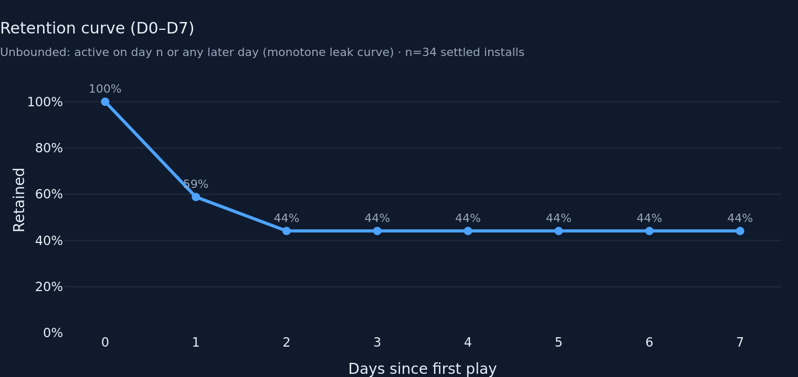
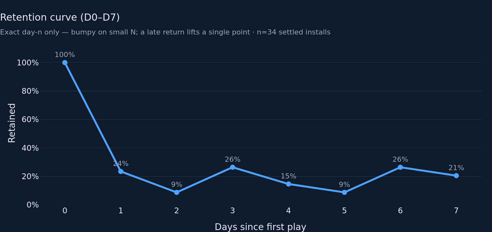
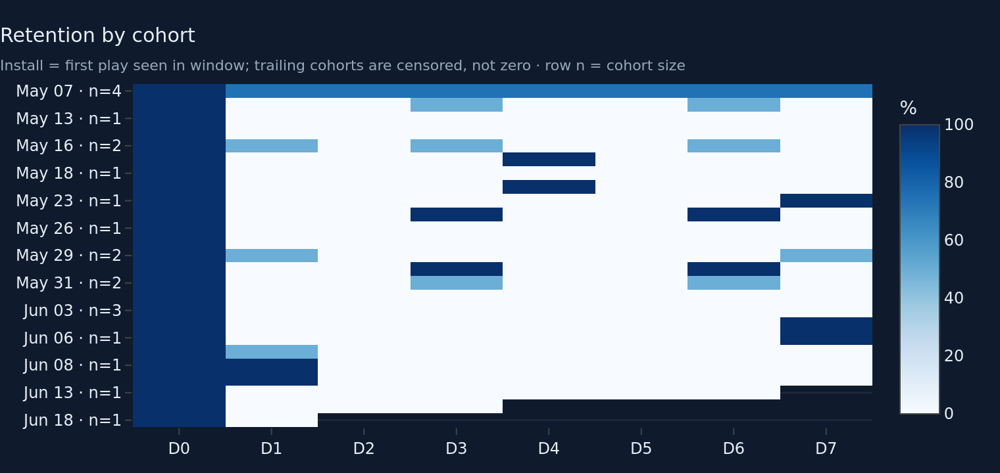
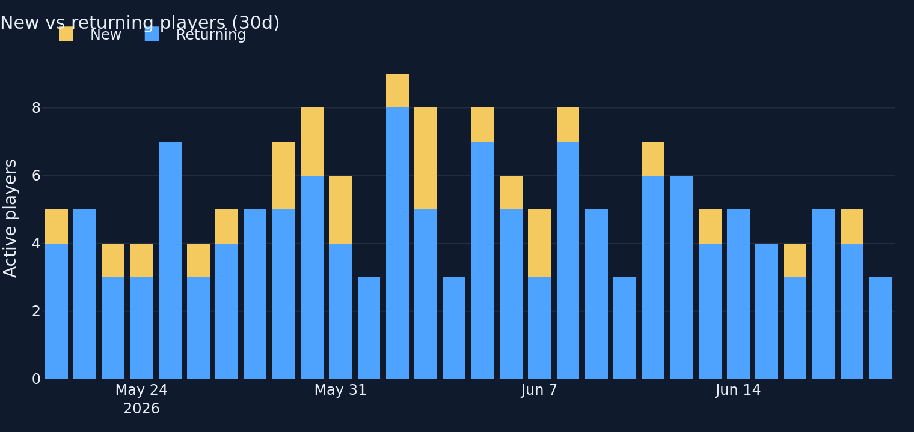
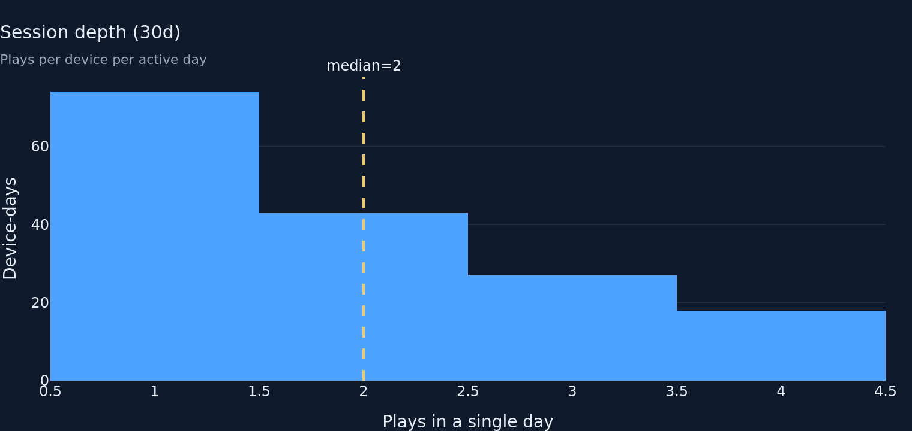

# Players & Retention — Round 1

**Goal.** Audit the highest-risk tab (retention methodology) and ship the
honest baseline: defensible retention math, a noise floor the eye can see, and
KPI definitions that can't read as broken. Keep structure and tests green.

## What I found in the baseline

1. **The "consistent denominator" curve was still non-monotone.** The docstring
   claimed the settled-cohort denominator "avoids a misleading non-monotone
   curve," but the curve measured *exact day-n* return, so it bumps anyway
   (fixture: D1 24% → D2 9% → D3 26% → D6 26%). On this small N a player who
   skips a week then returns on D7 single-handedly lifts D7 above D6. True, but
   reads as noise — and as a headline KPI, D7 > D6 looks broken.
2. **Cohort-size noise was invisible.** Most cohorts are 1–2 devices, so one
   returner swings a cell 50–100%. Nothing on the curve or triangle showed it.
3. **Tests imported the flat `metrics` namespace**, not the submodule the tab
   contract calls for.

## Changes

- **`metrics/players.py`**
  - `retention_curve(df, max_day=7, mode="unbounded"|"exact")`. **Unbounded**
    (new default) counts a device retained at offset n if it was active on day
    n *or any later day* (per-device max offset ≥ n). Monotone non-increasing
    by construction, so D7 ≤ D1 always holds. **Exact** keeps the old day-n
    behaviour, offered as a chart toggle only. Bad `mode` raises `ValueError`.
  - `retention_summary` now reads the **unbounded** curve for the D1/D7 KPIs.
    On the in-code cohort frame exact and unbounded agree at D1/D7 (no device
    gaps below offset 7), so the historical headline values (2/3, 1/3) are
    unchanged and provably correct.
  - New `settled_cohort_size(df, max_day)` → the n behind the pooled curve, for
    the curve subtitle and KPI help text.
  - Docstring rewritten to define both flavours and state the small-N posture.
- **`charts/players.py`**
  - `retention_curve(curve_df, mode=...)`: subtitle now states the definition
    *and* `n=<settled installs>`; hover shows `retained of n`.
  - `retention_matrix(matrix_df, sizes=...)`: cohort row labels carry `· n=<size>`
    so a vivid 100% row that is really one device can't pose as a trend.
- **`tabs/players.py`**: a `unbounded | exact` radio drives the curve;
  unbounded is default. Triangle is fed cohort sizes. D1/D7 KPI help text spells
  out the unbounded definition and shows n.
- **`tests/test_metrics_players.py`**: switched to `from metrics import players as m`;
  added monotonicity, D0-is-full-population, mode-validation, and
  `settled_cohort_size` tests; documented why the summary values survive.

## Fixture numbers (437 rows, 37 devices, ~43d span)

- **Settled cohort denominator: n = 34** installs (≤ today−7).
- **Unbounded** curve: D0 100% · D1 **59%** (20/34) · D2–D7 **44%** (15/34, flat).
- **Exact** curve: D0 100% · D1 24% · D2 9% · D3 26% · D4 15% · D5 9% · D6 26% · D7 21%.
  (The D3/D6 humps are the fixture's synthetic returners — exactly the artefact
  the unbounded view absorbs.)
- **Headline KPIs (unbounded):** D1 = 59%, D7 = 44%.
- **Bounce (7d):** 5 one-shots / 11 active = **45%**. Returning rate 7d = **55%**.
- **Engagement (30d):** 1 play 11 · 2–5 plays 9 · 6–20 plays 7 · 21+ plays 3.
- Cohort sizes range 1–4 devices (most are 1–2) — now visible on the triangle.

## Charts

- 
- 
- 
- 
- 
- 

## Methodology (the crux)

- **Install** = device's first `played_at` UTC date *within the fetched frame*
  (app fetches ≥120d). A device returning after a >120d gap reads as new —
  stated in the triangle subtitle and the new-vs-returning framing. Given only
  telemetry there is no cleaner definition; a true fix needs a server-side
  `first_seen`, out of scope for this tab.
- **Pooled curve denominator** is the *settled* cohort (install ≤ today−max_day),
  identical at every offset. This is correct and unchanged; what changed is the
  *retained* numerator flavour.
- **Unbounded vs exact.** Unbounded (active on day ≥ n) is the headline because
  it is monotone, D7 ≤ D1 holds, and it doesn't sell a single late returner as
  a D7 recovery. Exact (day-n only) is kept as a toggle for analysts who want
  the literal day-n rate, with a subtitle that flags it as small-N-bumpy.
- **Triangle** keeps per-cohort censoring: future `(cohort, offset)` cells are
  **NaN** (blank), never 0 — verified by `test_retention_matrix_shape_and_blank_cells`
  (today's cohort: D0 = 1.0, D1 = NaN). Cohort sizes ride the row labels.
- **Sanity checks pass:** D0 = 100% in both modes (test); unbounded curve is
  sorted-descending (test); triangle shows blanks not zeros (test).

## Tests

```
$ python -m pytest tests/test_metrics_players.py -q
............                                                             [100%]
12 passed in 0.56s
```

Full-suite note: `python -m pytest -q` currently fails to *collect* because
parallel in-progress work on the **gameplay** tab (`charts/__init__.py` still
imports `powerups_per_run`, which that tab renamed) and an **overview**
metric/test mismatch break import of the shared `charts` package and the
overview test module. Both are outside this tab's owned files
(`metrics|charts|tabs/players.py`, `tests/test_metrics_players.py`) and outside
what I may edit. My module plus the stable foundation tests are green:
`pytest tests/test_metrics_players.py tests/test_metrics_core.py tests/test_identity.py` → **37 passed**.

## Known limitations / open questions

- **Triangle contrast.** Near-0% (white) and censored-NaN (dark bg) cells can
  look similar at a glance; the cohort-size labels disambiguate, but an explicit
  "censored" hatch or a non-zero `zmin` floor is a possible polish.
- **Small N is structural, not cosmetic.** n=34 settled installs; per-cohort
  rows are 1–4 devices. The labels surface it, but any single-cohort read is
  noise — worth a director call on whether to suppress cohorts below a size
  threshold or band the pooled curve.
- **Windowed install** remains an approximation until server-side `first_seen`
  exists; framed in subtitles, not silently assumed.
- **Mode toggle vs visual budget.** The exact curve renders in the same panel
  via the radio (no extra visual). If the director prefers a single fixed basis,
  unbounded is the one to keep.
