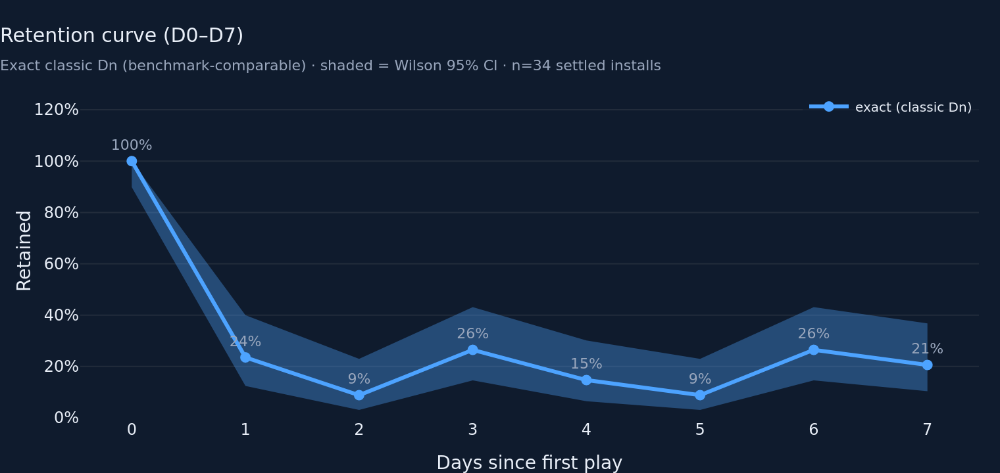
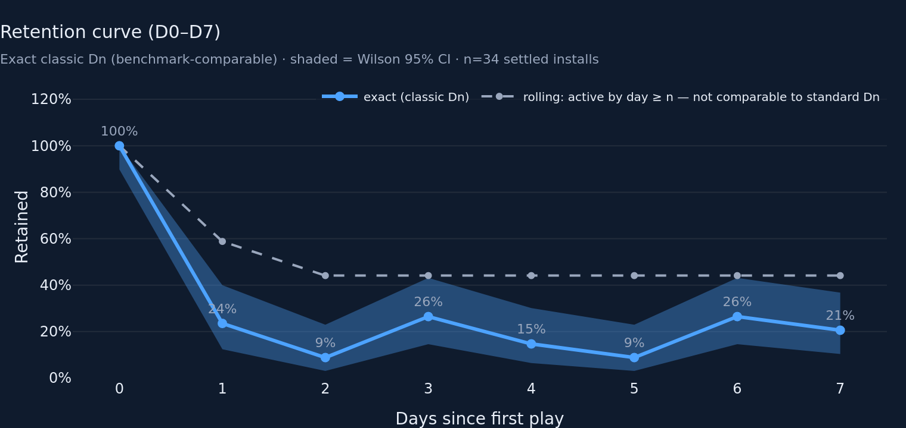
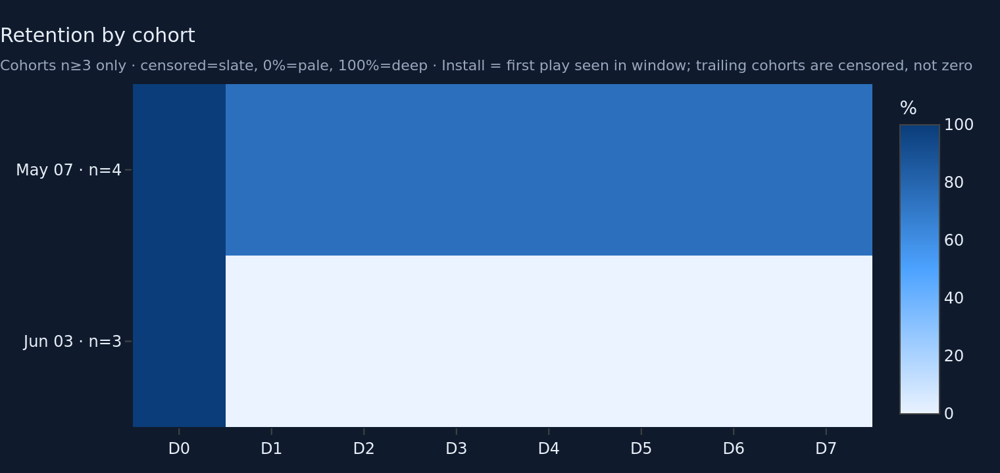
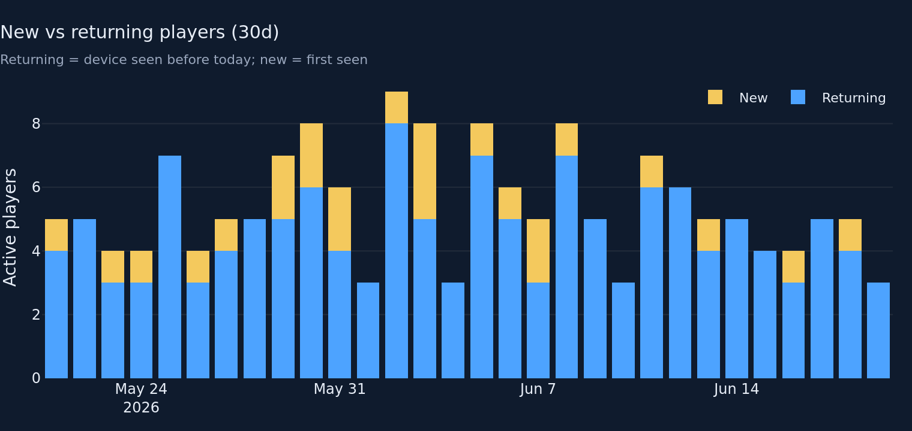
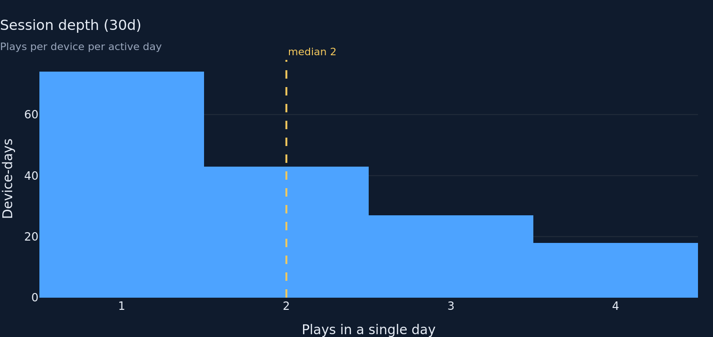
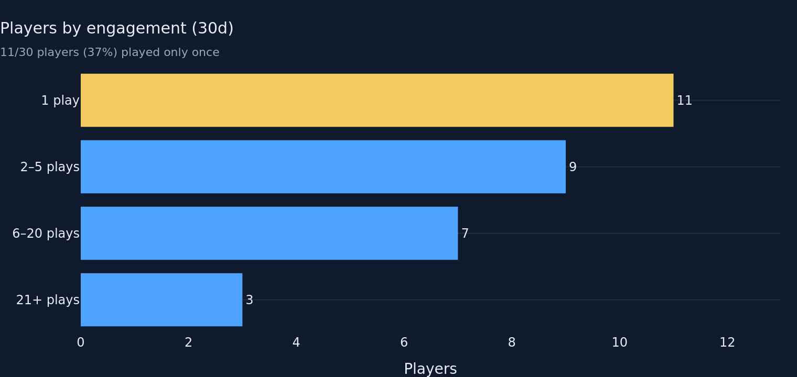

# Players & Retention — Round 2

**Verdict addressed:** ITERATE (round 1). Every directive below is implemented;
files touched are only `metrics/players.py`, `charts/players.py`,
`tabs/players.py`, `tests/test_metrics_players.py`.

## Directive 1 — kill the KPI-vs-benchmark contradiction

The cards previously showed UNBOUNDED D1=59% / D7=44% next to classic
same-day-n benchmarks (25–35% / 6–12%) — an apples-to-oranges read that
flattered the game. Resolved by making **exact / classic Dn** the single basis
for BOTH the KPI cards and the **default** retention-curve line, so card and
chart agree to the point and the benchmark comparison is now valid.

- `metrics/players.retention_summary` now reads the **exact** curve
  (was unbounded).
- `metrics/players.retention_curve` default `mode` flipped to `"exact"`.
- The **rolling** (unbounded) view is kept as a clearly-labelled SECONDARY dashed
  line on the same chart, behind a tab toggle (off by default). Its legend label
  is verbatim: *"rolling: active by day ≥ n — not comparable to standard Dn."*
- Headline now equals the curve's default D1/D7 — a viewer never sees a card
  number that disagrees with the curve.

## Directive 2 — caveats live on the cards

Each retention card's `help` now states the **basis** (classic Dn, exact day-n
return), the **settled cohort n**, the **Wilson 95% CI**, the **benchmark band**,
and the **windowed-install caveat** ("install = first play seen in the fetched
window; a pre-window return reads as new") — so a card screenshotted into a deck
without its chart still carries its own footnotes.

## Directive 3 — legible triangle

- `retention_matrix(df, max_day, min_cohort=MIN_COHORT_SIZE=3)` **suppresses
  cohorts below n≥3**, dropping the ~16 single-device noise rows the live 120d
  app returns (fixture cohort sizes: 16×n=1, 7×n=2, 1×n=3, 1×n=4 → 2 rows kept).
- New colorscale starts **pale at 0%** (`#EAF3FF`) → SKY → **deep at 100%**
  (`#0B3D7A`), so 0% no longer renders dark-like-100% on the INK page. Censored
  (NaN) cells sit over an explicit **slate** `plot_bgcolor` (`#243449`),
  distinct from both pale-0% and deep-100%. Subtitle spells out the legend:
  *"censored=slate, 0%=pale, 100%=deep."*
- PNG re-rendered from the actual wide fixture frame (the live shape): rows kept
  are **May 07 · n=4** and **Jun 03 · n=3**.

## Directive 4 — Wilson band on the default curve

`wilson_interval(retained, n)` (95% Wilson score interval — chosen over the
normal approx because it stays in [0,1] at the tiny-n and 0%/100% extremes this
tab lives at). `retention_curve` now emits `frac_lo`/`frac_hi` columns; the
chart shades the band so the D2=9% / D3=26% / D6=26% bumps read as **uncertain
small-N points**, not a discovered floor or recovery.

## Directive 5 — polish

- **Sessions histogram:** integer x-ticks (`dtick=1, tick0=1`), bins centred on
  integers (edges at .5), median annotation anchored to the line itself
  (`annotation_xanchor="left"`, gold) rather than the panel corner.
- **New-vs-returning:** legend moved out of the title band into the plot's
  top-right corner (`yanchor=top, y=0.99, xanchor=right`), and a subtitle added,
  so legend and left-anchored title no longer overlap. Same legend treatment
  applied to the retention curve (y-range lifted to 130% to clear the data).

## Directive 6 — tests

- `test_unbounded_dominates_exact` — pins `unbounded(offset) ≥ exact(offset)` at
  every offset (count and fraction) and asserts the gap is strict somewhere
  (offsets 2–6, where A is alive rolling but absent exact). This is the
  definitional inequality that makes the two non-interchangeable.
- `test_retention_curve_summary_is_exact_with_ci` — summary now exact basis;
  D1=2/3, D7=1/3, n=3, with Wilson bounds matching `wilson_interval(2,3)` /
  `(1,3)` and bracketing the point.
- `test_wilson_interval_bounds_and_degenerate` — [0,1] containment at 0%/100%,
  empty at n=0.
- `test_retention_matrix_suppresses_small_cohorts` — all-n=1 frame → empty
  triangle; `min_cohort=1` lets them back in.
- Updated `test_retention_matrix_shape_and_blank_cells` (today's n=1 cohort is
  now suppressed; the n=3 cohort survives) and `test_retention_on_empty` (new
  summary dict shape).

```
$ python -m pytest tests/test_metrics_players.py -q
...............                                                          [100%]
15 passed in 0.44s
```

Full-suite note: `python -m pytest -q` shows 1 unrelated failure in
`tests/test_metrics_gameplay.py` from in-flight parallel work on the **gameplay**
tab's owned files (`metrics/gameplay.py` + its test) — confirmed by `git stash`
(that test passes on the clean checkout, fails only with the other agents'
uncommitted edits). It is outside this tab's file scope. The players + stable
foundation suites are green:
`pytest tests/test_metrics_players.py tests/test_metrics_core.py tests/test_identity.py` → **40 passed**.

## Fixture numbers (437 rows, 37 devices, ~43d span)

- **Settled cohort denominator: n = 34** installs (≤ today−7).
- **Card basis = EXACT classic Dn:**
  - **D1 = 24%** (8/34) · Wilson 95% CI **12–40%** · benchmark 25–35%.
  - **D7 = 21%** (7/34) · Wilson 95% CI **10–37%** · benchmark 6–12%.
  - Cards now equal the default curve's D1/D7 points exactly.
- **Default (exact) curve, D0–D7:** 100 · 24 · 9 · 26 · 15 · 9 · 26 · 21 %
  (banded with the Wilson CI; the bumps now read as uncertainty).
- **Rolling (secondary, labelled non-comparable):** 100 · 59 · 44 · 44 · 44 · 44
  · 44 · 44 % — visibly above the exact line, illustrating directive 6's
  inequality.
- **Triangle (n≥3 only):** May 07 (n=4) ≈75% flat D1–D7; Jun 03 (n=3) 0% flat
  after D0.
- **Returning rate (7d):** 55% · **Bounce:** 5 one-shots / 11 actives = 45%.
- **Engagement (30d):** 1 play 11 · 2–5 plays 9 · 6–20 plays 7 · 21+ plays 3.
- **Session depth (30d):** median 2 plays/active-day, max 4, 162 device-days.

## Charts (re-rendered, dark `#0F1B2D`, 760×360 ×2)

- 
- 
- 
- 
- 
- 

## Known limitations / open questions

- **Triangle is thin by design.** After the n≥3 cut the live/fixture frame leaves
  2 cohorts. That's honest (the data genuinely has only 2 cohorts worth trusting)
  but the panel looks sparse; if the director prefers density over rigor, the
  knob is `min_cohort` (lowering to 2 restores 9 rows, at the cost of
  coin-flip cells). Flagging for a call.
- **Windowed install** remains an approximation until a server-side `first_seen`
  exists — now surfaced on the cards, not just the subtitle.
- **Visual budget:** the rolling overlay is a toggle on the existing curve panel,
  so the tab still ships ≤8 visuals.
