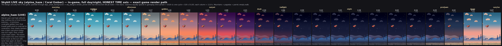
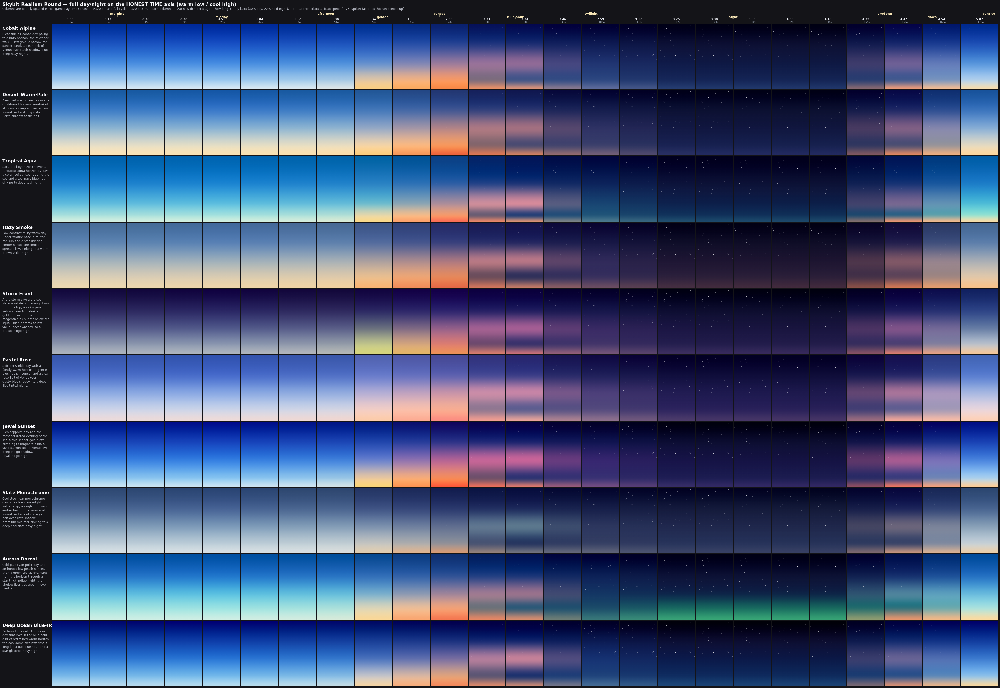
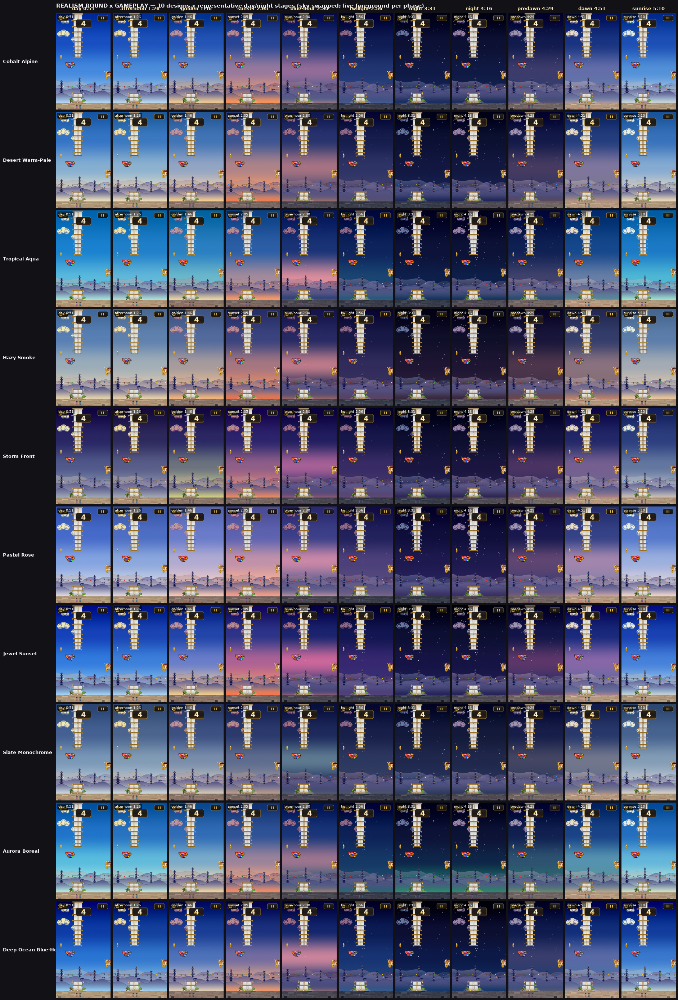
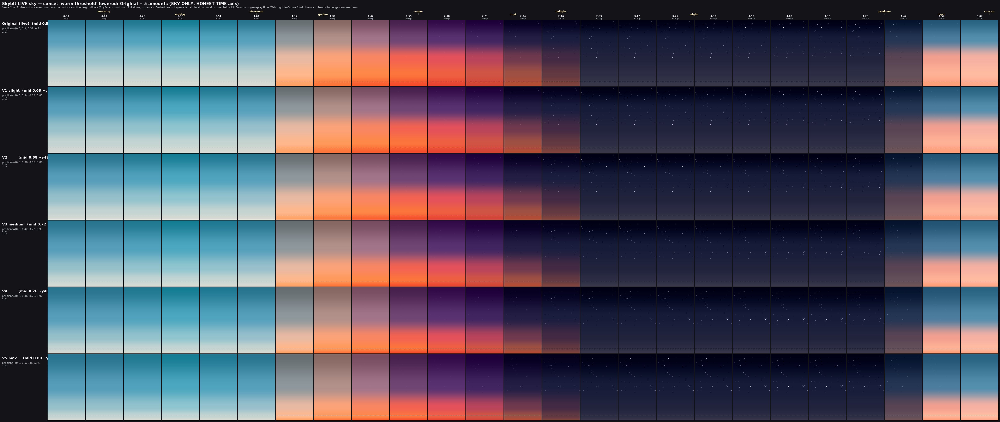
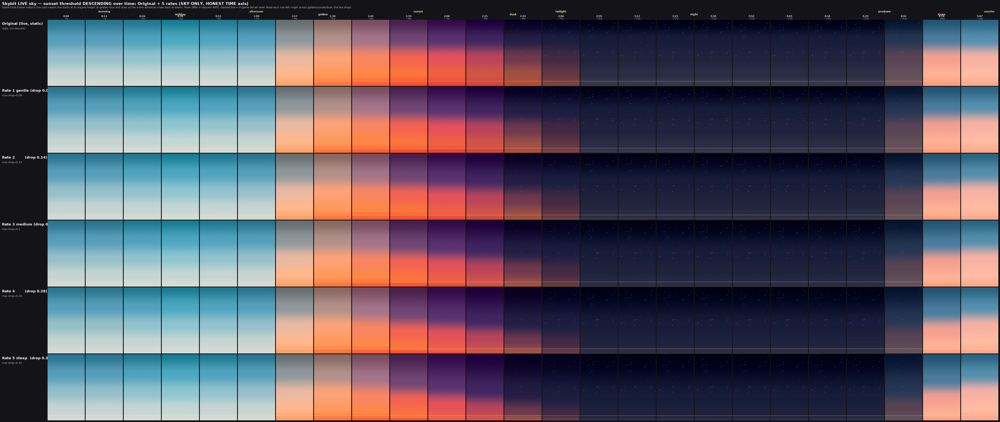

# Skybit — Sky Design Log (Coral Ember & the descending sunset threshold)

This folder holds the procedural **sky** design work for Skybit's day/night cycle.
This README is the canonical summary of the most recent effort (June 2026) and a
trace for whoever changes the sky next: what's live, where it lives in code, how
we got here, and how to retune it.

> Branch: `v5_skybit_merge_graphics_sky_changes` → deploys to the `/v5_test_sky/`
> web build. `main`/`v5_skybit` are unaffected until this is merged forward.

---

## TL;DR — what's live now

`ACTIVE_SKY_DESIGN = "alpine_haze"` (`game/sky_designs.py`) — the **"Coral Ember"**
evening: a glacial cyan-cool high-altitude **day** → a luminous coral-gold
**golden hour** → coral-red→coral-plum **sunset** → a deep cool plum-indigo,
star-rich **night** that reads as night yet never goes black → a fresh
coral-cream **dawn**.

**New in this effort:** the sunset "warm threshold" — the horizontal line where the
cool upper dome gives way to the warm sunset band — now **descends over time**.
It starts at its original height at golden hour and sinks toward the horizon as the
sun sets (rising back at dawn), instead of sitting at a fixed height. The descent
is a **steady, linear ramp from golden hour** (Rate 3, `descent_drop = 0.20`).

*The live Coral Ember sky across one full day/night (columns = real gameplay time).
Watch the warm band sink across the golden→sunset→dusk columns.*

---

## Where it lives in code — the levers

| Lever | File / symbol | What it controls |
|---|---|---|
| Active design | `game/sky_designs.py` → `ACTIVE_SKY_DESIGN` | Which registered sky is live. |
| Live bake path | `game/sky_designs.py` → `render_active` | Two-bucket OKLab blend + stars; the *exact* in-game sky. |
| Colours & timing | `game/biome_sky_keyframes.py` → `_ALPINE_HAZE_KF` | Per-phase `sky_top/mid/bot/horizon` + `star_alpha` (the day→night colour arc). |
| The spec | `game/biome_sky_keyframes.py` → `ALPINE_HAZE` | Binds the keyframes to a `SkyParams`. |
| Threshold height | `game/biome_sky.py` → `SkyParams.positions` | Vertical placement of the 5 stops; the **`sky_mid`** stop is the warm onset (the line). |
| Descent amount | `game/biome_sky.py` → `SkyParams.descent_drop` | How far the warm band translates down over the evening (`0.0` = static; live = `0.20`). |
| Descent window | `game/biome_sky.py` → `SkyParams.descent_anchors` | `(golden, night, dawn0, dawn1)` phases shaping the descent (live = `(0.235, 0.56, 0.82, 0.97)`). |
| Descent easing | `game/biome_sky.py` → `_evening_progress` | The 0→1 envelope; **currently linear** ("steady from golden"). |
| Stop assembly | `game/biome_sky.py` → `_sky_stops`, `paint_sky` | Apply `positions` + descent at a given phase and bake the gradient. |

Every other biome keeps `descent_drop = 0.0`, so the descent is opt-in and changes
nothing elsewhere.

---

## How we got here

1. **Ten full-day realism designs (review-only study).** A clean-sheet exploration
   grounded in real sky behaviour — *warmth low / cool high / darkness from the top
   down*, the full day→golden→sunset→Belt-of-Venus→twilight→night→dawn arc on a
   shared realistic clock. Run through the graphics-designer ⇄ art-director loop to
   a SHIP-READY set. **Not integrated** — a palette library for future biomes.
   
   

2. **Identified the live design.** The live `alpine_haze` keyframes are the
   **"Coral Ember"** row (#4) of the earlier evening study, ported verbatim, with the
   night un-blacked + stars added and a subsequent subtle dim (night top `(23,28,57)`).

3. **Single-design live filmstrip.** A faithful in-game day-cycle strip of *only* the
   live design, rendered through the real `render_active` path (above).

4. **Static threshold sweep.** Original + 5 versions with the warm line at a fixed
   *lower* position (a `SkyParams.positions` sweep of `sky_mid` 0.58 → 0.80).
   

5. **Descending-threshold rate study.** Original + 5 versions where the line *descends
   over time* at different rates — the realism refinement (a real sunset's band sinks
   as the sun drops).
   

6. **Shipped Rate 3.** Added phase-driven positions to the engine (`descent_drop` +
   `_evening_progress`) and set `alpine_haze` to `descent_drop = 0.20`, then tuned the
   easing to a **steady linear ramp from golden hour**.

---

## The ten realism designs (review-only library)

From `round_realism_3*` — fresh full-day skies for future biomes (not live):

1. **Cobalt Alpine** — clear thin-air cobalt day, textbook low-gold/narrow-red sunset, clean Belt of Venus, deep navy night.
2. **Desert Warm-Pale** — bleached sandy day, deep amber-red low sunset, strong slate Earth-shadow.
3. **Tropical Aqua** — cyan-over-turquoise day, coral-reef sunset, teal-navy blue-hour to deep teal night.
4. **Hazy Smoke** — milky low-contrast day, smouldering muted-ember sunset, warm brown-violet night.
5. **Storm Front** — bruised slate-violet deck + pre-storm yellow-green light leak, bruise-indigo night.
6. **Pastel Rose** — periwinkle day, blush-peach sunset, clear rose Belt of Venus, lilac-tinted night.
7. **Jewel Sunset** — sapphire day, saturated scarlet-gold→magenta dusk over a visible Earth-shadow band.
8. **Slate Monochrome** — cool near-monochrome day, one thin horizon ember, readable slate-indigo night.
9. **Aurora Boreal** — pale-cyan polar day, low peach sunset, green-teal aurora over a star-thick night.
10. **Deep Ocean Blue-Hour** — abyssal ultramarine day, brief warm horizon swallowed by the cool dome.

**To adopt one:** copy its keyframes from `tools/sky_round_realism.py` into a new
`BiomeSpec` in `game/biome_sky_keyframes.py`, register it in `BIOMES`, and point
`ACTIVE_SKY_DESIGN` at it (or replace `_ALPINE_HAZE_KF`).

---

## Reproduce the figures

All tools are headless; prefix with `SDL_VIDEODRIVER=dummy SDL_AUDIODRIVER=dummy`.

| Figure | Tool |
|---|---|
| `round_realism_3{,_ingame}.png` | `tools/preview_sky_round_realism.py` / `_ingame.py` (data: `tools/sky_round_realism.py`) |
| `alpine_haze_live_ingame_timeaxis.png` | `tools/preview_alpine_haze_live_ingame.py` |
| `alpine_haze_threshold_lower_{sky,ingame}.png` | `tools/preview_alpine_haze_threshold_sky.py` / `.py` (data: `tools/sky_alpine_haze_threshold.py`) |
| `alpine_haze_threshold_descent_{sky,ingame}.png` | `tools/preview_alpine_haze_descent_sky.py` / `.py` (data: `tools/sky_alpine_haze_descent.py`) |

The `_live_*` and in-game tools render through the real `render_active` path, so they
are pixel-faithful to the game; the `_sky` tools show the full dome (no terrain).

---

## Future-change cookbook

- **Retune the descent rate** → change `descent_drop` on `ALPINE_HAZE`
  (`game/biome_sky_keyframes.py`). The rate study (`alpine_haze_threshold_descent_*`)
  maps drops 0.08–0.36 to gentle→steep.
- **Shift when the descent starts/ends** → `descent_anchors` (golden, night, dawn0,
  dawn1). These track the keyframe timing; keep them consistent with `_ALPINE_HAZE_KF`.
- **Change the easing** → `_evening_progress` (`game/biome_sky.py`). Currently linear;
  swap to `_smoothstep(...)` for ease-in-out, or another curve.
- **Change colours/timing** → edit `_ALPINE_HAZE_KF` keyframes (the colour arc).
- **Swap the whole sky** → adopt a realism design (above) or a different registered biome.

**Guardrails (from `CLAUDE.md`):** procedural-only; **both build targets must stay
green** (native + pygbag/WASM — the bake is pure-Python, no `pygame.mixer`/numpy on
the web path); fixed-timestep physics is untouched by sky work. After any change:
re-render the live filmstrip to eyeball it, run `python -m pytest tests/`, and a
headless `main.py` smoke.

---

## Changelog (this effort, on `v5_skybit_merge_graphics_sky_changes`)

| Commit | Summary |
|---|---|
| `683be3f` | Round 1 — ten realism full-day sky designs (study) |
| `27d0096` | Round 2 — apply art-director critique |
| `cea71dd` | Round 3 — ship-ready micro-polish |
| `8d3dfc0` | Single-design in-game filmstrip of the live sky |
| `77cd20f` | Static sunset-threshold height sweep (study) |
| `3ad9af0` | Descending-threshold rate study |
| `372ddcc` | **Ship** descending sunset threshold (Rate 3) on the live sky |
| `76abc59` | Make the descent a steady **linear** ramp from golden hour |

**Provenance:** this folder also holds earlier exploration sheets from prior sessions
that led to Coral Ember — `alpine_sunsets_*`, `sky_evening_*` (evening study, the
un-blacking + stars, and the subtle dim). They predate this effort and are kept for
history.
