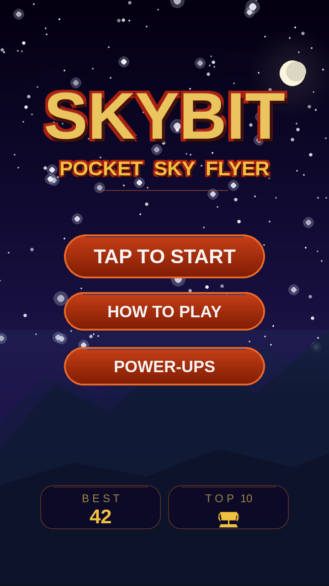
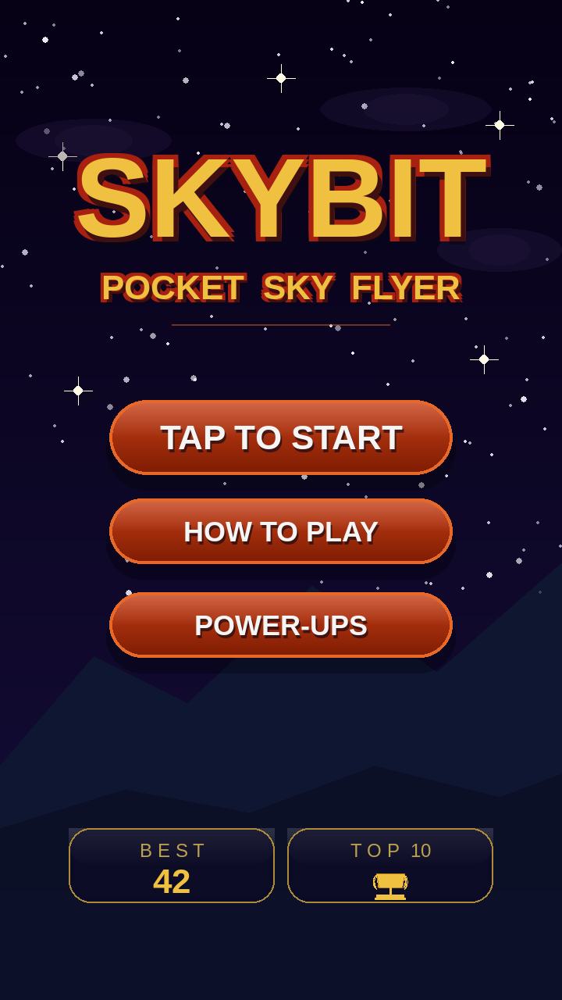
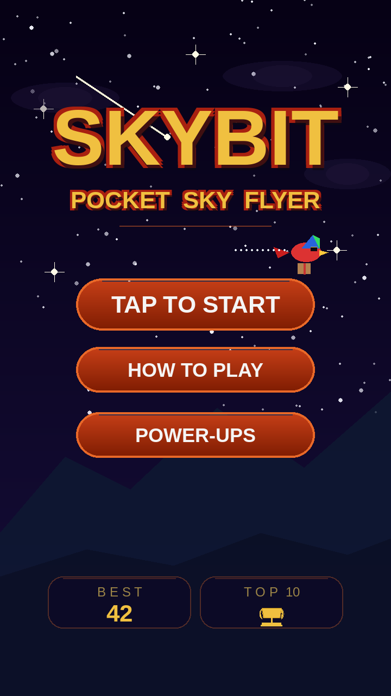
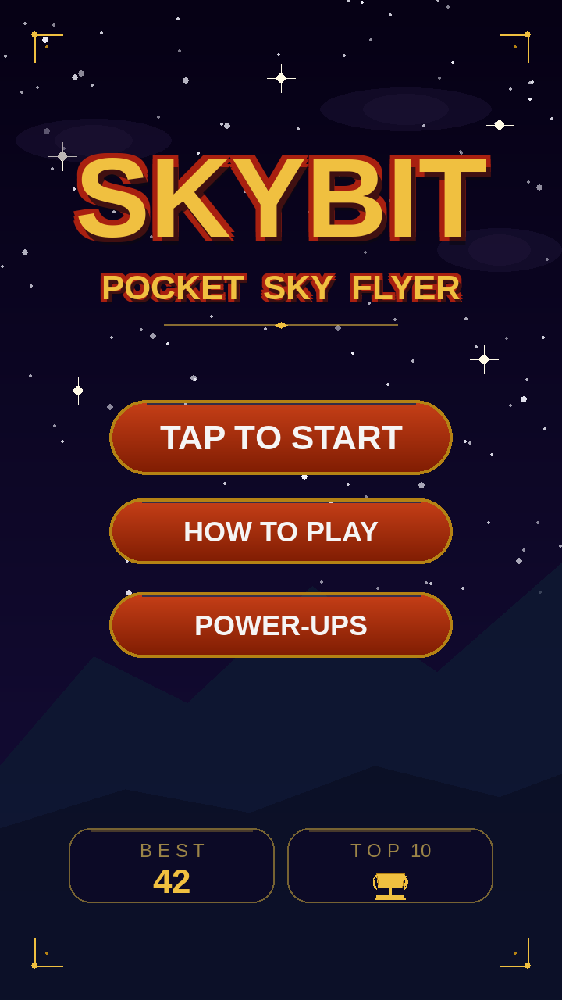

# Skybit — Menu Polish (5 candidates)

**Brief:** take the existing v3 menu as-is and *polish it to
extraordinary*. No new frames, no new themes, no story overlays — just
five different ways to push the rendering quality so the menu looks
premium without changing what's there.

All five mockups are **720 × 1280** (2× the game's canvas) for crisp
display on web and modern mobile. They use only Skybit's canonical
palette (gold `#F0C040`, red `#A82010`, orange `#E86828`, deep purple
`#0C0826`, night-deep `#060115`) and the bundled Liberation Sans font.

The layout — SKYBIT title, POCKET SKY FLYER subtitle, orange divider,
three red-gradient pills (TAP TO START / HOW TO PLAY / POWER-UPS),
BEST + TOP 10 twin panels, mountain silhouettes — is identical across
every variant. Each one pushes **one** quality axis.

Pick one and I'll roll the same polish across the remaining
non-gameplay screens (pause / stats / game-over / name-entry /
leaderboard / power-ups help / how-to-play).

---

## 1 — Cinematic Sky

**Push axis:** atmosphere & depth.

Same v3 layout. The sky gradient is deepened with a hint of warmth
just above the horizon. A **soft full moon** sits top-right adding a
quiet focal point. **180+ stars** in 4 size tiers, with soft halos on
the largest ones. **Three mountain layers** instead of two, with a
faint atmospheric haze band where mountains meet the sky. The title
keeps its canonical gold-on-red treatment with a subtle moonlight rim
on its top edge. Cloud puffs get softer multi-layer edges.

**Best at:** depth and mood. Reads as the v3 menu rendered at a
higher fidelity bar.

---

## 2 — Refined Glass

**Push axis:** UI surface quality.

Same v3 layout. The pills become **glassy**: the top half gains a
subtle frost-light highlight, the bottoms get a soft drop shadow that
lifts them off the page. The **BEST + TOP 10 panels become true
glassmorphic cards** — more translucent, with a thin gold-leaf rim
and a faint inner warm glow instead of v3's solid dark panel + orange
border. A handful of cross-flare sparkle stars add tactile detail to
the sky.

**Best at:** making the touch targets feel premium without changing
their colour or shape.

---

## 3 — Stage Light

**Push axis:** lighting & focus.

Same v3 layout. A **very subtle warm spotlight halo** sits behind the
title (you have to look for it — that's the point), giving the title
region a quiet lift. The **mountain tops gain a thin warm rim light**
along their silhouette where they catch the same warmth. The three
pills sit on soft drop shadows for depth. Everything else is exactly
v3.

**Best at:** making the SKYBIT title feel like a *hero element*
without altering the title art itself.

---

## 4 — Living Scene

**Push axis:** in-world life.

Same v3 layout. **Pip is flying** through the menu — fully-rendered
scarlet macaw with sunglasses + parcel trailing + motion-trail dots
behind him, positioned just below the subtitle so he's clearly the
star. A **shooting star streaks** across the upper-left sky. A few
**cross-flare sparkle stars** punctuate the field. Mountains, title,
pills, and panels are unchanged v3.

**Best at:** the menu feels like a paused moment from the gameplay
rather than a static splash screen.

---

## 5 — Micro Ornament

**Push axis:** refinement & taste.

Same v3 layout. **Tiny gold corner flourishes** — L-shaped marks with
a single dot inset — anchor the four corners (NOT a frame, just
corner detailing). The orange divider under the title is **replaced
with a hairline gold underline + tiny diamond accent** for a more
elegant feel. The pill borders shift from `ORANGE_BORDER` to
`GOLD_DEEP`, and the BEST + TOP 10 panel accents go to bright gold
instead of orange. Everything else is unchanged v3.

**Best at:** turning the dial just slightly more toward "premium"
without spending a single new pixel of decoration.

---

## How the chosen polish carries to the rest of the screens

After you pick one, the same polish language will roll onto every
other non-gameplay screen — pause overlay, run summary, game over,
name entry, leaderboard, power-ups help, and how-to-play — keeping
each screen's existing layout and just pushing it to the same
fidelity bar.
