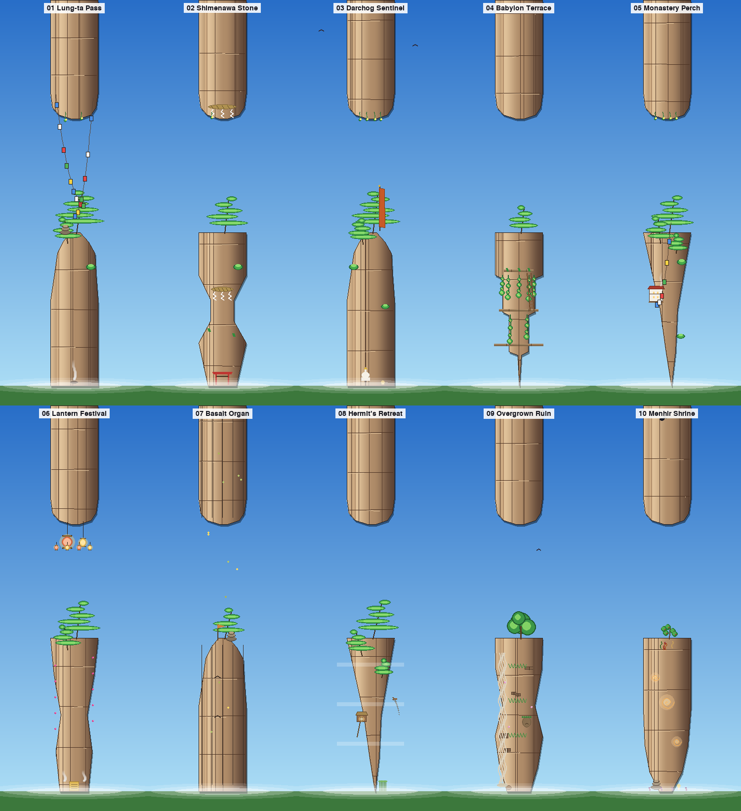

# Pillar Redesign — 10 Options for Approval



*Rendered by `tools/pillar_redesign_preview.py` — 1500×1640 canvas, 5 columns
× 2 rows. Row 1 = options 1–5, row 2 = options 6–10.*

**Status:** proposals only — nothing is wired into the game yet. Pick the
ones you want and I'll build them against the existing pillar pipeline in
`game/draw.py` / `game/entities.py`.

## Goals

- **Less baked, more alive.** The current pillar reads as a clean stone body
  with a hint of vegetation and a single pine on the cap. Target a **lived-in
  mountain column** instead: weathered, pilgrim-touched, grown-over.
- **Vegetation coverage 10–30%** of the silhouette (measured as "leafy /
  mossy / flowering area over total stone area"). Each option below states an
  explicit target.
- **Signature decorations** drawn from real mountain cultures (researched, not
  invented): Tibetan prayer flags, Japanese shimenawa ropes, Chinese lantern
  festivals, Bhutanese cliff-monasteries, Hanging-Gardens terraces, Celtic
  menhirs, etc. Cited at the end.
- **Pillar shapes may vary** within realistic weathering — no fantasy crystals,
  no obviously-cartoon proportions. Erosion, tilt, fracture, stepping,
  fluting, bulbous caps are all OK; they occur in nature.

## Design axes each option fixes

| Axis | What it controls |
|---|---|
| **Silhouette** | Overall shape beyond the current rounded spire |
| **Vegetation %** | Target leafy / mossy coverage (10–30%) |
| **Vegetation mix** | Which species: pine, moss, fern, shrub, vine, flowers |
| **Ornaments** | Cultural decorations: flags, ropes, lanterns, cairns, carvings |
| **Wildlife** | Optional: a bird / butterfly / small animal that implies life |

## How to read each option

```
N. Name
   Inspiration · Shape · Vegetation XX% · Ornaments summary
   Detail paragraph, decoration list.
```

---

## Options

### 1. Lung-ta Pass — Tibetan prayer-flag ridge

*Inspiration: Tibetan mountain-pass cairns · Shape: slender spire (current) ·
Vegetation 15% · Ornaments: prayer flags + cairn + juniper smoke*

A pilgrim's high pass. Thin horizontal **lung-ta flag strings** (the
traditional 5-colour order: blue / white / red / green / yellow) run from the
top pillar's shoulder diagonally down across the gap to the bottom pillar's
peak — two crossing strings, sagging in the wind. A **small stacked cairn**
sits on the peak ledge beside the pine. A thin column of **juniper smoke**
rises from a carved rock bowl at the base. Vegetation: the existing pine,
plus 2 smaller companion shrubs, a moss cascade under the top pillar's fang,
and hardy grass tufts in crevices.

**Ornaments:** 2 lung-ta flag strings · 1 cairn (3 stones) · 1 smoke bowl ·
1 carved mani stone with painted mantra at the base.

---

### 2. Shimenawa Stone — Japanese sacred rock

*Inspiration: Shinto sacred-rock ropes · Shape: stout rounded column with a
"neck" groove · Vegetation 12% · Ornaments: thick woven rope + paper shide*

The pillar is clearly a **yorishiro** — a stone the kami inhabits. A thick
twisted **rice-straw shimenawa rope** wraps around the narrow neck of the
bottom pillar (and a smaller rope around the top pillar's fang), with
**five white zigzag shide paper streamers** hanging from each rope,
fluttering slightly. Sparse but carefully-placed vegetation: a single
wind-bent pine clinging to the cap, moss patches in the shade of the rope,
a small fern cluster on the ledge. A tiny weathered wooden **torii gate**
stands at the base.

**Ornaments:** 2 shimenawa ropes (one per pillar) · ~10 shide streamers ·
1 mini torii · 1 offering plate with pebbles.

---

### 3. Darchog Sentinel — vertical banner pole

*Inspiration: Tibetan darchog vertical prayer flags · Shape: slender spire ·
Vegetation 18% · Ornaments: tall flag pole + stupa*

A lone **vertical darchog pole** rises from the peak, carrying one tall
narrow cloth banner (red or saffron) with wind-frayed edges — this is the
hero ornament. A small whitewashed **stupa shrine** sits at the base with a
thin gold spire. Vegetation is stronger than option 1: two pines staggered
on the peak, a dense moss mat across the top pillar's cap, a climbing shrub
on the bottom pillar's face. A couple of crows circle in the sky behind.

**Ornaments:** 1 darchog pole with banner · 1 stupa · 1 butter-lamp on the
base ledge · 2 distant bird silhouettes.

---

### 4. Babylon Terrace — hanging garden tiers

*Inspiration: Hanging Gardens of Babylon + cliff hanging gardens (Glen Canyon)
· Shape: stepped / tiered column with 3 visible ledges · Vegetation 28%
(heavy) · Ornaments: terrace walls, irrigation stones, a small ladder*

The bottom pillar is carved-weathered into **three distinct terraces** — not
dramatic staircase, just clear shelf-breaks. Each shelf is **lush** with
cascading vines spilling over the edge, a tuft of ferns, and a band of small
flowering plants (orange / yellow / pink). The top pillar has a **mossy drip
line** where water has carved a channel. A tiny **wooden ladder** leans
between two terraces — someone gardens here. One pine on the peak, smaller
than usual so the vegetation carries the composition.

**Ornaments:** 3 low stone terrace walls · 1 wooden ladder · 1 carved
irrigation spout with a drip · scattered clay pot remnants.

---

### 5. Monastery Perch — Bhutanese cliff-dzong

*Inspiration: Paro Taktsang "Tiger's Nest" style cliff monasteries ·
Shape: slender but slightly leaning spire · Vegetation 20% · Ornaments:
tiny monastery building clinging to mid-face*

A **miniature two-storey whitewashed monastery building** (red roof, narrow
windows, small wooden balcony) clings impossibly to a ledge halfway down the
bottom pillar, as if the rock had been carved out around it. Small prayer
flag lines flutter from the balcony to a pine above. A few thin wisps of
smoke from a chimney. Vegetation: dense alpine pines staggered above and
below the building, climbing shrubs along the stone face, a moss cascade
under the top pillar.

**Ornaments:** 1 monastery balcony building · 1 short prayer-flag line
(~5 flags) · chimney smoke · a tiny figure of a monk on the balcony (optional).

---

### 6. Lantern Festival — Chinese red-lantern column

*Inspiration: Chinese Mid-Autumn / Lantern Festival cliff shrines ·
Shape: stout column with slight waist · Vegetation 15% · Ornaments:
lantern strings, incense, gilded plaque*

**Dense clusters of red paper lanterns** with gold tassels hang between the
two pillars (two sagging strings of ~5 lanterns each, plus one hero lantern
much larger on a short cord from the top pillar's underside). A small
**gilded plaque** carved with calligraphy is mounted at the base, flanked by
two incense stick holders with thin smoke rising. Vegetation: one pine, one
small bamboo cluster, bougainvillea (bright magenta) climbing the face.

**Ornaments:** 2 lantern strings (10 small) · 1 hero lantern · 1 plaque ·
2 incense holders + smoke.

---

### 7. Basalt Organ — fluted hexagonal column

*Inspiration: Giant's Causeway / Devils Postpile / Svartifoss basalt columns ·
Shape: vertically fluted column with sharp parallel ridges · Vegetation 10%
(sparse, harsh mountain) · Ornaments: weathered pole + cairn*

The pillar body has **distinct vertical fluting** — a cluster of hexagonal
basalt columns fused into a single spire, each face a narrow flat panel
instead of a smooth curve. This is the most **geologically striking** of the
ten. Sparse vegetation (alpine conditions): lichen patches, tiny yellow
cushion flowers, a single stunted pine leaning from the cap. A single
**weathered wooden pole** with a strip of faded orange cloth sits on the
peak — a minimalist trail marker. A small 3-stone cairn.

**Ornaments:** 1 marker pole with cloth · 1 cairn · a pair of carved notches
in the stone (Norse-style) · 1 raven perched on the cap.

---

### 8. Hermit's Retreat — Chinese landscape painting

*Inspiration: Song Dynasty shan shui (Ma Yuan, Li Cheng, Guo Xi) ·
Shape: jagged leaning spire, slight backward lean · Vegetation 20% ·
Ornaments: tiny wooden hut + rope bridge stub*

Read as a scene from a classical Chinese ink painting. A **tiny wooden
hermit's hut** (thatched roof, open door, single window, faint warm glow
inside) sits on a tucked-away ledge of the bottom pillar. A broken **rope
bridge stub** dangles off the far side, suggesting a larger path cut off by
time. Vegetation is painterly: **a few twisted pines** on different ledges at
sharp angles (like brush strokes), wisps of mist wrapping the column,
bamboo spray at the base. A **hermit figure in robes** (optional tiny
silhouette) at the hut door.

**Ornaments:** 1 hut (with glow) · 1 rope bridge stub · 1 hanging scroll on
the face · bamboo cluster · a walking-stick leaning against the hut.

---

### 9. Overgrown Ruin — jungle temple swallowed by growth

*Inspiration: Ta Prohm at Angkor, Tikal, Mayan ruins reclaimed by jungle ·
Shape: wider, more eroded column with visible carved stone blocks ·
Vegetation 30% (maximum) · Ornaments: half-buried stone carving + strangler-fig roots*

The pillar is ancient — once worked stone, now reclaimed. **Rectangular carved
stone blocks** are visible in several places where weathering has exposed the
underlying masonry. A **strangler-fig root system** crawls down the side of
the bottom pillar, thick and whitish against the dark stone. Vegetation is
lush: dense ferns on every ledge, orchid clumps, hanging moss curtains, a
large leafy tree replacing the usual pine on the peak. A **cracked stone
face** (serene expression, half-overgrown) is embedded near the base. A
butterfly drifts through the gap.

**Ornaments:** 4 exposed masonry blocks · 1 stone face statue · 1 strangler
fig root cascade · 1 weathered urn at the base · 1 butterfly.

---

### 10. Menhir Shrine — Celtic standing stone

*Inspiration: European menhirs, Iberian cromlechs, megalithic sites (Callanish,
Carnac) · Shape: fat bulbous monolith with slight tilt, mushroom-like ·
Vegetation 12% (sparse moorland) · Ornaments: glowing carvings + tied ribbons*

A primeval marker stone. The bottom pillar is **thick and squat** (not
slender) with a slight tilt as if settled unevenly over centuries. Its face
bears **shallow carved spirals and knotwork** that catch the light faintly —
a subtle warm glow, as if still warm from ritual. **Linen ribbons** in
natural-dyed colours (ochre, burgundy, deep green) are knotted around the
narrowest part, left by pilgrims. At the base: a **small offering cairn**,
a few dried flower bundles, a stub candle. Vegetation is low and wild:
heather tufts, lichen blotches, one wind-bent rowan tree with red berries
on the cap. A **raven** perches on the top pillar's fang.

**Ornaments:** spiral carvings with subtle glow · 4 tied ribbons · 1 offering
cairn · 1 dried flower bundle · 1 candle stub · 1 raven.

---

## How to pick

Reply with numbers (e.g. `"2, 5, 9"`, ranges `"1-3, 7"`, or `"all"`). Only the
chosen options will be implemented; the others stay on paper.

## Sources consulted for cultural accuracy

- [Prayer flag — Wikipedia](https://en.wikipedia.org/wiki/Prayer_flag)
- [Prayer Flags and Cairns in the Himalayas](https://greensocietyadventure.com/blog/prayer-flags-and-cairns)
- [Shimenawa — Wikipedia](https://en.wikipedia.org/wiki/Shimenawa)
- [Shimenawa: Sacred Ropes of Japan — Japan Experience](https://www.japan-experience.com/plan-your-trip/to-know/understanding-japan/shimenawa)
- [Hanging Gardens of Babylon — World History Encyclopedia](https://www.worldhistory.org/Hanging_Gardens_of_Babylon/)
- [Hanging Gardens — Glen Canyon NPS](https://www.nps.gov/glca/learn/nature/hanginggardens.htm)
