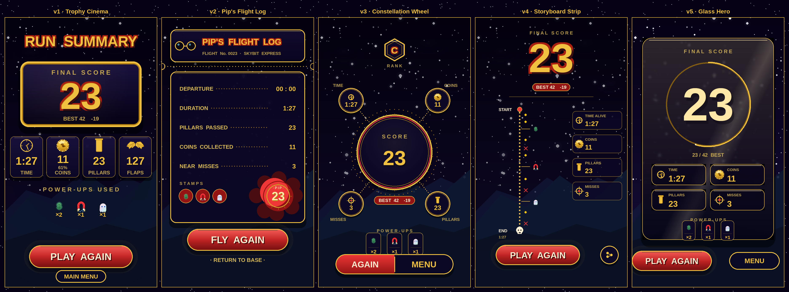
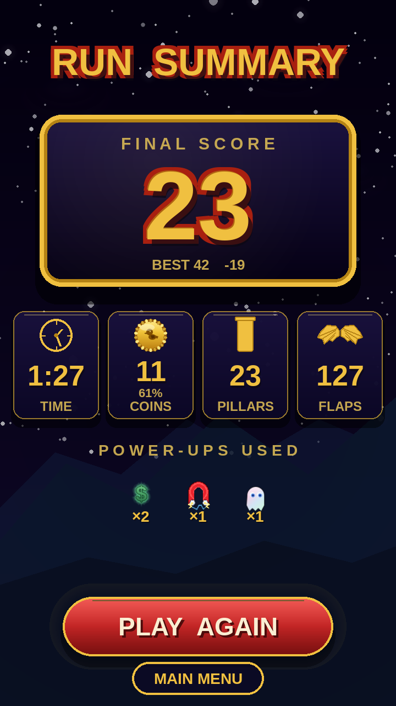
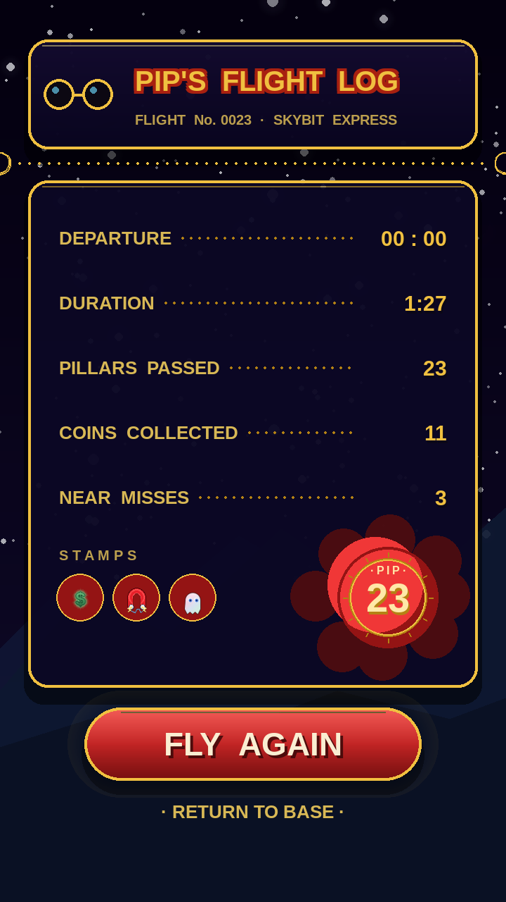
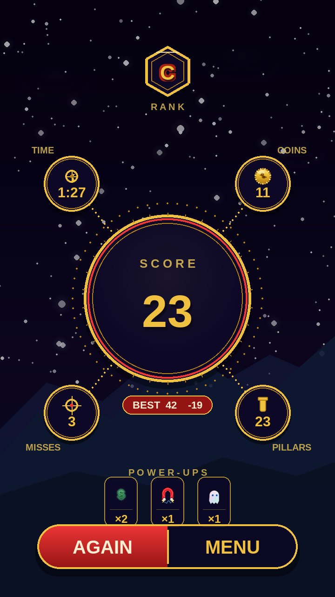
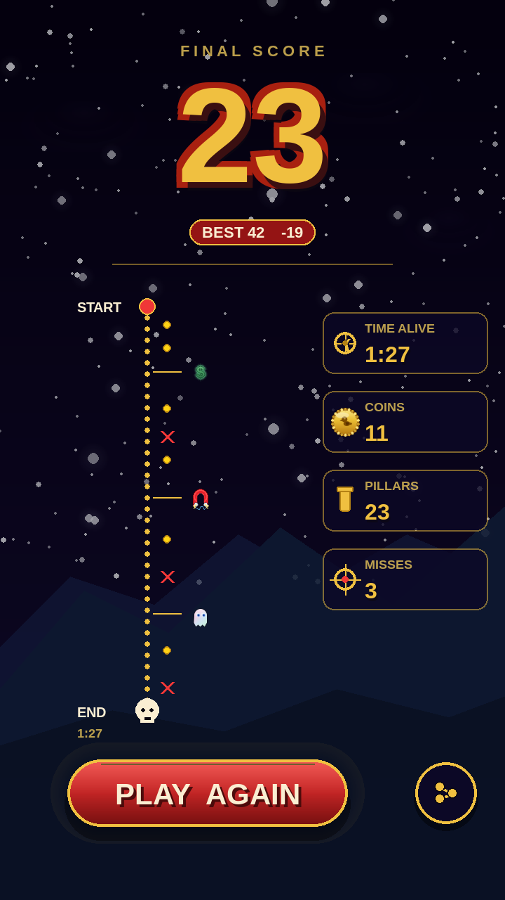
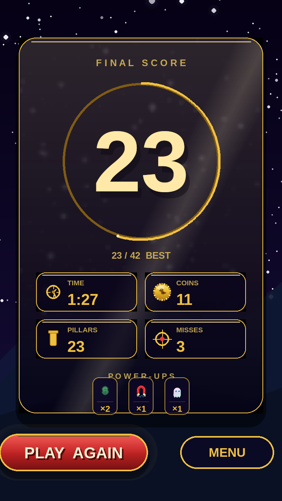

# Run Summary — 5 Redesign Candidates

The current run-summary screen (`docs/menu_polish/v3_scarlet_stats.png`)
is functional but reads like a spreadsheet — small medallion, five label/
value rows, no celebration of the run. These 5 candidate redesigns push
the screen well past that baseline while staying inside the established
**Pip Scarlet** theme (gold + scarlet + deep navy, twinkling stars,
mountain silhouettes, Liberation Sans Bold).

All mockups use the same sample data so they can be compared directly:
- **score** 23, **best** 42 (so −19 vs best)
- **time** 1:27, **coins** 11, **pillars** 23, **near misses** 3
- **power-ups picked**: triple, magnet, ghost (1 each)

Renderer: [`tools/gen_run_summary_redesigns.py`](../../tools/gen_run_summary_redesigns.py)
— same Pygame primitives the game uses, so what's drawn here is what
ships.

---

## Side-by-side

---

## v1 · Trophy Cinema

A premium award-show feel. A hex **letter-grade** medal up top (S/A/B/C/D
derived from score thresholds), then a massive engraved score plaque
with a deep-beveled gold frame and an inset radial light sweep — the
"23" reads like an inscription, not a number. Underneath: a row of four
chunky stat tiles (clock / coin / pillar / crosshair) and a strip of
**actual power-ups used**, each in its own framed chip. Single big
scarlet "PLAY AGAIN" CTA + a slim outline "MAIN MENU".

*In-game animation*: radial light sweep across the plaque on entry, hex
medal scales-in with a tiny bounce, stat tiles flip-in left-to-right.

---

## v2 · Pip's Flight Log

Themed as Pip's aviator logbook / boarding pass. Top header strip with
goggles icon and "PIP'S FLIGHT LOG" in the canonical gold-on-red title
style. **Perforated dotted-gold edge** with half-circle notches splits
the header from the body — the boarding-pass cliché executed cleanly.
Stats laid out as logbook entries with dotted leader lines connecting
labels to values. Bottom-left: a **STAMPS** row showing each power-up
collected as an oval embossed stamp. Bottom-right: an embossed **gold
wax seal** with the score in the center. CTA "FLY AGAIN" + tiny
"RETURN TO BASE" link.

*In-game animation*: header slides down from top, perforation reveals
left-to-right, stamps drop in one at a time with a "thud", wax seal
splash blooms last.

---

## v3 · Constellation Wheel

Radial achievement layout. Top: hex **RANK** medal. Center: a large
circular score medallion with a faint laurel-ring of dots floating
behind it. Four stat **satellite orbs** float around the medallion in
the four quadrants, each connected to the center by a dotted gold
line — as if charting a constellation. BEST chip ribbon hangs from the
medallion. Power-up chips below. Bottom: a single segmented capsule
button "AGAIN | MENU" — the segmented look is rare in the current UI
and gives the screen an immediate distinct identity.

*In-game animation*: dotted lines draw out from center to each orb in
sequence (like a constellation forming), satellites pop in as their
line completes, BEST chip slides up.

---

## v4 · Storyboard Strip

The run as a story. Massive "23" hero number at top with a **delta
chip** showing how this run compares to your best ("BEST 42  −19", or
"NEW BEST  +5" if you set a record). Below: a **vertical timeline** of
the actual run. Coins drop along the rail at the moments you collected
them, near-misses are marked with red X's, and **the power-ups you
picked** are pinned beside the rail at the seconds they fired. Right
column: stat tiles. Bottom: scarlet "PLAY AGAIN" pill + a circular
**share** button.

*In-game animation*: timeline rail draws top-to-bottom, events pin
themselves on as the rail reaches them, end-skull lands with a small
shake.

This is the most data-rich and the most *narrative* of the five — it
tells the player what happened, not just what the totals were.

---

## v5 · Glass Hero

Modern minimal premium. A **frosted-glass panel** sits over the night
sky (real Gaussian-blur via downscale-upscale of the rendered backdrop),
giving the screen an Apple-Arcade flagship feel. Massive cream-gold
hero number with a thin **progress arc** sweeping around it — filled
to score/best so the player can *see* how close they got to their PB.
Clean 2×2 grid of frosted stat tiles, a tidy power-up chip strip, and
the action bar (PLAY AGAIN + MENU outline) sits **below** the panel for
proper visual separation. Less ornament, more breathing room.

*In-game animation*: panel scales-in from 0.92→1.0 with a soft bloom,
arc sweeps from 0% to its final fraction, hero number ticks up
0 → final score, stat tiles flip in.

This is the most modern-feeling and the cleanest — it would feel at
home in any 2026 mobile arcade game.

---

## How to choose

Each direction makes a different bet about what feels "amazing":

| Variant | Bet | Best for |
|---|---|---|
| **v1** Trophy Cinema | The score should *feel inscribed* — a trophy you earned | Players who love big, premium reveals |
| **v2** Pip's Flight Log | Every screen should feel like Pip's world | Players who care about character + theme |
| **v3** Constellation Wheel | Stats are satellites orbiting the score | Players who like pretty, animated UI |
| **v4** Storyboard Strip | The run is a story with a timeline | Data-curious players, replayability |
| **v5** Glass Hero | Less is more — clean, modern, breathing room | Players who like flagship-app polish |

Reply with which direction(s) you want me to build into the actual
game. I can also mix elements (e.g. v1's grade medal + v5's progress
arc + v4's timeline) if a single variant doesn't quite hit it.

---

## Direct links

- [v1 Trophy Cinema](https://raw.githubusercontent.com/ytocker/skybit/v4_skybit_summary/docs/run_summary_redesign/v1_trophy_cinema.png)
- [v2 Pip's Flight Log](https://raw.githubusercontent.com/ytocker/skybit/v4_skybit_summary/docs/run_summary_redesign/v2_pip_flight_log.png)
- [v3 Constellation Wheel](https://raw.githubusercontent.com/ytocker/skybit/v4_skybit_summary/docs/run_summary_redesign/v3_constellation_wheel.png)
- [v4 Storyboard Strip](https://raw.githubusercontent.com/ytocker/skybit/v4_skybit_summary/docs/run_summary_redesign/v4_storyboard_strip.png)
- [v5 Glass Hero](https://raw.githubusercontent.com/ytocker/skybit/v4_skybit_summary/docs/run_summary_redesign/v5_glass_hero.png)
- [Contact sheet (all 5)](https://raw.githubusercontent.com/ytocker/skybit/v4_skybit_summary/docs/run_summary_redesign/contact_sheet.png)
