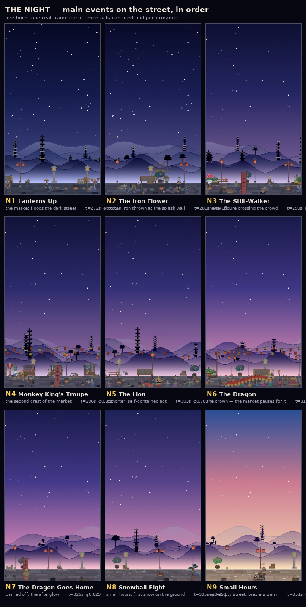

# The night — main events on the street

Regenerate with `SDL_VIDEODRIVER=dummy PYTHONPATH=. python tools/night_events.py`.

Every panel is a real frame from the live build. The timed acts are staged to
mid-performance: `foreground_weekend.happening()` latches on the first frame
`phase` enters its window, so jumping to a timestamp always renders progress
0 — the act at its opening instant, usually still off-screen. The tool
scrolls in from before each window, steps forward at 1/30 s to 45% progress,
and asserts the beat is live at the moment of capture.

| ID | Event | Window (φ) | Starts | Runs | Beat name |
|---|---|---|---|---|---|
| **N1** | Lanterns Up — the market floods the dark street | 0.680 – 0.695 | t 267.6 s | — | *(state)* |
| **N2** | The Iron Flower — molten iron thrown at the splash wall | 0.706 – 0.727 | t 277.8 s | 8.0 s | `festival_fire` |
| **N3** | The Stilt-Walker — one tall figure crossing the crowd | 0.730 – 0.744 | t 287.3 s | 6.0 s | `festival_stilts` |
| **N4** | Monkey King's Troupe — the market's second crest | 0.744 – 0.760 | t 292.8 s | 7.0 s | `festival_troupe` |
| **N5** | The Lion — a shorter, self-contained act | 0.762 – 0.774 | t 299.8 s | 6.0 s | `festival_lion` |
| **N6** | The Dragon — the crown; the market pauses for it | 0.788 – 0.818 | t 310.1 s | 10.5 s | `festival_dragon` |
| **N7** | The Dragon Goes Home — carried off, the afterglow | 0.822 – 0.840 | t 323.5 s | 6.0 s | `dragon_home` |
| **N8** | Snowball Fight — small hours, first snow underfoot | 0.845 – 0.905 | t 332.5 s | 4.5 s | `snowball` |
| **N9** | Small Hours — near-empty street, braziers warm | 0.845 – 0.924 | — | — | *(state)* |

Notes:

- The night runs from the lanterns going up at φ0.416 (market setup) to first
  light at φ0.924; the festival window proper is `_FESTIVAL_WIN = (0.680, 0.820)`
  (`foreground_near_lane.py:1427`).
- **N6 is the only act the market pauses for** — `parade_active()` is keyed to
  `festival_dragon` alone, which is what keeps the dragon feeling bigger than
  the lion.
- N2's set is planted three times earlier in the day before it lights: a
  scaffold raised among the stall frames at t 178 s, then standing dark in the
  storm at t 236–273 s. See `FESTIVAL_PLAN.md`.
- Each beat fires **once per day** and never re-fires that run.
- One smaller gag shares the window and is not listed as a main event:
  `noodles_dog` (φ 0.70 – 0.78).
