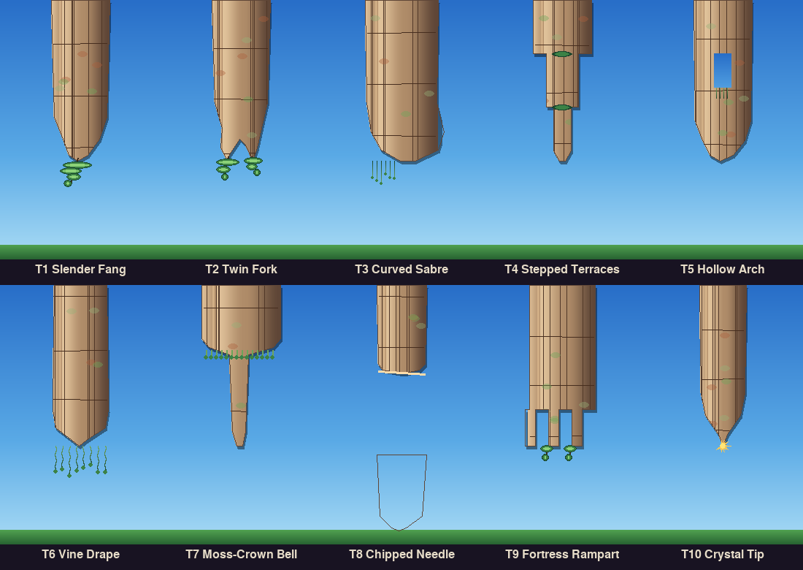
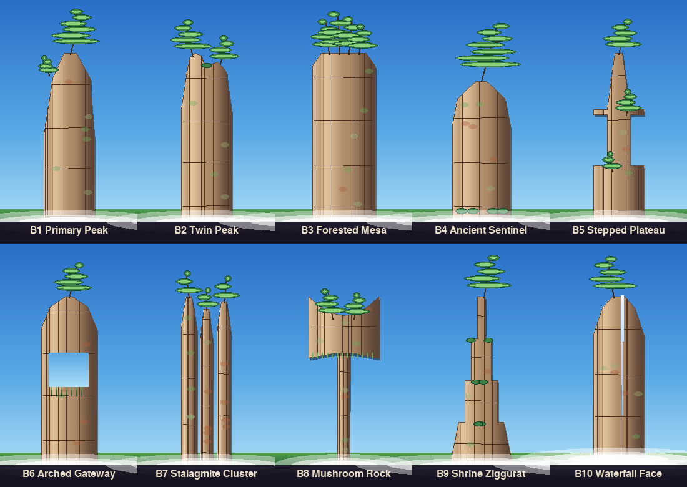

# Pillar Variety — 10 Top + 10 Bottom Sketches

## Overview

Skybit pillars currently use a **single silhouette** for each orientation. This reduces visual variety on long runs. Here are **20 new variants** (10 top, 10 bottom) themed consistently with Zhangjiajie quartzite pillars: smooth gradient stone, Wuling pines, moss cascades, shrubs on ledges, mist halos, and biome retinting.

All variants reuse the existing drawing helpers:
- `stone_body()` — gradient stone surface with erosion grooves
- `silhouette_blit()` — polygon masking to shaped silhouettes
- `draw_pine()` — Wuling pine foliage (Skybit's signature tree)
- `draw_mist()` — atmospheric halo at pillar base
- `lerp()` — color interpolation for gradients

---

## Top Pillars (Hanging Stalactite-Style)

These hang from the ceiling, tapering toward a lower tip. Each has signature decoration.



| # | Name | Silhouette | Signature Deco |
|---|------|-----------|--|
| **T1** | **Slender Fang** | Single narrow descending spire (current default) | One hanging pine at tip |
| **T2** | **Twin Fork** | Body splits into two uneven fangs | Pine on each fang |
| **T3** | **Curved Sabre** | Leans ~20° rightward like a tusk; bulges on convex side | Heavy moss cascade on convex (left) side |
| **T4** | **Stepped Terraces** | Staircase of 3 ledges, narrows to point | Small shrub on each ledge |
| **T5** | **Hollow Arch** | Rectangular window cut through mid-body | Moss draping through the arch |
| **T6** | **Vine Drape** | Cylindrical body, sides taper at bottom | ≥6 long moss vines trailing down |
| **T7** | **Moss-Crown Bell** | Wide flat cap, abrupt thin neck below | Broad dense moss mat across the cap top |
| **T8** | **Chipped Needle** | Sharp fracture/break at mid-height, jagged edges | Exposed accent stripe visible through the chip |
| **T9** | **Fortress Rampart** | Squared profile with battlement crenellations | Tiny pines sprouting between crenels |
| **T10** | **Crystal Tip** | Slender spire tipped with amber quartz cluster | Glowing amber quartz facets at tip |

---

## Bottom Pillars (Rising Spires)

These rise from the ground to the ceiling gap, tapering toward an upper tip. Each has signature foliage.



| # | Name | Silhouette | Signature Deco |
|---|------|-----------|---|
| **B1** | **Primary Peak** | Single tall spire (current default) | Dominant pine on peak + secondary side pine |
| **B2** | **Twin Peak** | Two uneven summits shoulder-to-shoulder | Pine on each peak; shrub in the cleft |
| **B3** | **Forested Mesa** | Flat tabletop (wide, low-rise) | 3–4 pines clustered on the mesa top |
| **B4** | **Ancient Sentinel** | Broad low base, one enormous old gnarled pine | Single ancient pine dominating; shrubs at base |
| **B5** | **Stepped Plateau** | Stair-stepped terraces, each with its own shelf | Pine per shelf; moss between tiers |
| **B6** | **Arched Gateway** | Pillar with a clear window/hole at mid-height | Vines draping through the gap |
| **B7** | **Stalagmite Cluster** | 3 thin parallel spires of varying heights | One pine per spire |
| **B8** | **Mushroom Rock** | Narrow stem with wider overhanging cap | Pines on the overhang; moss underneath |
| **B9** | **Shrine Ziggurat** | Trapezoidal tiered base (like a temple plinth) | Single central pine; shrubs at each tier |
| **B10** | **Waterfall Face** | Pillar with vertical silver-white streak | Pine + thick mist halo (heavier than usual) |

---

## How to Use

### For Review
1. Open `top_pillars.png` and `bottom_pillars.png` in an image viewer.
2. Note which variants appeal to you visually — they should all "read" as Zhangjiajie quartzite with Wuling pines, yet feel distinct.
3. Reply with picks, e.g.:
   ```
   Top: T1, T3, T5, T7, T9
   Bottom: B1, B3, B4, B6, B9
   ```
   Or request all 20 to ship with random selection each gap.

### For Implementation (After Approval)
Once you pick your favorites:
1. The chosen variants will be moved into `game/entities.py` as `Pipe._TOP_VARIANTS` and `Pipe._BOT_VARIANTS`.
2. Each new `Pipe` will randomly pick one variant per spawn, seeded by the world RNG for deterministic beauty.
3. `world.py` spawn code will use the variant index.
4. Reference snapshots in `tools/snapshot.py` will be regenerated.

---

## Technical Details

All variants are built from:

```python
# Per variant:
pw = 80  # pillar body width (some variants wider for asymmetry)
body = stone_body(pw, height, seed)  # gradient stone with erosion
poly = [...]  # local silhouette polygon (x,y in body coords)
silhouette_blit(surf, body, poly, (cx - pw//2, y_offset))  # mask & render
# Decorations: draw_pine(), draw_mist(), moss lines, shrubs, etc.
```

The `stone_body()` helper creates a consistent warm-left/cool-right gradient with:
- Vertical erosion striations
- Horizontal cracks
- Rust / lichen / moss patches
- Subtle accent stripe on the sunlit side

This ensures all 20 variants feel like the same quartzite formation, just with different shapes and foliage.

---

## Notes

- **Zhangjiajie theme**: Smooth gradient stone (no blocky geometry), Wuling pines (narrow trunks, horizontal peacock-tail canopy), moss cascades, mist.
- **Consistency**: All variants use the same color palette, pine shape, and mist style.
- **Variety without bloat**: 20 sketches, but only reuse existing rendering code—no new primitives.
- **Determinism**: Once seeded, each gap's pair will be the same on every play-through (good for reference screenshots, playtesting).

---

## Next Steps

1. **Sketch approval**: Pick your favorites from these 20, or ask for all.
2. **Integration**: Move chosen variants into the game code.
3. **Testing**: Verify randomness, new biome palettes, and reference snapshots.

Reply below with your picks!
