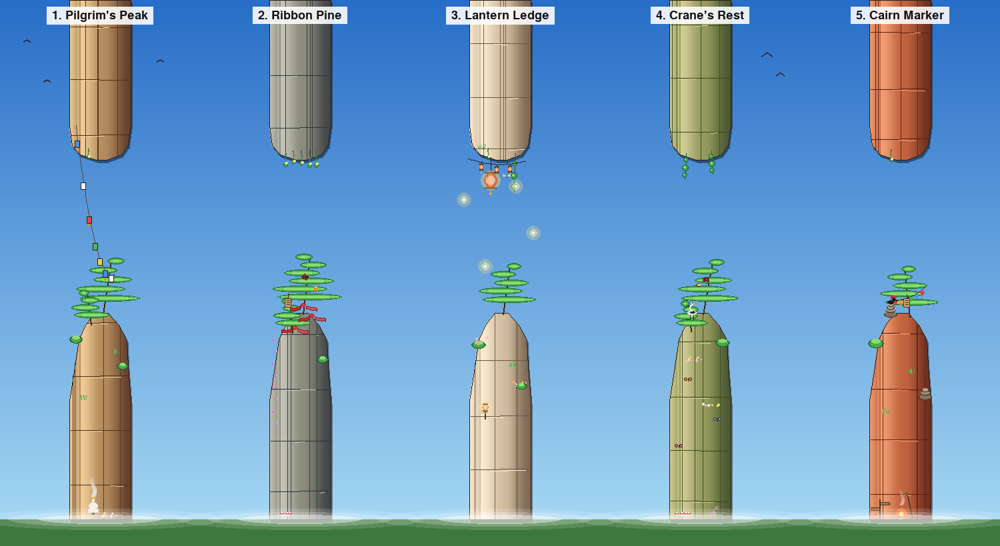

# Pillar Variants — 5 Dense Options

*Rendered by `tools/pillar_variants.py`, reusing the game's existing pillar
helpers (`get_stone_pillar_body`, `silhouette_*_spire`, `draw_wuling_pine`,
`draw_moss_strand`, `draw_side_shrub`, `draw_pillar_mist`).*

Each variant keeps the same silhouette and foliage palette — only the **stone
palette** and **decoration pack** change.

| # | Name | Stone tint | Decoration pack |
|---|------|------------|-----------------|
| 1 | **Pilgrim's Peak** | warm honey-gold | 2 pines · 2 shrubs · moss · 2 grass tufts · prayer flags with bells strung across the gap · white stupa + incense wisp at base · wildflowers · 3 bird silhouettes in the sky |
| 2 | **Ribbon Pine** | cool silver-grey | 2 pines · 5 moss strands · 3 red silk ribbons knotted on branches · hanging wish plaque · brass bell · berry cluster in canopy · mushrooms · flowering vine on the face · low shrub |
| 3 | **Lantern Ledge** | pale bone-ivory | pine · 2 flower shrubs · pom-pom vine · 3 grass tufts · moss · **hero red paper lantern** · string of 3 smaller lanterns · ledge lantern on a post · 4 fireflies · moth |
| 4 | **Crane's Rest** | olive-green tinted | 2 pines · wildflower patches · berries · bird nest · 2 hanging vines · perched crane · 2 flying birds · 3 butterflies · rabbit · mushrooms · shrub |
| 5 | **Cairn Marker** | terracotta red | pine · moss · shrub · 2 grass tufts · **4-stone cairn with red pennant** · secondary 3-stone cairn · multi-colour pennant string · wooden signpost · walking stick · campfire with smoke · wish plaque on pine · raven on cairn |

## How they're built

- Only **stone palette** differs between variants — the foliage palette is the
  same DAY keyframe from `game/biome.py`.
- Every decoration is a small self-contained helper (≤ 20 lines) in
  `tools/pillar_variants.py`.
- Per-variant wiring is a single `if` branch inside `decorate()`, so adding or
  dropping an ornament on any variant is a one-line change.

## Next step

Reply with your picks (e.g. `"1, 3, 5"` or `"all"`) and those variants will be
folded into `game/entities.py` as random-per-spawn decorations, seeded by the
world RNG so each run is deterministic.
