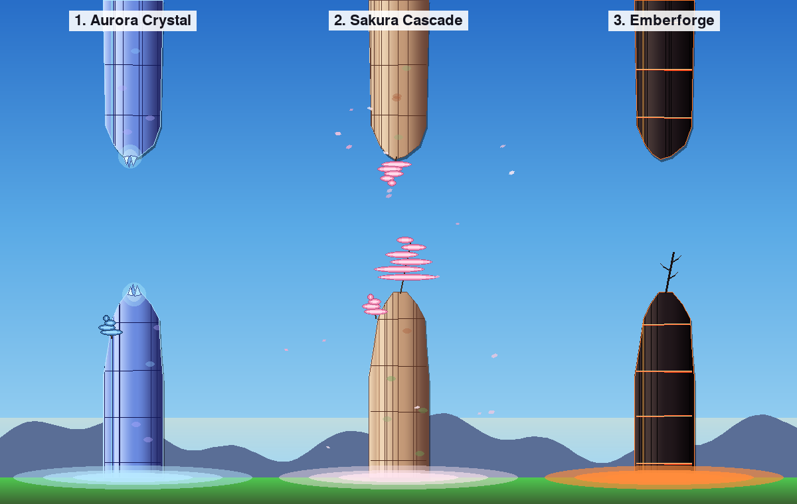

# Vivid Pillar Looks — 3 Options

*Preview rendered by `tools/vivid_pillar_preview.py`. Each column shows a full
top+bottom pillar pair with halo, rendered against the day-biome sky.*

Three bold reskins of the existing Zhangjiajie pillar. Each one keeps the same
silhouette shapes and drawing pipeline (`stone_body` + `silhouette_blit` +
decoration + base halo) and only swaps **colors, accents, and one signature
flourish** — so any choice ships with minimal code churn.

The current pillars read as earthy, muted sandstone. "Vivid" here means pushing
the visual key in a clear direction: **cool & luminous**, **warm & soft**, or
**hot & dramatic**. One of each below.

---

## Option 1 — **Aurora Crystal** 🔷

*Cool, luminous, glassy. An icy translucent spire catching sunlight.*

A faceted quartz pillar in blue-violet with a glowing cyan accent stripe along
the sunlit edge. Sparse, precious vegetation — just a single pine at the peak
— lets the crystal dominate. A pale cyan halo replaces the white mist.

**Palette**

| Role | Color | Swatch |
|---|---|---|
| `stone_light` | `#C8DAFF` (200, 218, 255) | very pale periwinkle |
| `stone_mid`   | `#6B8BE0` (107, 139, 224) | saturated sky-blue |
| `stone_dark`  | `#2A2F6E` (42, 47, 110)  | deep indigo |
| `stone_accent`| `#9BFFF0` (155, 255, 240) | glowing cyan highlight |
| `halo`        | `#B8E8FF @ 140` | cyan fog instead of white |

**Silhouette** — unchanged sharp slender spire (same polygon as default),
but the silhouette outline is drawn in `stone_accent` at 50% alpha instead
of `stone_dark`, giving a soft edge-glow.

**Signature flourish** — a **faceted tip gem**: three small overlapping
lighter-blue triangles at the peak plus a 6-pixel additive glow behind them.
One slim pine at the base (not the peak) keeps the eye on the crystal.

**Why it works** — the cool palette pops hard against the warm horizon
glow and green ground, reading as something magical rather than geological.
Zero new primitives: same erosion striations become internal facet lines.

---

## Option 2 — **Sakura Cascade** 🌸

*Warm, soft, joyful. Familiar sandstone body, explosion of pink canopy.*

Body palette stays close to the current day-sandstone so it still feels like
the same world — but the pine foliage is swapped for cherry blossoms, and a
few petals drift in the column of air beside the pillar. Reads instantly as
"spring."

**Palette**

| Role | Color | Swatch |
|---|---|---|
| `stone_light` | `#F0D8B8` (240, 216, 184) | warm cream (unchanged-ish) |
| `stone_mid`   | `#C49A78` (196, 154, 120) | soft terracotta |
| `stone_dark`  | `#6B4638` (107, 70, 56)   | cocoa |
| `foliage_top` | `#FFC8DE` (255, 200, 222) | blossom pink |
| `foliage_mid` | `#F591B8` (245, 145, 184) | rose |
| `foliage_dark`| `#B84E80` (184, 78, 128)  | magenta shadow |
| `foliage_accent`| `#FFFFFF` (255, 255, 255) | white petal highlights |

**Silhouette** — default "Slender Spire" / "Primary Peak" unchanged.

**Signature flourish** — replace the **pine layered canopy** with the exact
same layered-ellipse code in pink. Sprinkle **3–5 small petal dots** (4-pixel
rounded rectangles in blossom-pink at 60% alpha) drifting sideways in the gap
beside each pillar pair, using the same RNG seed as the pillar so the look is
deterministic.

**Why it works** — maximum visual payoff for near-zero effort: one color-swap
in the foliage palette plus a handful of drifting petals. Fits every biome
by simply tinting the foliage group toward pink.

---

## Option 3 — **Emberforge** 🔥

*Hot, dramatic, high-contrast. Obsidian-black stone with glowing lava veins.*

Jet-black volcanic glass body with the existing erosion cracks re-colored as
**glowing magma** — deep orange at the edges fading to near-white at the
center. The base halo becomes a warm amber glow instead of cool fog, as if
the pillar is radiating heat into the ground.

**Palette**

| Role | Color | Swatch |
|---|---|---|
| `stone_light` | `#4A3A38` (74, 58, 56)    | charcoal grey |
| `stone_mid`   | `#22181C` (34, 24, 28)    | near-black basalt |
| `stone_dark`  | `#0A0608` (10, 6, 8)      | true black |
| `stone_accent`| `#FFB14A` (255, 177, 74)  | warm amber (lit side) |
| `vein_glow`   | `#FF5020` → `#FFE090`     | orange→pale gold gradient |
| `halo`        | `#FFA040 @ 180` | amber fog, strong |

**Silhouette** — same "Slender Spire" / "Primary Peak" polygon. Jagged
asymmetric peak reads more menacing against the black fill.

**Signature flourish** — in the existing horizontal erosion cracks (already
drawn by `stone_body`), draw each crack as a **2-pixel glowing line**: dark
orange core with a 1-pixel pale-gold highlight down its middle. Add one
optional **charred snag** (a twisted dead tree, just pine trunk code with
foliage layers turned off and a brown-black color) at the peak in place of
the usual pine.

**Why it works** — the sharpest visual contrast against any sky biome, day or
night. It's the same pillar geometry — only the palette changes and the cracks
become emissive, which costs one extra highlight line per crack.

---

## Summary — pick one (or mix)

| # | Name        | Vibe                | Code change | Reuse |
|---|-------------|---------------------|-------------|-------|
| 1 | Aurora Crystal | cool, luminous     | palette + 1 tip gem + glow outline | silhouette, striations, halo |
| 2 | Sakura Cascade | warm, joyful       | foliage palette + petal particles  | silhouette, body, pine geometry |
| 3 | Emberforge     | hot, dramatic      | palette + glowing cracks + amber halo | silhouette, body, crack pattern |

All three slot into the existing `biome.py` palette dict — no new draw
primitives required. Say the word and the picked option can be wired into
the pillar palette keys and shipped behind a config toggle for A/B preview
before replacing the default.
