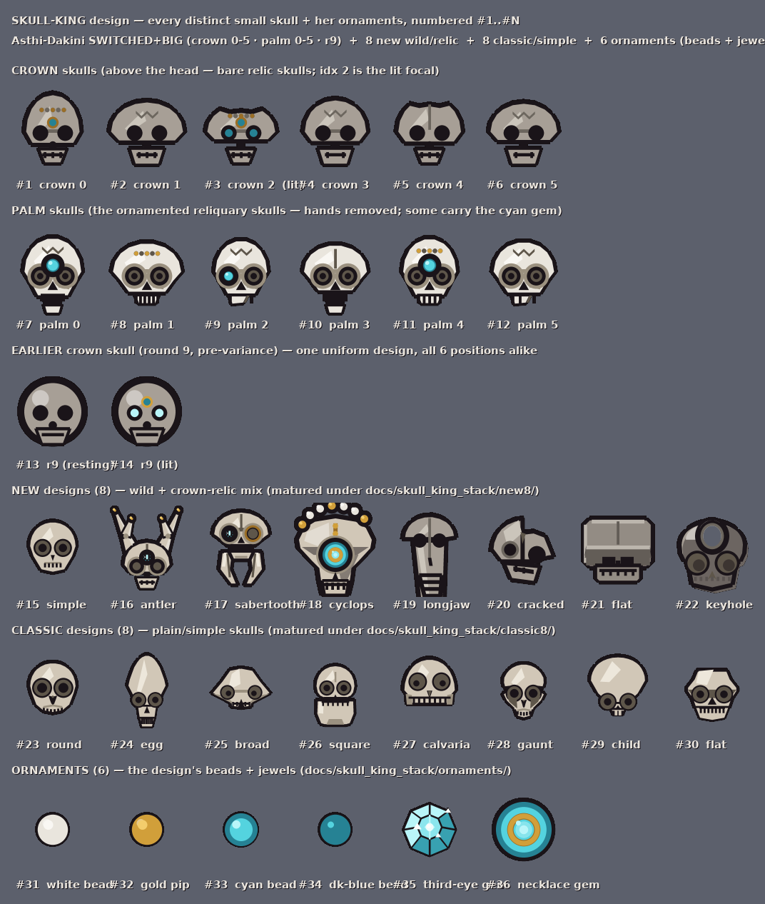
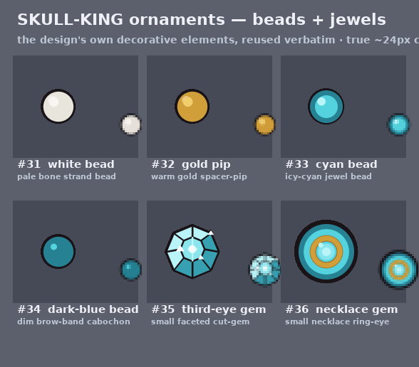
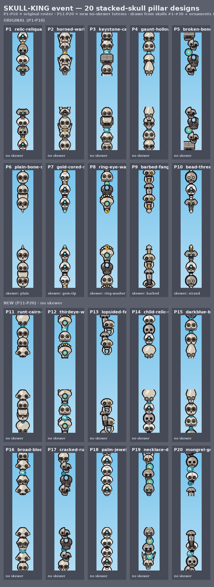
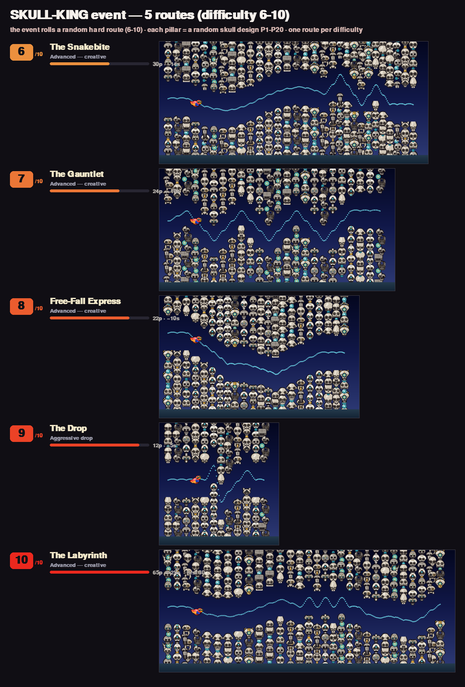

# Skull-King — art document

> The curated "what we shipped" art doc. The blow-by-blow exploration lives in
> the brainstorm docs ([`pillars/_new10_brainstorm.md`](pillars/_new10_brainstorm.md),
> [`pillars/brainstorm_round_1.md`](pillars/brainstorm_round_1.md),
> [`new8/brainstorm.md`](new8/brainstorm.md),
> [`classic8/brainstorm_round_1.md`](classic8/brainstorm_round_1.md)) and the
> original concept note ([`README.md`](README.md)). This page just shows the
> chosen design: the parts, the 20 columns built from them, and the routes.

---

## 1 · What the Skull-King is

The **Skull-King** is a hard-band event whose pillars are **stacked-skull totems** —
columns built by stacking the small skulls that belong to the chosen king-skull
design, **Asthi-Dakini `SWITCHED + BIG`** (see
[`../skybit_devil/batch2/asthi_ringeye/CHOSEN.md`](../skybit_devil/batch2/asthi_ringeye/CHOSEN.md)),
one on top of another. The gap-edge skull is the **lit focal** (cyan eyes), facing
the player's lane; the rest of the column climbs away from the gap as a wall of bone.

The look is deliberately dusk/night-leaning so bone reads bright against the sky.
Every pillar in a route is an independent **column design** — and the whole point of
this pass was depth: the pool is now **20 distinct column designs**, drawn at random
per pillar, so a route never feels like the same totem repeated.

Three building blocks make a column:

1. **Skulls** — the stacked units (six families, below).
2. **Ornaments** — small beads/jewels seated between skulls as accents or keystones.
3. **Recipe + knobs** — each column is a *recipe* (which skulls/ornaments, in what
   order, focal first) plus a `COLLAR` (gold seam beads on/off) and a `LEAN`
   (off-axis tilt). Five of the original ten also thread a **skewer** (a rod down the
   stack); the ten new ones are all plain (no skewer).

---

## 2 · The parts — skulls + ornaments

Every visual is procedural (drawn from code, no sprite sheets). The full parts
library — all **30 skulls** and **6 ornaments**, with global IDs #1–#36 — is the
vocabulary every column is composed from.

### Skull + ornament catalog

*Renderer: [`../../tools/render_skull_king_stack.py`](../../tools/render_skull_king_stack.py)*

| Family | IDs | Count | What they are |
| --- | --- | --- | --- |
| **Crown skulls** (`crown:0..5`) | #1–#6 | 6 | The bare relic skulls from above the king's head — varied jaw / suture / brow / forehead-pip. `crown:2` is the heart/lit focal type. |
| **Palm skulls** (`palm:0..5`) | #7–#12 | 6 | The ornamented cradled reliquary skulls from her palms, stacked **bare** (cup + fingers removed); several carry the cyan forehead gem. |
| **Earlier crown** (`r9:0/1`) | #13–#14 | 2 | The earlier round crown skull — `r9:0` unlit (a relic in repose), `r9:1` can be lit. |
| **New designs** (`new:<slug>`) | #15–#22 | 8 | The wild/relic set: simple-skull, antler-stag, sabertooth-maw, longjaw-relic, cyclops-brow, keyhole-relic, cracked-half, flat-slab. |
| **Classic designs** (`classic:<slug>`) | #23–#30 | 8 | The plain/simple set: round-cap, square-jaw, broad-zygo, egg-dome, gaunt-hollow, calvaria, flat-brow-robust, child-skull. |
| **Ornaments** (`orn:<fn>`) | #31–#36 | 6 | Beads + jewels (detailed below). |

### Ornaments (detail)

*Renderer: [`ornaments/build_showcase.py`](ornaments/build_showcase.py)*

| ID | Token | Reads as |
| --- | --- | --- |
| #31 | `orn:bead_white` | pale bone strand bead |
| #32 | `orn:bead_gold` | warm gold spacer-pip |
| #33 | `orn:bead_cyan` | icy-cyan jewel bead |
| #34 | `orn:bead_darkblue` | dim brow-band cabochon |
| #35 | `orn:gem_thirdeye` | small faceted cut-gem (set mid-stack as a keystone) |
| #36 | `orn:ornament_necklace` | gold-ringed cyan halo / necklace ring-eye |

---

## 3 · The 20 column designs

Each column is a recipe over the parts above. **P1–P10** are the original ten (five
plain totems + five skewered); **P11–P20** are the ten added in this pass — all plain,
deliberately composed to spend parts the first ten never used (`classic:child-skull`,
`orn:bead_darkblue`, the unlit `r9:0`) and to spread the under-used skulls so no two
columns share a dominant read.

*Renderer: [`pillars/build_showcase.py`](pillars/build_showcase.py) · each design's own
module lives at `pillars/<slug>/render_<slug>.py`*

### Original ten (P1–P10)

| P | slug | skewer | the read |
| --- | --- | --- | --- |
| P1 | relic-reliquary-totem | — | crown + palm relic stack, the canonical king totem |
| P2 | horned-warband | — | antler-stag racks alternating with simple skulls |
| P3 | keystone-cairn | — | squared masonry courses with a third-eye gem keystone |
| P4 | gaunt-hollow-spire | — | gaunt / egg / calvaria bone spire, cyan accent |
| P5 | broken-bone-pile | — | cracked-half rubble pile, draped necklace, leaning |
| P6 | plain-bone-spit | skewer: plain | simple classic skulls threaded on a bare bone rod |
| P7 | gold-cored-scepter | skewer: gem-tip | all-palm jewelled scepter, gold core + cyan tip |
| P8 | ring-eye-washer-axle | skewer: ring-washer | cyclops + keyhole skulls on a ring-washer axle |
| P9 | barbed-fang-harpoon | skewer: barbed | sabertooth/longjaw fangs over a barbed harpoon |
| P10 | bead-threaded-strand-spindle | skewer: strand | crown/palm/r9 threaded on a continuous bead cord |

### New ten (P11–P20) — all plain, no skewer

| P | slug | the read |
| --- | --- | --- |
| P11 | runt-cairn-taper | a cairn tapering down to a tiny child-skull nub |
| P12 | thirdeye-watchtower | slender tower: single-socket cyclops skulls alternating with third-eye gems |
| P13 | lopsided-fang-lean | a leaning pile of fanged sabertooth/longjaw maws |
| P14 | child-relic-shrine | a child-skull venerated as the focal, larger guardians above, a dark-blue votive bead |
| P15 | darkblue-bone-rosary | bone domes beaded at every joint by dark-blue pips |
| P16 | broad-block-bastion | the widest, blockiest masonry column, one third-eye gem |
| P17 | cracked-ruin-lean | a cracked + keyhole ruin, dark-blue accent, leaning |
| P18 | palm-jewel-pagoda | an all-palm jewelled pagoda (plain sibling of the P7 scepter) |
| P19 | necklace-draped-warlord | crowns + antler draped with gold-ringed halo necklaces |
| P20 | mongrel-generations-totem | a deliberately mismatched size-ladder — the odd one out |

---

## 4 · The routes

The event rolls a random **hard route** (difficulty 6–10) and renders it in skull
pillars. Each pillar slot independently picks one of the 20 column designs (a
per-route seeded random), so the same route always renders identically but the
totems vary all the way down it. Columns are packed shoulder-to-shoulder so the
route reads as a near-continuous skull wall with the gap channel threading through.

*Renderer: [`../../tools/render_skull_routes.py`](../../tools/render_skull_routes.py)*

Five routes are shown, one at each difficulty in the hard band:

| Diff | Route | Character |
| --- | --- | --- |
| 6 | The Snakebite | advanced, weaving — the gentlest of the band |
| 7 | The Gauntlet | advanced, sustained pressure |
| 8 | Free-Fall Express | a long committed descent |
| 9 | The Drop | aggressive drop |
| 10 | The Labyrinth | the longest, most demanding channel |

The skull pillars fill exactly the same top/bottom gap rectangles as the validated
source routes, so the flyable channel is unchanged — only the pillar skin differs.

---

## Status

**Design only — not wired into the game.** This page documents the chosen art (the
20 columns + the route presentation). Everything here is regenerated by the renderers
linked in each section.
