# Skybit-Devil — design journey (illustrated catalog)

An **image-forward** record of the boss-design directions we explored, in the order they happened.
Each entry has a one-line description, its **showcase image**, and **where the code lives** (every
figure is procedural — code-drawn, no sprite sheets).

The arc: a brainstorm cull locked **15 single bosses** → those seeded a wave of **spin-off broods**
(5 bosses each) → the exploration pivoted into the **👑 king-skull royal direction** (`skull_kings`,
2026-06-17) → that fused into the **Mukha × Citipati courts** → and most recently a deep-dive on
**design #1, Asthi-Dakini**.

> Scope: this doc catalogs the directions that produced a **showcase image**. The earlier batch-1
> devils and the 15 single locked bosses (no individual showcases) are catalogued links-only in
> [`SPINOFF_BROODS_INDEX.md`](./SPINOFF_BROODS_INDEX.md) and
> [`brainstorm_locked15.md`](./brainstorm_locked15.md).
>
> Lineage thread: **Citipati** (from `jiangshi_epic`) became the bone house-grammar; it spawned
> **Koschei** + **Mukha-Devi** (in `citipati_versions`), which fed the king-skull courts and then the
> fused Mukha × Citipati courts and Asthi-Dakini.

---

## A. Spin-off broods — the attempts BEFORE the king-skull direction

### 🎺 Mariachi variants — warm-skeleton charro musician spin-offs
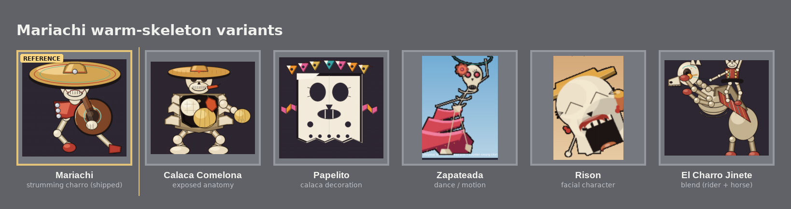
**Code:** `batch2/mariachi_variants/` (per-concept `render_*.py`) · **README:** [./mariachi_variants/README.md](./mariachi_variants/README.md) · 5 concepts.

### 🩸 Leyak-epic — epic flying-head broods
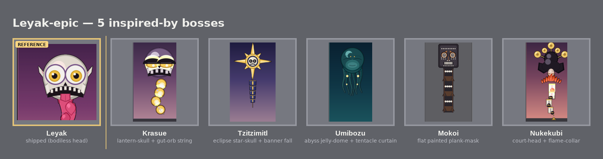
**Code:** `batch2/leyak_epic/` (krasue · mokoi · nukekubi · tzitzimitl · umibozu) · **README:** [./leyak_epic/README.md](./leyak_epic/README.md) · 5 concepts.

### 💀 Jiangshi-epic — charnel hopping-corpse broods (**introduces Citipati**, the bone house-grammar ancestor)
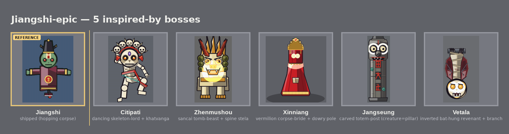
**Code:** `batch2/jiangshi_epic/` (citipati · jangseung · vetala · xinniang · zhenmushou) · **README:** [./jiangshi_epic/README.md](./jiangshi_epic/README.md) · 5 concepts.

### 💀 Citipati versions — five charnel skeleton-lord KINDs (**introduces Koschei + Mukha-Devi**)
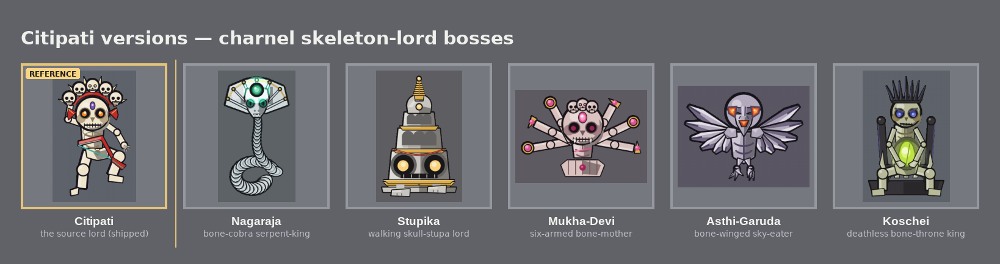
**Code:** `batch2/citipati_versions/` (nagaraja · stupika · mukha_devi · asthi_garuda · koschei) · **README:** [./citipati_versions/README.md](./citipati_versions/README.md) · 5 concepts · SHIP-READY.

### 🪵 Jangseung versions — carved-wood guardian totems
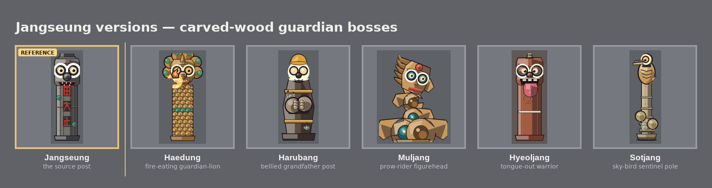
**Code:** `batch2/jangseung_versions/` (haedung · harubang · hyeoljang · muljang · sotjang) · **README:** [./jangseung_versions/README.md](./jangseung_versions/README.md) · 5 concepts · SHIP-READY.

### 🎨 Mokoi versions — flat-graphic painted-spirits
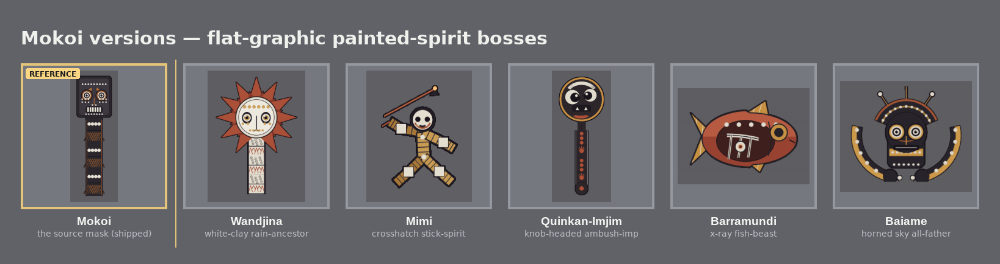
**Code:** `batch2/mokoi_versions/` (baiame · barramundi · mimi · quinkan_imjim · wandjina) · **README:** [./mokoi_versions/README.md](./mokoi_versions/README.md) · 5 concepts · SHIP-READY.

### 🌊 Umibozu versions — deep-sea / oceanic-yokai
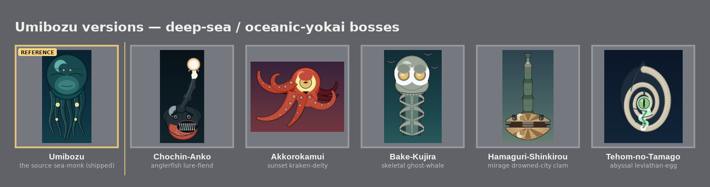
**Code:** `batch2/umibozu_versions/` (akkorokamui · bake_kujira · chochin_anko · hamaguri · tehom) · **README:** [./umibozu_versions/README.md](./umibozu_versions/README.md) · 5 concepts · SHIP-READY.

### 🎋 Bamboo versions (v1) — chibi bamboo bosses *(superseded by v2)*
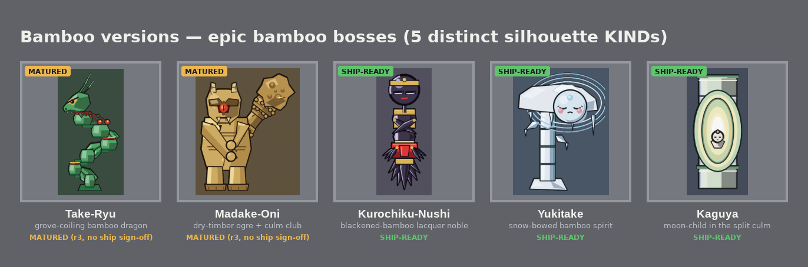
**Code:** `batch2/bamboo_versions/` (kaguya · kurochiku_nushi · madake_oni · take_ryu · yukitake) · **README:** [./bamboo_versions/README.md](./bamboo_versions/README.md) · 5 concepts · superseded by Bamboo v2.

### 🎍 Bamboo v2 — realistic botanically-accurate bamboo bosses
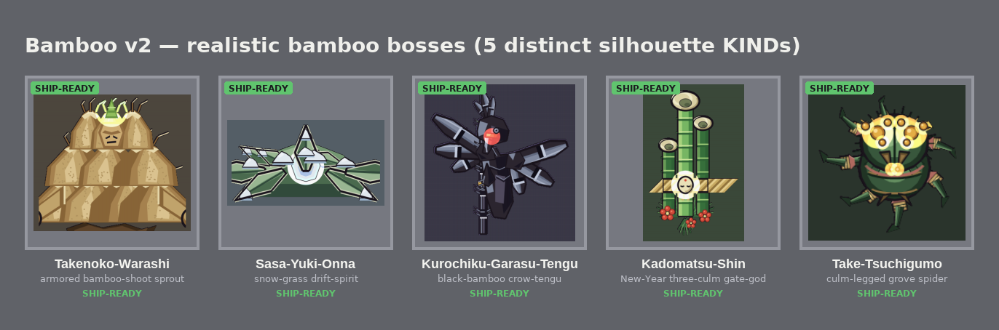
**Code:** `batch2/bamboo_v2_versions/` (kadomatsu_shin · kurochiku_garasu_tengu · sasa_yuki_onna · take_tsuchigumo · takenoko_warashi) · **README:** [./bamboo_v2_versions/README.md](./bamboo_v2_versions/README.md) · 5 concepts · SHIP-READY.

### 🎍 Kadomatsu versions — epic bamboo-plant gate-bosses (spun off Kadomatsu-Shin)
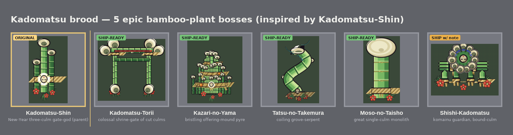
**Code:** `batch2/kadomatsu_versions/` (kadomatsu_torii · kazari_no_yama · moso_no_taisho · shishi_kadomatsu · tatsu_no_takemura) · **README:** [./kadomatsu_versions/README.md](./kadomatsu_versions/README.md) · 5 concepts.

### 💀 Mukha-Devi versions — many-armed bone-goddess KINDs (chibi → monumental)
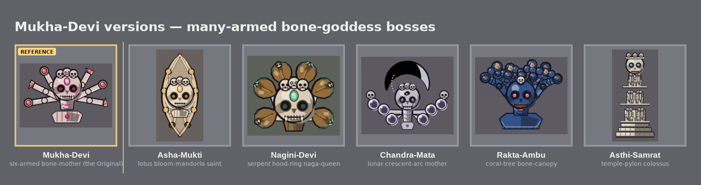
**Code:** `batch2/mukha_devi_versions/` (asha_mukti · asthi_samrat · chandra_mata · nagini_devi · rakta_ambu) · **README:** [./mukha_devi_versions/README.md](./mukha_devi_versions/README.md) · 5 concepts.

### 💀 Mukha-Devi KIN — grounded six-arm sister-bosses (differ by arm-end ornament)
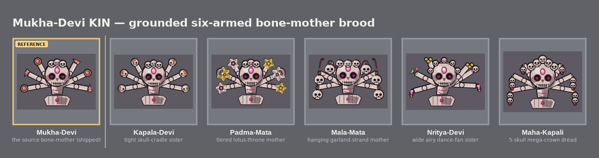
**Code:** `batch2/mukha_devi_kin/` (kapala_devi · maha_kapali · mala_mata · nritya_devi · padma_mata) · **README:** [./mukha_devi_kin/README.md](./mukha_devi_kin/README.md) · 5 concepts.

---

## B. 👑 The king-skull royal direction (the pivot) and after

### 👑 Skull Kings — **PIVOT** · a royal court of six skeleton-kings
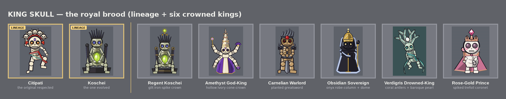
**Code:** `batch2/skull_kings/` (regent_koschei · amethyst_god_king · carnelian_warlord · obsidian_sovereign · verdigris_drowned_king · rosegold_prince) · **README:** [./skull_kings/README.md](./skull_kings/README.md) · 6 concepts · SHIP-READY. Regent Koschei is the royal evolution of Koschei (from `citipati_versions`).

### 👑 Skull Kings II — a second royal court of ten skeleton-kings (above-head skull-crowns)
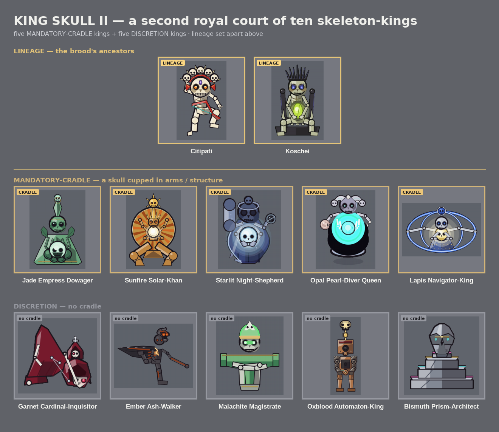
**Code:** `batch2/skull_kings_ii/` (jade_empress_dowager · sunfire_solar_khan · starlit_night_shepherd · opal_pearl_diver_queen · lapis_navigator_king · garnet_cardinal_inquisitor · ember_ash_walker · malachite_magistrate · oxblood_automaton_king · bismuth_prism_architect) · **README:** [./skull_kings_ii/README.md](./skull_kings_ii/README.md) · 10 concepts · SHIP-READY.

### 💀 Mukha × Citipati Court — temple-treasury bone-deity sisters (fused Mukha + Citipati)

**Code:** `batch2/mukha_citipati_court/` (asthi_dakini · vajra_rakta · naga_kapali · mundamala_mata · ratna_padmini) · **README:** [./mukha_citipati_court/README.md](./mukha_citipati_court/README.md) · 5 concepts · SHIP-READY. **Asthi-Dakini originates here.**

### 💀 Mukha × Citipati Court II — charnel-ascetic bone-deity sisters (distinct register)

**Code:** `batch2/mukha_citipati_court_ii/` (vyaghra_charma · bhasma_yogini · jvala_nirmala · lekha_dakini · hima_kapalini) · **README:** [./mukha_citipati_court_ii/README.md](./mukha_citipati_court_ii/README.md) · 5 concepts · SHIP-READY.

---

## C. 💎 Asthi-Dakini — design-#1 deep-dive (the most recent work)

A focused exploration of the **Asthi-Dakini** figure (the bone-jewel sky-dancer from
`mukha_citipati_court`): a gem-skull refinement, then 5 distinct restyles, then a chosen gem /
third-eye revision.

### 💠 Gem-skull redesign — refining the faceted cyan cut-gem look
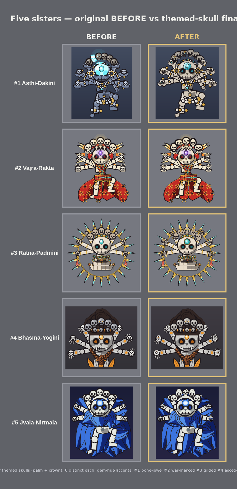
**Code:** `batch2/gem_skull_redesign/` · no README (the `before_after.png` is the record).

### 💎 Asthi options — 5 distinct versions of design #1
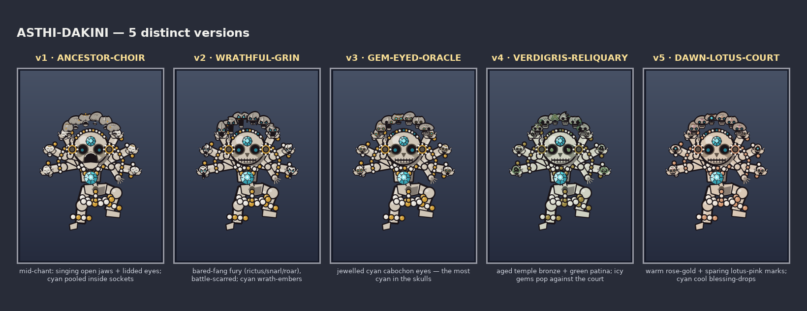
Shared base: a larger faceted cyan **hero gem in the necklace centre**, a smaller dimmer **third-eye**,
hand-skulls sized to the crown skulls, and all 12 skulls distinct in structure **and** contents.
**Code:** `batch2/asthi_options/_base/render.py` (shared base) + per-version `<slug>/render.py`; each
`<slug>/` holds `round_N*.png` + `critique_round*.md`. Brainstorm: `asthi_options/brainstorm_gd.md` /
`brainstorm_ad.md`. The five (all SHIP-READY):
- **ancestor-choir** — mid-chant singing open jaws + lidded eyes; cyan in sockets *(final round_2)*
- **wrathful-grin** — bared-fang fury (rictus/snarl/roar), contour-carved damage; cyan embers *(final round_3)*
- **gem-eyed-oracle** — jewelled cyan cabochon gem-eyes, the most cyan version *(final round_2)*
- **verdigris-reliquary** — aged bronze + green patina, eroded relics; icy gems pop *(final round_2)*
- **dawn-lotus-court** — warm rose-gold + sparing lotus-pink marks; cyan blessing-drops *(final round_2)*

### 💍 Asthi ring-eye — the CHOSEN revision (gem / third-eye placement family)
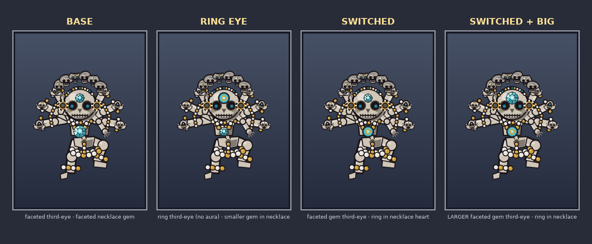
A revision built on Asthi's round-10 base, reusing the earlier darker-skin round's concentric-ring
third-eye **shape** with **no blue aura**. Three variants (see also `before_after.png`):
- **RING EYE** — ring third-eye (no aura) + smaller faceted gem in the necklace heart — `render.py`
- **SWITCHED** — faceted gem third-eye + ring in the necklace — `render_switched.py`
- **SWITCHED + BIG ← CHOSEN** — larger faceted gem third-eye (the bright focal) + ring in necklace — `render_switchbig.py`

**Code:** `batch2/asthi_ringeye/` · decision recorded in [./asthi_ringeye/CHOSEN.md](./asthi_ringeye/CHOSEN.md). Asthi-Dakini is design-only — not yet wired into the live game.
