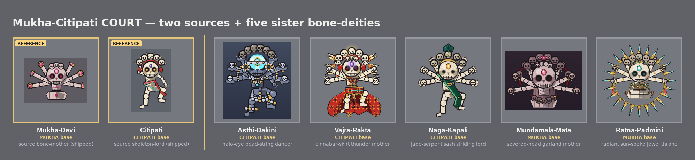

# Mukha × Citipati Court — five richly-ornamented bone-deity sisters

Five new bosses fused from TWO shipped references — **Mukha-Devi** (the six-armed wrathful
bone-mother / radial-fan member of the Citipati brood) and **Citipati** (the tall rib-barrel
charnel-ground dancing skeleton). They are **sisters of one form**: every one keeps Mukha's
**six-arm radial fan**, **six open palms each cradling a tiny skull** (the core motif, replacing
Mukha's relic-discs), and an **above-head skull-crown that fuses both reference heads** —
Citipati's 5-skull arc-sweep seated over Mukha's tiara-band. This brood answers an earlier set
that read **"naked"**: each sister is wrapped in a dense, researched Tibetan wrathful-deity
**ornament set**, gold-on-bone, rendered at higher resolution (SS=8 hero + a standalone
~1024px hi-res hero per sister).

> **Doctrine note.** The `distinct-design-variants` rule (five unique bottom-up silhouettes) is
> intentionally **relaxed** here at the user's direction — tight adherence to the locked motif,
> controlled novelty. These are sisters, not five creature KINDs. Distinctness lives only on the
> open axes: **body base** (Citipati tall dancer vs Mukha squat + lotus throne), the **dominant
> ornament set**, **palette**, and **skull/crown treatment**. Body-base split: **3 Citipati / 2
> Mukha**. No two sisters share a palette or an ornament set.

The five:

- **asthi_dakini** — *bone-jewel sky-dancer.* CITIPATI body. Multi-strand bone-bead lattice
  (choker + swags + girdle + armlets) on darkened cool-bone with warm gold spacer-pips; icy-cyan
  third-eye. *(Citipati · bead)* — **SHIP-READY** (round 3) — [./asthi_dakini](./asthi_dakini)
- **vajra_rakta** — *wrathful blood-scarf adept.* CITIPATI body. Billowing cinnabar brocade
  vajra-silk (crossed chest X + bell skirt) + open ember flame-ring; violet third-eye. The
  cleanest true-fusion crown in the brood. *(Citipati · silk)* — **SHIP-READY** (round 2) —
  [./vajra_rakta](./vajra_rakta)
- **naga_kapali** — *serpent-thread skull-priest.* CITIPATI body. Jade naga sacred-thread
  diagonal + kapala skull-cups, a rearing-naga hood over the crown centre, a coiling-naga pillar;
  amber third-eye. *(Citipati · serpent)* — **SHIP-READY** (round 3) — [./naga_kapali](./naga_kapali)
- **mundamala_mata** — *severed-head garland mother.* MUKHA body (lotus throne). A double-loop
  mundamala framing the face + a carved bone apron, oxblood cord dominant over sparse gold; rose
  third-eye. The art-director's pick for **strongest sister** (best blackout silhouette in the
  brood). *(Mukha · garland)* — **SHIP-READY** (round 3) — [./mundamala_mata](./mundamala_mata)
- **ratna_padmini** — *jewel-lotus throne mother* (gentlest; the premium anchor). MUKHA body.
  Jewel inlay + tassels + tiered gem-tipped lotus throne inside a full enclosing flame-halo
  (the only complete prabhamandala); turquoise third-eye. *(Mukha · jewel-throne)* —
  **SHIP-READY** (round 2) — [./ratna_padmini](./ratna_padmini)

**Ship-status:** all five earned genuine `SHIP-READY` verdicts from the art-director —
vajra_rakta and ratna_padmini at round 2, asthi_dakini, naga_kapali, and mundamala_mata at
round 3. Each sister's `critique_round*.md` records the loop (round-1 + round-2 critiques and
the final sign-off). Every sister holds all locked items — the six-arm fan, six palm-cradled
tiny skulls, the fused skull-crown, a dense non-naked ornament set, and the value ladder
(third-eye = single brightest pixel → palm-skulls mid → crown/garland dimmest) reading day +
night at true 32px.

References: [Mukha-Devi](../citipati_versions/mukha_devi/round_2.png) ·
[Citipati](../jiangshi_epic/citipati/round_2.png) — reference tiles in the showcase above.
