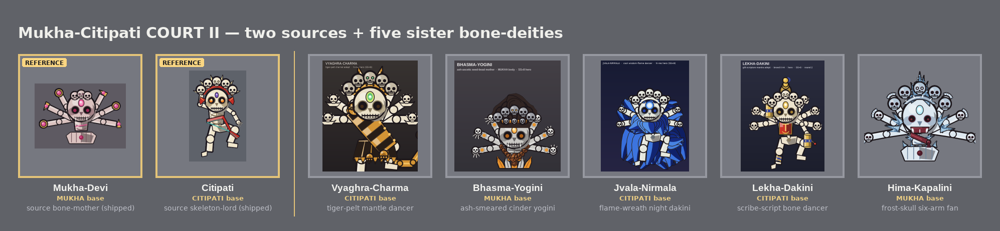

# Mukha × Citipati Court II — five charnel-ascetic bone-deity sisters

A **second** brood of five bone-deity sisters fused from the same two references —
**Mukha-Devi** (six-armed radial-fan bone-mother) and **Citipati** (tall dancing skeleton) —
built to be **visibly distinct** from the first court
([`mukha_citipati_court/`](../mukha_citipati_court/README.md)). Same locked motif, deliberately
different register: where court I was *adorned in temple treasure* (bone-beads, brocade silk,
naga-thread, severed-head garland, jewel-throne), court II is **clad in the charnel ground /
ascetic / elemental** — tiger-pelt, ash and seed-beads, wisdom-flame, scripture, and ice.

Every sister keeps the locked DNA: Mukha's **six-arm radial fan**, **six open palms each cradling
a tiny skull**, and a **fused above-head skull-crown** (Citipati's 5-skull arc-sweep seated over
Mukha's tiara-band) — with each sister's own fresh crown superstructure springing from *behind* it.
Each is densely ornamented (answering an earlier "naked" set), at higher resolution (SS=8 hero +
a standalone ~1024px hi-res hero per sister), with the strict value ladder (third-eye = single
brightest pixel → palm-skulls mid → crown dimmest) reading day + night at true 32px.

> **Doctrine note.** The `distinct-design-variants` rule is intentionally **relaxed** (sisters of
> one form, per the user's direction). Novelty lives only on the open axes — **body base**,
> **ornament set**, **palette**, **crown/skull treatment** — and here every choice is
> **collision-free** vs court I AND the adjacent skull broods (`mukha_devi_kin`, `skull_kings`,
> `skull_kings_ii`): no ornament language, palette, or crown superstructure repeats.
> Body-base split: **3 Citipati / 2 Mukha**.

The five:

- **vyaghra_charma** — *tiger-pelt charnel adept.* CITIPATI body. A striped tiger-hide sash +
  claw-danglers + tail + tiger-face buckle, paired tiger-ear crest; tawny-gold + black-stripe +
  cream. The freshest sister in either brood. *(Citipati · pelt)* — **SHIP-READY** (round 2) —
  [./vyaghra_charma](./vyaghra_charma)
- **bhasma_yogini** — *ash-ascetic seed-bead mother.* MUKHA body. Ash-smear + a knobbly matte
  rudraksha seed-bead U-swag, a sculpted matted-hair jata topknot (the dominant 32px silhouette);
  ash-grey + saffron + seed-brown. *(Mukha · ash/seed)* — **SHIP-READY** (round 2) —
  [./bhasma_yogini](./bhasma_yogini)
- **jvala_nirmala** — *cool wisdom-flame dancer.* CITIPATI body. A full-body draped **cloth-of-
  flame** mantle (cobalt, not ember — sheeting, not a ring) + a triple flame-crest; cobalt + ice-
  white + bone. The brood's color-inverted answer to fire. *(Citipati · flame)* — **SHIP-READY**
  (round 2) — [./jvala_nirmala](./jvala_nirmala)
- **lekha_dakini** — *gilt-scripture mantra adept.* CITIPATI body. Gold lantsa-script inlay bands
  + prayer-wheel pendants + a round stupa/chorten finial; indigo-ink + vermillion-seal + gold.
  *(Citipati · scripture)* — **SHIP-READY** (round 2) — [./lekha_dakini](./lekha_dakini)
- **hima_kapalini** — *hoar-frost crystal mother.* MUKHA body. Matte rime-ice shard sheathing (no
  facets) + an upthrust shard-crown, marked by a dried-blood plum "wound"; frost-white + slate-
  blue + plum. *(Mukha · frost)* — **SHIP-READY** (round 2) — [./hima_kapalini](./hima_kapalini)

**Ship-status:** all five earned genuine `SHIP-READY` verdicts from the art-director at round 2.
Each sister's `critique_round*.md` records the loop (round-1 critique + final sign-off). The
hardest gate was distinctness: jvala_nirmala had to become a draped *flame robe* (not a ring) to
clear the brood-I fire sisters, hima_kapalini's shards had to stay *matte rime-ice* (not faceted
crystal) to clear Bismuth/Amethyst/Opal, and lekha_dakini's stupa had to read *round* (not gabled)
to clear Garnet — all verified.

References: [Mukha-Devi](../citipati_versions/mukha_devi/round_2.png) ·
[Citipati](../jiangshi_epic/citipati/round_2.png) — reference tiles in the showcase above.
