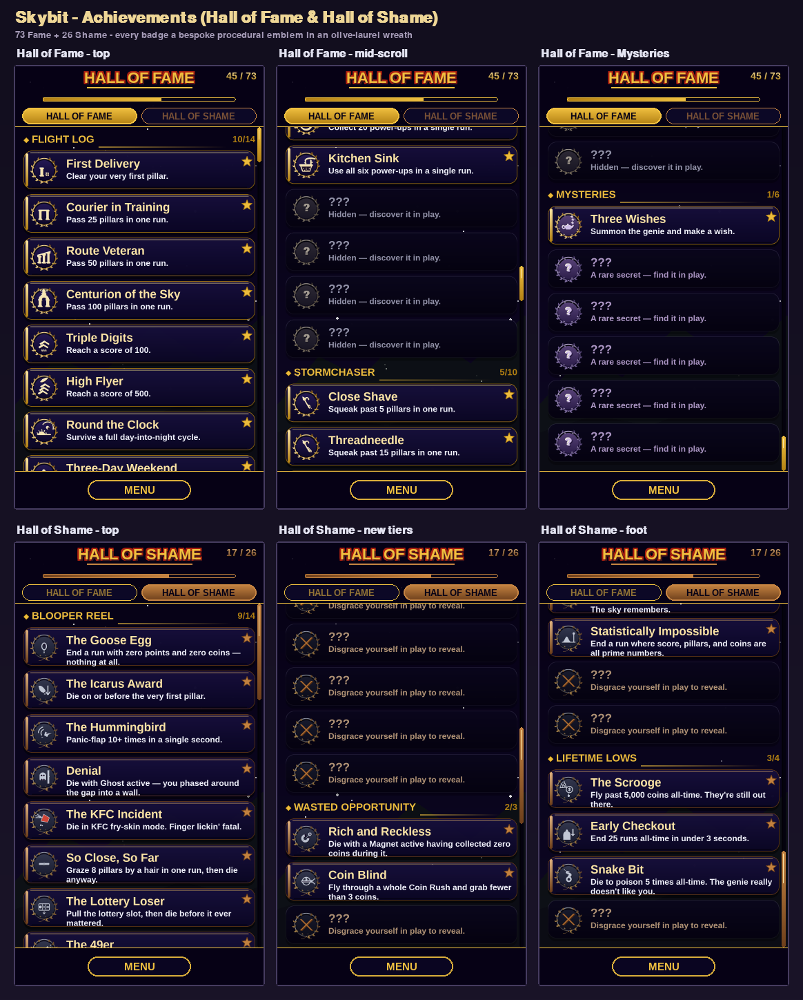

# Skybit — Achievements Effort (Hall of Fame & Hall of Shame)

*Branch: `v5_achievements` · state as of 2026-07-03*

## Overview

What began as a 46-badge Achievements menu has grown into a two-hall
recognition system: a **Hall of Fame** (things you did well) and a **Hall of
Shame** (roasts of things you did badly), sharing one engine, one save blob, and
one procedurally-drawn badge family. This document is the current-state snapshot
of the whole effort — the base system is also covered in
[`docs/achievements/README.md`](../achievements/README.md), which predates the
expansions below and now understates the roster (it still says "46 / six
categories / schema v1"); treat *this* file as the up-to-date view.

**Where it stands now: 99 badges total — 73 Fame across 8 categories + 26 Shame
across 4 categories — every one with a bespoke procedural center emblem, ringed
by an olive-laurel victor's wreath that wilts for Shame.**

📸 **See it** — a six-panel capture of the live screen across both halls (click to open full size):

## What shipped

- **Two halls, one screen.** The Achievements screen has **Fame** and **Shame**
  tabs. "WALL OF FAME/SHAME" was renamed to **HALL OF FAME/SHAME**. The screen
  was polished to high-end-mobile quality: the old "TAP TO RETURN" prompt is now
  a real bottom **MENU** pill button, and tap-anywhere-to-dismiss was removed so
  scrolling never bounces you out.
- **Hall of Fame — 73 badges / 8 categories.** The original six (Flight Log,
  Riches, Power Player, Stormchaser, Skater, Mysteries) plus **Oddities** and
  **Dedication**, grown by a category-by-category expansion of late-game and
  out-of-the-box unlocks.
- **Hall of Shame — 26 anti-achievements / 4 categories.** **Blooper Reel** and
  **Lifetime Lows** joined by **Wasted Opportunity** and **Cosmic Joke**. Every
  roast punches at the *play*, never the player, and is out-grindable. The 15
  newest (this session):
  - *Blooper Reel:* Bullet Time Bystander, Cursed, Board to Death, The Lightning
    Rod, Party Foul.
  - *Wasted Opportunity:* Rich and Reckless, Coin Blind, Wish Unspent.
  - *Cosmic Joke:* Ninety-Nine Problems, Groundhog Day, Statistically Impossible,
    The 3 AM Shift, Same Time Tomorrow.
  - *Lifetime Lows:* Snake Bit, Lightning Magnet.
- **A bespoke emblem for every badge (99).** No two badges share a center glyph;
  there are zero generic fallbacks. Each is drawn in code in the engraved-relief
  idiom.
- **The olive-laurel wreath ring.** The badge perimeter *is* an Olympic-style
  olive-laurel wreath. It renders gold (earned Fame), amethyst (Mystery tier),
  warm pewter (dormant/locked), and **wilted + loosened-ribbon + shed-leaf** for
  Shame — the anti-trophy trade-off, with no crude "crack."
- **UI-driven unlocks.** Some Oddities/Mysteries fire from interacting with the
  screen itself (scroll to the bottom → *Read the Fine Print*; open the Shame tab
  → *Morbid Curiosity*; idle on the menu 5 min → *Are You Still There?*) and from
  the real wall clock (after-midnight, dawn, Feb 29, New Year, 3 AM, etc.).

## How it works

### Roster & engine — `game/achievements.py`
- **Source of truth:** the `ACHIEVEMENTS` tuple (Fame) and `SHAME_ACHIEVEMENTS`
  tuple (Shame). Each `Achievement` is a frozen dataclass: `id` (permanent),
  `title`, `desc`, `category`, `icon_key`, `stat`, `target`, `scope`
  (`"run"`|`"life"`), `hidden`. `ALL_ACHIEVEMENTS = ACHIEVEMENTS +
  SHAME_ACHIEVEMENTS` share one flat `unlocked{}` map and one evaluate loop; the
  `BY_CAT` / `BY_CAT_SHAME` maps keep the two tabs separate. **Convention:
  bespoke-emblem badges set `icon_key == id`.**
- **Evaluated once at death.** `evaluate_run(world, store)` (called from
  `scenes._on_death` the same frame `world.game_over` flips) runs
  `_accumulate(store, world)` to fold the finished run into lifetime counters,
  then for every still-locked badge compares its value — run-scope via
  `_run_value(world, ach)`, life-scope via `_life_value(store, ach)` — against
  `target`, unlocking and returning the new ids for the toast. Zero per-frame
  cost: all stats are final at death. `_check_completionist` flips *The
  Completionist* when every other Fame badge is held; `unlock(id)` handles
  manual/UI unlocks.

### Death-context signals — `game/world.py`
The Shame expansion added cheap, event-driven trackers rather than any per-frame
scan, following the existing `death_ghost`/`death_kfc` snapshot pattern in
`_die()`:
- **Death-moment snapshot** (set in `_die` while effect state is still live):
  `death_slowmo`, `death_poison`, `death_skateboard`, `death_lightning`,
  `death_celebration`, `death_magnet_zero`, `death_wish_pending`.
- **Live tallies:** `_coins_in_magnet` (reset when a magnet starts), a Coin Rush
  grab counter with `_finalize_rush()` (only counts a rush you flew *all* the way
  through), `_genie_wish_taken`, and `_lightning_strikes_run`.
- Rush coins are tagged `is_rush` at spawn so `_on_coin` can score the grab rate.

### Persistence — schema v2 + cloud mirror
One JSON blob behind `load()`/`save()`, now at **schema v2** (added `mtime`
last-write clock, plus forward-looking `wallet` and `inventory` sections for a
future store). `life` holds monotonic counters; `_migrate()` back-fills missing
keys additively; `_merge()` reconciles two devices' blobs (grow-only maps union
on earliest timestamp, counters take element-wise max, `equipped` is
last-write-wins). The web build mirrors the blob to a Supabase `profiles` row
(fire-and-forget push, merge-on-startup pull). Native path writes under the
`"achievements"` key of `skybit_save.json`; web path uses
`localStorage["skybit_ach"]` via the `window.__sk` dispatcher.
- New life keys this session: `poison_deaths`, `lightning_hits`, and a
  **merge-protected `play_minutes` map** (HH:MM → earliest date) plus
  `same_minute_two_days`. `play_minutes` is a dict, so it is special-cased out of
  the counter-max path in `_merge` (unioned keeping the earliest date) exactly
  like `powerups_seen`, or a cloud reconcile would zero it.

### Badge art — `game/achievement_icons.py` + `game/emblems/`
`_build(icon_key, size, unlocked, hidden, tone)` composes each badge: an enamel
face, the **olive-laurel wreath ring** (`_wr_*` helpers; wilted variant for
`tone="tarnished"`), a base ribbon, and a stamped center glyph. The glyph table
`_GLYPHS` is keyed by `icon_key`; the `game/emblems/` package aggregates one
drawer module per category and `.update()`s them into `_GLYPHS` at import
(`MYSTERY_KEYS` route the amethyst secret tier). Each glyph is
`_glyph_<id>(surf, cx, cy, r, col)` — bold single-colour masses with `_GLYPH_SH`
recesses, one decisive silhouette that reads at 44px. Shame badges always build
`tone="tarnished"`; an unlocked one stamps its glyph, a locked one shows a ✕.

### Design loop
All badge art was produced by the orchestrator-run design loop
(graphics-designer → art-director critique → graphics-designer revision), in
per-category batches. A read-only **`novelty-designer`** subagent was added
(`.claude/agents/novelty-designer.md`) for divergent anti-achievement ideation;
the `gaming-experience-tester` mapped which death/blooper signals the engine can
already detect, grounding feasibility.

## Files touched

Effort span (`v5_skybit_merge_graphics`..`HEAD`): **63 commits, ~187 files,
~21k insertions**. The load-bearing ones:

| File / area | Role |
|---|---|
| `game/achievements.py` | Roster (73 Fame + 26 Shame), categories, resolvers, `_accumulate`, evaluate loop, schema v2 + migrate/merge, store/wallet/inventory API |
| `game/world.py` | Per-run stat trackers + death-context snapshot (`_die`), Coin Rush tagging + `_finalize_rush`, magnet/genie/lightning tallies |
| `game/achievement_icons.py` | Badge builder, olive-laurel wreath ring (`_wr_*`), tarnished/amethyst/pewter states, `_GLYPHS` table |
| `game/emblems/` | Per-category bespoke glyph modules (flight_log, riches, power_player, stormchaser, skater, mysteries, milestones, quirks, loyalty, blooper_reel, lifetime_lows, **shame_blooper_wasted**, **shame_cosmic_lows**) merged in `__init__.py` |
| `game/achievements_screen.py` | Fame/Shame tabs, scroll, bottom MENU button, `_saw_bottom`/`_saw_shame` UI-unlock hooks |
| `game/scenes.py` | `_on_death` → `evaluate_run`, menu-idle timer, MENU-button routing |
| `tests/test_achievements.py` | 56 tests — engine, shame triggers, schema/merge |
| `.claude/agents/novelty-designer.md` | New read-only ideation subagent |
| `docs/achievements/`, `docs/hall_of_shame_emblems/`, `docs/*` | Design-loop proof sheets + galleries (out of the pygbag bundle) |

## Key decisions

- **Two disjoint rosters, one engine.** Shame ids are disjoint from Fame and live
  in their own categories/tabs but share the flat `unlocked{}` map and single
  evaluate loop — no parallel machinery.
- **Roast the play, keep it out-grindable.** Every anti-achievement fires on a
  play choice/outcome, never on identity or disengagement (`_accumulate` runs
  only on a real death, never a quit).
- **Olive-laurel "the wreath IS the ring."** After several rejected ring
  directions (booby-prize, twig-crown, material-degradation), the chosen
  trade-off is one wreath that wilts for Shame rather than a separate frame —
  Fame prestige and Shame degradation read as the same object in two moods.
- **`icon_key == id` for bespoke emblems.** Made every badge addressable to its
  own glyph. This also surfaced and fixed a latent gap: the original 11 shame
  badges pointed `icon_key` at generic names, leaving their authored bespoke
  glyphs unreachable — repointed with zero visual regression (shame always builds
  tarnished, a path that never consults the mystery-key set).
- **Cheap death snapshots over per-frame instrumentation.** New Shame signals are
  read once at death while effect state is still live, relying on the
  death→`evaluate_run` same-frame invariant (flagged in comments so a future
  buffered-death change doesn't silently drift weather-dependent hooks).
- **Merge-protected `play_minutes`.** The only genuinely structured (non-counter)
  save state; special-cased in `_merge` so cross-device reconcile can't zero it.

## Tests & verification

- **`python -m pytest tests/` → 56 passed** (was 35 at the base README). New
  coverage: every Shame death-context flag, Wasted-Opportunity triggers,
  Cosmic-Joke run-scope roasts (99-exact, all-prime, groundhog repeat-pillar),
  same-minute-two-days via a seeded `play_minutes`, and the Snake Bit / Lightning
  Magnet lifetime tallies.
- **Headless render checks (both build targets' shared code):** all 99 badges
  build in every state; all 26 shame badges render locked + unlocked with **zero
  generic-glyph fallbacks**; a driven `World` populates the death snapshot and
  `evaluate_run` fires the right ids.
- **Both targets stay green** — the only target-divergent code is
  `load`/`save` + the `__sk` bridge; art is procedural, toast reuses existing
  OGGs, so the player-facing bundle is unaffected.
- Proof filmstrips (git links on `v5_achievements`):
  [Blooper + Wasted](https://github.com/ytocker/skybit/blob/v5_achievements/docs/hall_of_shame_emblems/blooper_wasted/round_2.png)
  ·
  [Cosmic + Lows](https://github.com/ytocker/skybit/blob/v5_achievements/docs/hall_of_shame_emblems/cosmic_lows/round_2.png).
- Live-screen figure (both halls, six states):
  [`docs/achievements/screenshots/hall_feature_gallery.png`](https://github.com/ytocker/skybit/blob/v5_achievements/docs/achievements/screenshots/hall_feature_gallery.png).

## Follow-ups / open items

- **Emblem sign-off.** The art-director's last verdict on the 15 new Shame
  emblems was *ITERATE*; the final designer pass folded in every fix but the loop
  ended on a designer revision, not a *SHIP-READY* stamp. One confirmation
  critique would lock them.
- **Refresh `docs/achievements/README.md`.** It still describes the v1 base (46
  badges, six categories, schema v1, 35 tests, no Shame/wreath/emblems). Worth
  updating to the current two-hall state.
- **Clock-dependent roasts** (`three_am`, `same_time_tomorrow`) are not
  deterministically unit-tested (they read the real wall clock); verified by
  logic/seeded-state instead.
- **Store/wallet/inventory** scaffolding exists in the save schema but has no UI
  yet — the hook for a future coin store.
- **Not yet merged** into `v5_skybit` / the deployment line.

## Commits (grouped)

Selected, most-recent first — full list via `git log v5_skybit_merge_graphics..HEAD`.

**Hall of Shame expansion (this session)**
- `8877c1a` wire the 15 new bespoke tarnished emblems
- `228ab75` Blooper Reel + Wasted Opportunity glyphs (round 2)
- `aaef89b` / `99a071f` cosmic-lows emblem glyphs (round 2 / round 1)
- `8ba0d76` Blooper Reel + Wasted glyphs (round 1)
- `4a482d9` wire the original 11 shame badges to their bespoke glyphs
- `670065c` 15 new anti-achievements (engine + world signals)
- `11619c7` add novelty-designer subagent

**Hall of Fame expansion + emblems**
- `344b155` bespoke glyphs for the 27 new Hall-of-Fame achievements
- `c0a59b8` … `d2d35d8` Fame emblem batches 1–3 (rounds 1 + final revision)
- `b72cd7b` 27 Hall-of-Fame achievements + Oddities/Dedication categories

**Olive-laurel wreath ring**
- `ac72652` adopt the olive-laurel victor's wreath (Fame/Shame)
- `302486b` wreath forms the perimeter ring itself
- `0374e46`/`29a6530`/`b909644` elegant Olympic-laurel concepts + refinements
- `bfb99be`/`9c67f77` Fame→Shame trade-off ring rounds

**Base emblems + earlier ring exploration**
- `5a7e432` integrate 57 bespoke per-achievement center glyphs
- `295b9ba`/`23fa6a1`/`d0e707c`/`ea2d9e4` per-category emblem passes + spec
